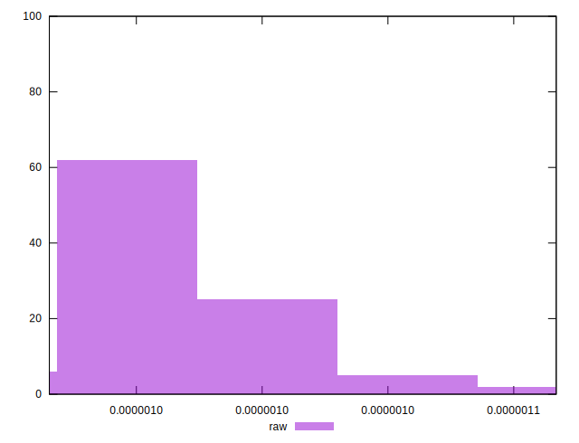

# //meta/score-difference/samples/empty

[→ Parent](../..)


## Raw


```yaml
p90min: 9.161314996730674e-7
p90max: 0.0000010195544074997897
p90range: 1.0342290782672228e-7
p90mean: 9.646739517098868e-7
p90median: 9.658550176816495e-7
p90stdev: 2.2566988651563246e-8
p90skewness: -0.018367953117345192
p90eccentricity: 1.0000000000000007
p90discretization: 1
outlandishness: 1.0130278329595277
confidence: 1.4019894344956022e-8
p90confidence: 9.273229348556007e-9

```

