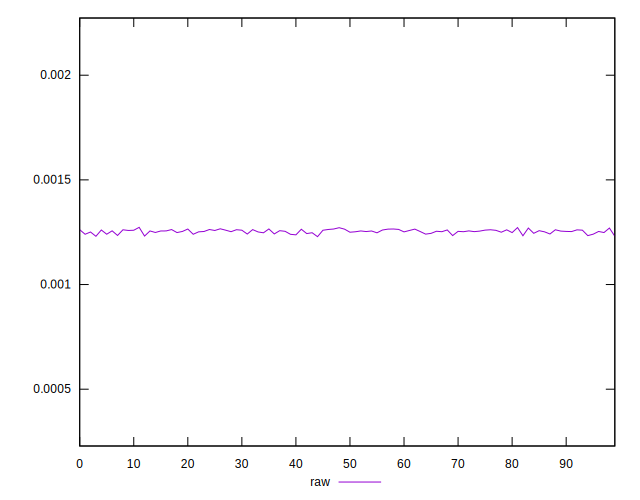
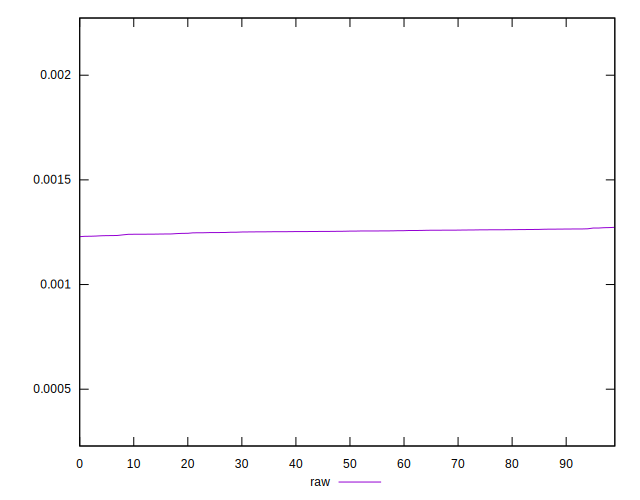
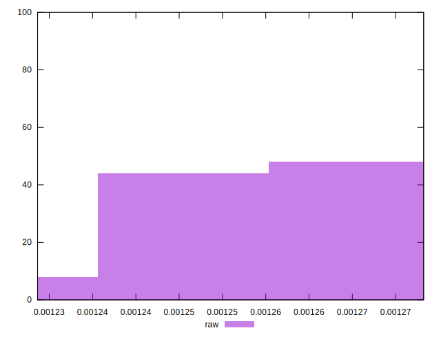

# //meta/score-difference/samples/pages+cached+noexternal+nofonts+nosvg+noimg+nocss+nojs

[→ Parent](../..)


## Raw


```yaml
p90min: 0.0012373602858666399
p90max: 0.0012721044043261076
p90range: 0.00003474411845946768
p90mean: 0.0012553085625765501
p90median: 0.0012558952408901868
p90stdev: 0.000008014310290942928
p90skewness: -0.27527787827135747
p90eccentricity: 0.9999999999999999
p90discretization: 1.011111111111111
outlandishness: 0.9973219657528858
confidence: 0.00000396716986662219
p90confidence: 0.0000032932412270814115

```

