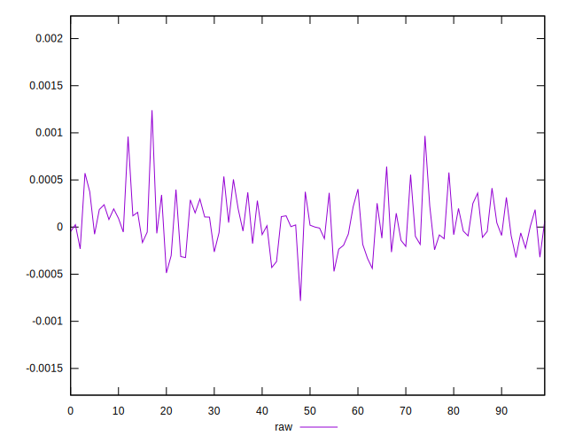

# //meta/score-difference/samples/pages+cached+noexternal+nofonts+nosvg+noimg+nocss

[→ Parent](../..)


## Raw


```yaml
p90min: -0.0004385238459152452
p90max: 0.0005565024167685339
p90range: 0.0009950262626837792
p90mean: 0.000023962204792226853
p90median: 6.878503397034219e-7
p90stdev: 0.00023214150559070296
p90skewness: 0.23400183173163894
p90eccentricity: 1.0000000000000007
p90discretization: 1
outlandishness: 5.080284669841444
confidence: 0.00012523763235065138
p90confidence: 0.00009539161187607301

```

