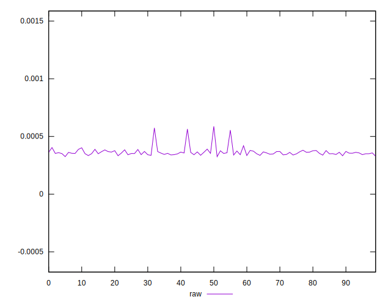
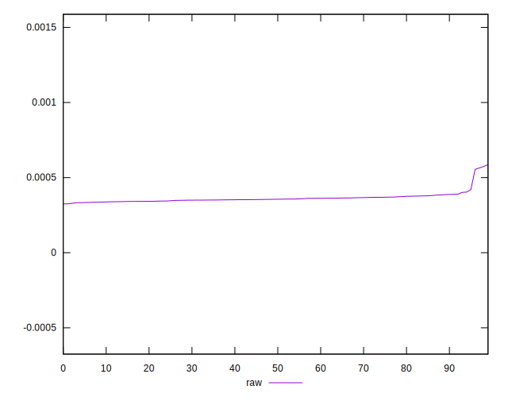
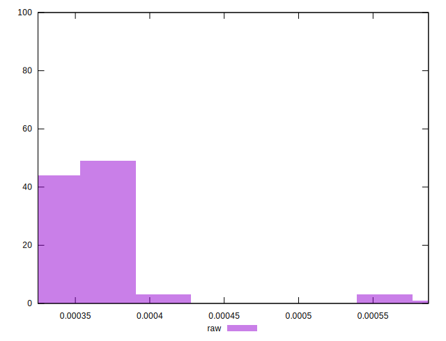

# //meta/score-difference/samples/pages+cached+noexternal+nojs

[→ Parent](../..)


## Raw


```yaml
p90min: 0.0003326779769345367
p90max: 0.00040180410969004043
p90range: 0.00006912613275550372
p90mean: 0.00035770860990420915
p90median: 0.0003550239467162708
p90stdev: 0.000015076428616044076
p90skewness: 0.5121289244365964
p90eccentricity: 0.9999999999999996
p90discretization: 1
outlandishness: 1.0488792173793262
confidence: 0.000017676588637811777
p90confidence: 0.000006195207631480982

```

