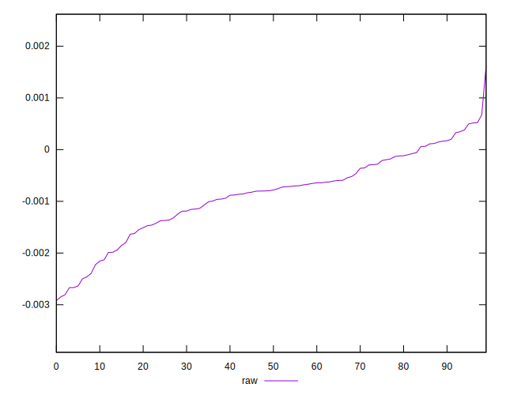

# //meta/score-difference/samples/pages+cached

[→ Parent](../..)


## Raw


```yaml
p90min: -0.0023941883465096693
p90max: 0.0006709027244320917
p90range: 0.003065091070941761
p90mean: -0.0007400315373475822
p90median: -0.0007172037706616771
p90stdev: 0.0006965181027358084
p90skewness: -0.1994990224952944
p90eccentricity: 1.0000000000000004
p90discretization: 1
outlandishness: 1.3895917722426223
confidence: 0.0003473516140699083
p90confidence: 0.0002862132919822587

```

