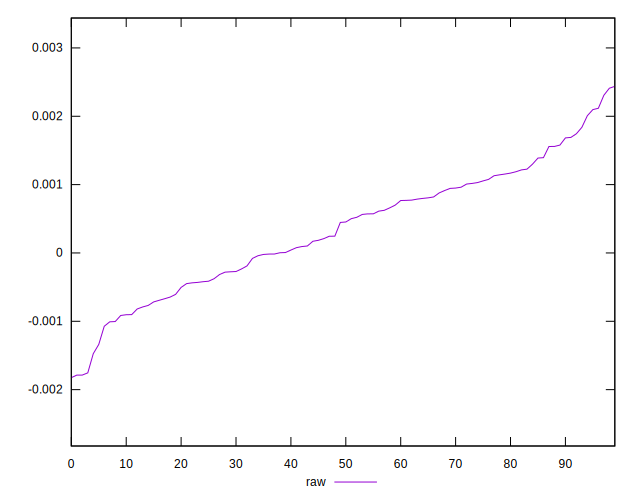

# //meta/score-difference/samples/pages

[→ Parent](../..)


## Raw


```yaml
p90min: -0.0013384783369402547
p90max: 0.0020974295255597715
p90range: 0.0034359078625000265
p90mean: 0.0003670607654013708
p90median: 0.0004532373420270186
p90stdev: 0.0008259077113624034
p90skewness: -0.005942959832924766
p90eccentricity: 0.9999999999999997
p90discretization: 1
outlandishness: 0.8603575147944283
confidence: 0.0003905471790130163
p90confidence: 0.00033938208355831993

```

