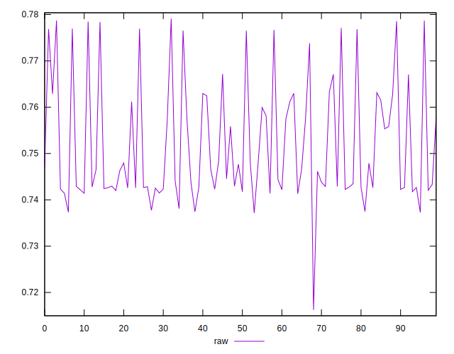
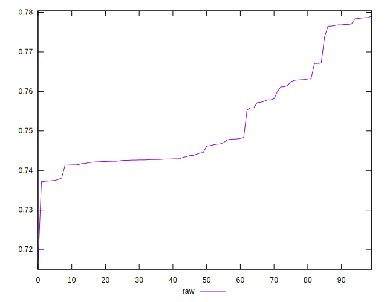
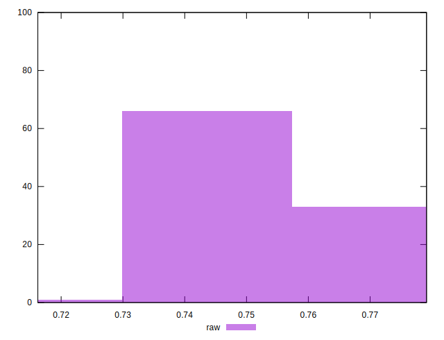

# //meta/score/samples/pages+cached+noexternal+noimg

[→ Parent](../..)


## Raw


```yaml
p90min: 0.7371551063622097
p90max: 0.7769587298750307
p90range: 0.03980362351282096
p90mean: 0.7500181648187442
p90median: 0.7438008278510883
p90stdev: 0.011164669759820472
p90skewness: 1.0634032482621512
p90eccentricity: 0.9999999999999999
p90discretization: 1
outlandishness: 1.0051281798219165
confidence: 0.005331203056855749
p90confidence: 0.0045877872711443946

```

