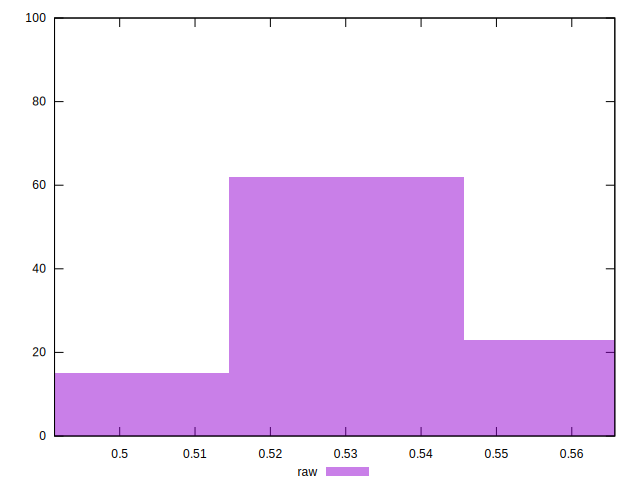

# //meta/score/samples/pages+cached

[→ Parent](../..)


## Raw


```yaml
p90min: 0.5084200537344374
p90max: 0.5544934915624473
p90range: 0.04607343782800988
p90mean: 0.5342190278465773
p90median: 0.5352809141339204
p90stdev: 0.0126421269837444
p90skewness: -0.29457350672381866
p90eccentricity: 0.9999999999999997
p90discretization: 1
outlandishness: 0.9912338669754456
confidence: 0.00607723024328255
p90confidence: 0.0051949041488841274

```

