# //render-blocking-resources/samples/pages+cached+noexternal+nojs

[→ Parent](../..)


## Raw


```yaml
p90min: 8
p90max: 13
p90range: 5
p90mean: 10.615384615384615
p90median: 11
p90stdev: 1.2383011294656243
p90skewness: 0.16889475539316517
p90eccentricity: 1.0000000000000002
p90discretization: 15.166666666666666
outlandishness: 0.9561438563327034
confidence: 1.0067119905468545
p90confidence: 0.5088428302690318

```

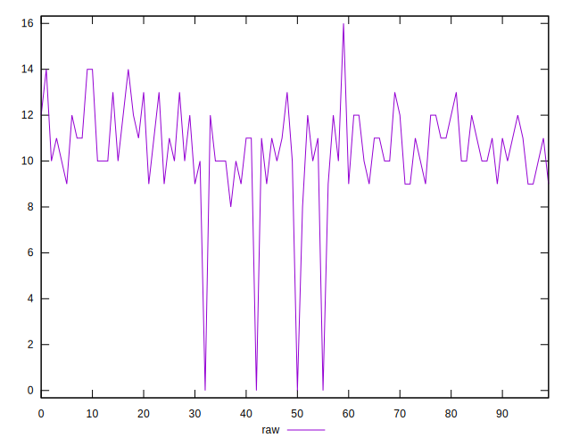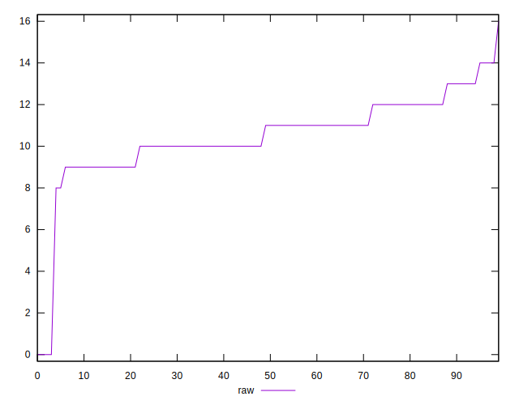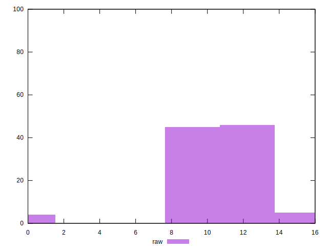
## Score


```yaml
p90min: 0.9891666666666666
p90max: 0.9933333333333333
p90range: 0.004166666666666652
p90mean: 0.9911538461538455
p90median: 0.9908333333333333
p90stdev: 0.0010319176078880392
p90skewness: -0.16889475539026866
p90eccentricity: 1
p90discretization: 15.166666666666666
outlandishness: 1.0003958482465325
confidence: 0.000838926658789152
p90confidence: 0.00042403569189097823

```

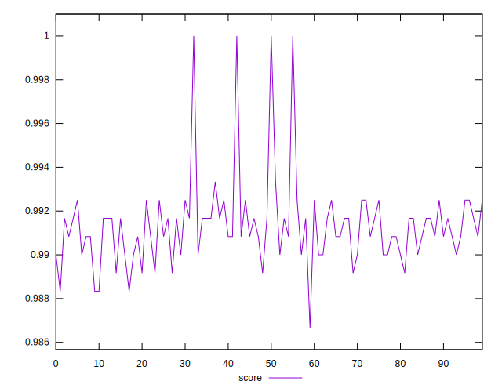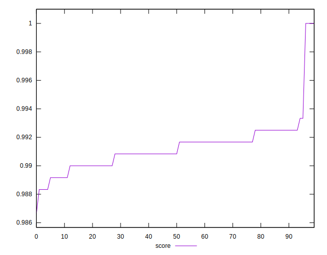
## Raw Estimate

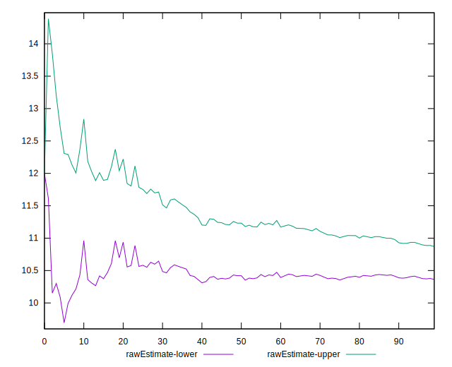
## Score Estimate

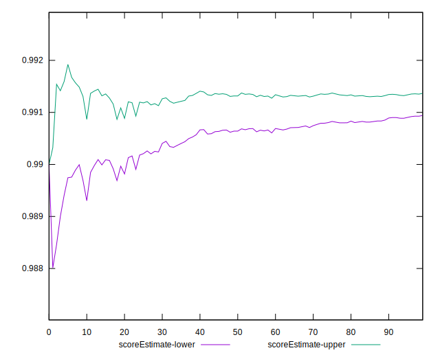
## P Score


```yaml
p90min: 0.9891666666666666
p90max: 0.9933333333333333
p90range: 0.004166666666666652
p90mean: 0.9911538461538455
p90median: 0.9908333333333333
p90stdev: 0.0010319176078880392
p90skewness: -0.16889475539026866
p90eccentricity: 1
p90discretization: 15.166666666666666
outlandishness: 1.0003958482465325
confidence: 0.000838926658789152
p90confidence: 0.00042403569189097823

```

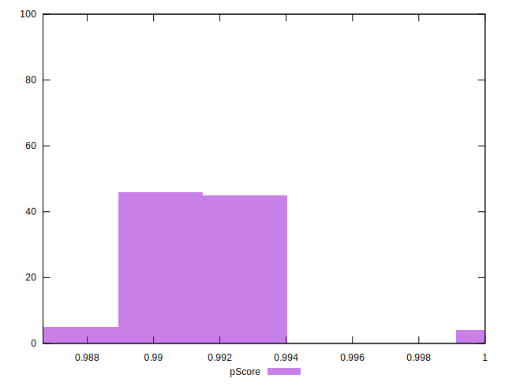
## Score Difference


```yaml
p90min: -0.0025000000000000577
p90max: 0.0008333333333333526
p90range: 0.0033333333333334103
p90mean: -0.0010989010989011243
p90median: -0.0008333333333333526
p90stdev: 0.0009639338730359757
p90skewness: 0.17290087873118878
p90eccentricity: 1.0000000000000002
p90discretization: 18.2
outlandishness: 0.7473602499999982
confidence: 0.0004801356184636178
p90confidence: 0.00039609980842017153

```

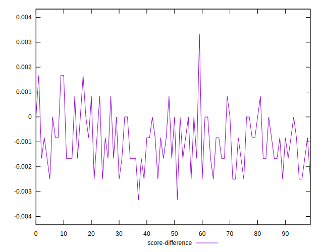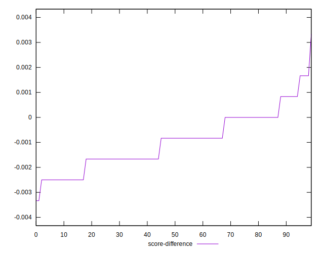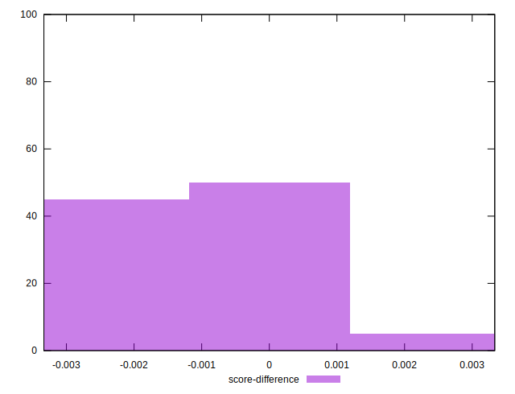
## P Score Difference


```yaml
p90min: 0
p90max: 0
p90range: 0
p90mean: 0
p90median: 0
p90stdev: 0
p90skewness: .nan
p90eccentricity: .nan
p90discretization: 91
outlandishness: .nan
confidence: 0
p90confidence: 0

```

