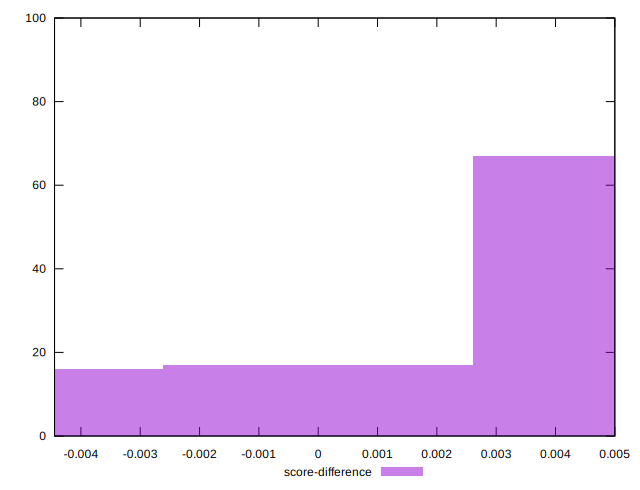

# //render-blocking-resources/samples/pages+cached+noexternal

[→ Parent](../..)


## Raw


```yaml
p90min: 159
p90max: 475
p90range: 316
p90mean: 347.7362637362637
p90median: 468
p90stdev: 151.26948772211347
p90skewness: -0.42660003146504244
p90eccentricity: 1.0000000000000009
p90discretization: 5.6875
outlandishness: 0.9046351888406771
confidence: 60.402353619181326
p90confidence: 62.15967379363008

```


## Score


```yaml
p90min: 0.6527777777777778
p90max: 0.8674999999999999
p90range: 0.21472222222222215
p90mean: 0.7387789987789989
p90median: 0.6566666666666666
p90stdev: 0.1029483938358484
p90skewness: 0.42678050354841573
p90eccentricity: 0.9999999999999997
p90discretization: 5.6875
outlandishness: 1.0316310730926685
confidence: 0.041119066178167074
p90confidence: 0.0423035648151997

```


## Raw Estimate


## Score Estimate


## P Score


```yaml
p90min: 0.6527777777777778
p90max: 0.8674999999999999
p90range: 0.21472222222222215
p90mean: 0.7387789987789989
p90median: 0.6566666666666666
p90stdev: 0.1029483938358484
p90skewness: 0.42678050354841573
p90eccentricity: 0.9999999999999997
p90discretization: 5.6875
outlandishness: 1.0316310730926685
confidence: 0.041119066178167074
p90confidence: 0.0423035648151997

```


## Score Difference


```yaml
p90min: -0.0038888888888888307
p90max: 0.0050000000000000044
p90range: 0.008888888888888835
p90mean: 0.00319291819291821
p90median: 0.0038888888888889417
p90stdev: 0.0021200463287363177
p90skewness: -2.23426270460626
p90eccentricity: 1.0000000000000002
p90discretization: 6.5
outlandishness: 0.6267613397482572
confidence: 0.0011474528985707926
p90confidence: 0.0008711696602273075

```


## P Score Difference


```yaml
p90min: 0
p90max: 0
p90range: 0
p90mean: 0
p90median: 0
p90stdev: 0
p90skewness: .nan
p90eccentricity: .nan
p90discretization: 91
outlandishness: .nan
confidence: 0
p90confidence: 0

```

