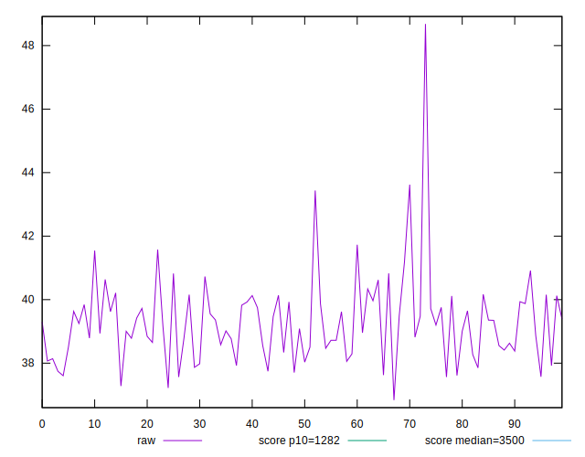
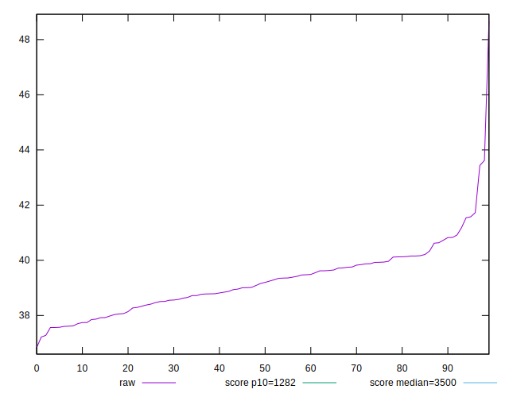
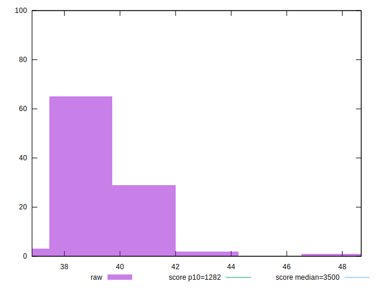
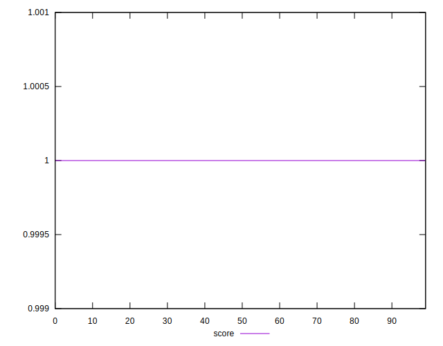
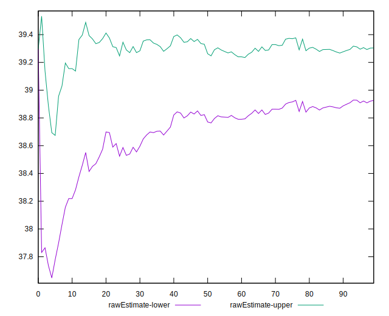
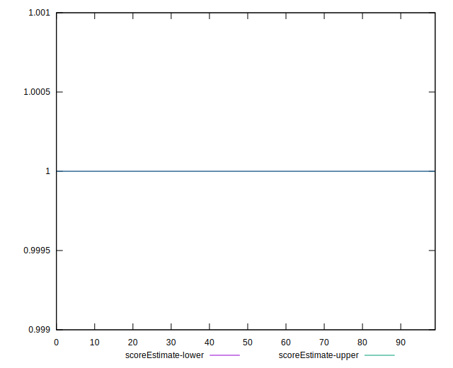
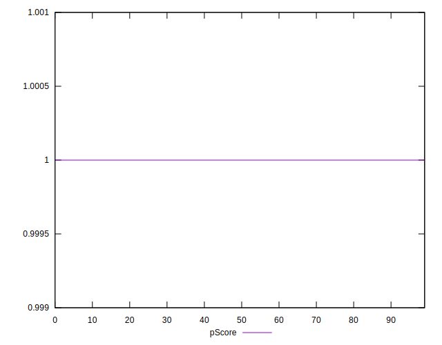
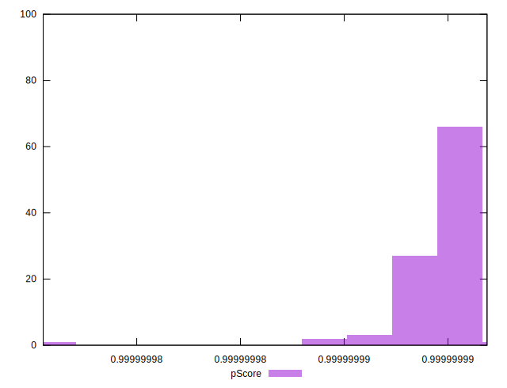
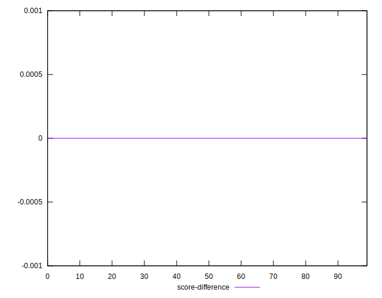
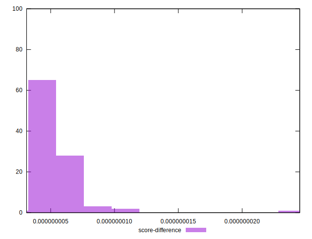

# //bootup-time/samples/pages+cached+noexternal+nofonts+nosvg+noimg

[→ Parent](../..)


## Raw


```yaml
p90min: 37.56399999999998
p90max: 41.184
p90range: 3.6200000000000188
p90mean: 39.11512087912086
p90median: 39.087999999999994
p90stdev: 0.9202588842057802
p90skewness: 0.07655891692089689
p90eccentricity: 0.9999999999999993
p90discretization: 1.0224719101123596
outlandishness: 1.0101927085554492
confidence: 0.600272637297735
p90confidence: 0.3781528774196943

```


## Score


```yaml
p90min: 0.9999999927830115
p90max: 0.9999999963856424
p90range: 3.6026308602998824e-9
p90mean: 0.9999999950279856
p90median: 0.999999995118382
p90stdev: 8.820833035300943e-10
p90skewness: -0.33962026529969186
p90eccentricity: 0.9999999999996602
p90discretization: 1.058139534883721
outlandishness: 0.9999999993040238
confidence: 9.129927924789172e-10
p90confidence: 3.6246583512422603e-10

```


## Raw Estimate


## Score Estimate


## P Score


```yaml
p90min: 0.9999999927830115
p90max: 0.9999999963856424
p90range: 3.6026308602998824e-9
p90mean: 0.9999999950279856
p90median: 0.999999995118382
p90stdev: 8.820833035300943e-10
p90skewness: -0.33962026529969186
p90eccentricity: 0.9999999999996602
p90discretization: 1.058139534883721
outlandishness: 0.9999999993040238
confidence: 9.129927924789172e-10
p90confidence: 3.6246583512422603e-10

```


## Score Difference


```yaml
p90min: 3.6143575909974857e-9
p90max: 7.216988451297368e-9
p90range: 3.6026308602998824e-9
p90mean: 4.972014574170843e-9
p90median: 4.881617998719889e-9
p90stdev: 8.820833035299173e-10
p90skewness: 0.3396221657040389
p90eccentricity: 1.0000000000000002
p90discretization: 1.058139534883721
outlandishness: 1.1448771787265863
confidence: 9.129928925063598e-10
p90confidence: 3.624657637960117e-10

```


## P Score Difference


```yaml
p90min: 0
p90max: 0
p90range: 0
p90mean: 0
p90median: 0
p90stdev: 0
p90skewness: .nan
p90eccentricity: .nan
p90discretization: 91
outlandishness: .nan
confidence: 0
p90confidence: 0

```

