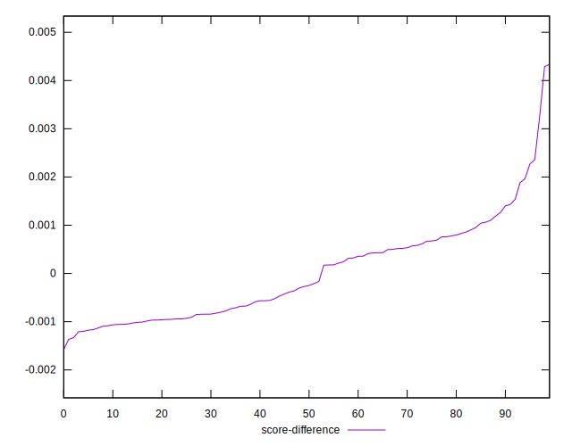

# //bootup-time/samples/pages+cached

[→ Parent](../..)


## Raw


```yaml
p90min: 541.6320000000003
p90max: 588.1720000000005
p90range: 46.54000000000019
p90mean: 561.8969670329673
p90median: 558.8520000000003
p90stdev: 13.252585344663705
p90skewness: 0.2651384352170461
p90eccentricity: 0.9999999999999992
p90discretization: 1
outlandishness: 1.0121189713308707
confidence: 7.190973600219877
p90confidence: 5.445753762714048

```


## Score


```yaml
p90min: 0.9885700010691848
p90max: 0.9913659879407442
p90range: 0.0027959868715593528
p90mean: 0.9901858766887691
p90median: 0.9903842903602412
p90stdev: 0.0007928066463616084
p90skewness: -0.3059008560909772
p90eccentricity: 0.9999999999999996
p90discretization: 1
outlandishness: 0.999555926191777
confidence: 0.0004486544737571929
p90confidence: 0.0003257801904492652

```


## Raw Estimate


## Score Estimate


## P Score


```yaml
p90min: 0.9885700010691848
p90max: 0.9913659879407442
p90range: 0.0027959868715593528
p90mean: 0.9901858766887691
p90median: 0.9903842903602412
p90stdev: 0.0007928066463616084
p90skewness: -0.3059008560909772
p90eccentricity: 0.9999999999999996
p90discretization: 1
outlandishness: 0.999555926191777
confidence: 0.0004486544737571929
p90confidence: 0.0003257801904492652

```


## Score Difference


```yaml
p90min: -0.0013659879407441622
p90max: 0.0014299989308151906
p90range: 0.0027959868715593528
p90mean: -0.00018587668876949987
p90median: -0.0003842903602412351
p90stdev: 0.0007928066463616081
p90skewness: 0.30590085609197004
p90eccentricity: 1.0000000000000004
p90discretization: 1
outlandishness: 0.03346950421893718
confidence: 0.0004486544737571195
p90confidence: 0.00032578019044917565

```


## P Score Difference


```yaml
p90min: 0
p90max: 0
p90range: 0
p90mean: 0
p90median: 0
p90stdev: 0
p90skewness: .nan
p90eccentricity: .nan
p90discretization: 91
outlandishness: .nan
confidence: 0
p90confidence: 0

```

