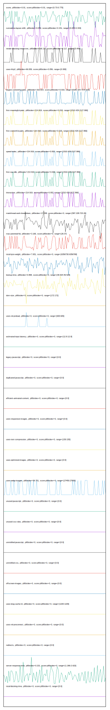

# //correlation/pages+cached+noexternal+nofonts

[→ Parent](../..)

[0. score, p90stdev=0.01, score:p90stdev=0.01, range=[0.73:0.775]](../../meta/score/samples/pages+cached+noexternal+nofonts)  
[1. cumulative-layout-shift, p90stdev=0.059, score:p90stdev=0.151, range=[0.064:0.344]](../../cumulative-layout-shift/samples/pages+cached+noexternal+nofonts/)  
[2. render-blocking-resources, p90stdev=156.137, score:p90stdev=0.117, range=[5:459]](../../render-blocking-resources/samples/pages+cached+noexternal+nofonts/)  
[3. uses-http2, p90stdev=66.839, score:p90stdev=0.056, range=[0:300]](../../uses-http2/samples/pages+cached+noexternal+nofonts/)  
[4. largest-contentful-paint, p90stdev=319.814, score:p90stdev=0.019, range=[6185.324:7170.529]](../../largest-contentful-paint/samples/pages+cached+noexternal+nofonts/)  
[5. first-meaningful-paint, p90stdev=214.919, score:p90stdev=0.018, range=[1510.429:2127.866]](../../first-meaningful-paint/samples/pages+cached+noexternal+nofonts/)  
[6. first-contentful-paint, p90stdev=214.919, score:p90stdev=0.018, range=[1510.429:2127.866]](../../first-contentful-paint/samples/pages+cached+noexternal+nofonts/)  
[7. speed-index, p90stdev=214.919, score:p90stdev=0.002, range=[1510.429:2127.866]](../../speed-index/samples/pages+cached+noexternal+nofonts/)  
[8. first-cpu-idle, p90stdev=214.919, score:p90stdev=0.002, range=[1510.429:2127.866]](../../first-cpu-idle/samples/pages+cached+noexternal+nofonts/)  
[9. interactive, p90stdev=214.919, score:p90stdev=0.002, range=[1510.429:2127.866]](../../interactive/samples/pages+cached+noexternal+nofonts/)  
[10. mainthread-work-breakdown, p90stdev=17.038, score:p90stdev=0, range=[587.228:723.26]](../../mainthread-work-breakdown/samples/pages+cached+noexternal+nofonts/)  
[11. max-potential-fid, p90stdev=3.166, score:p90stdev=0, range=[26:37]](../../max-potential-fid/samples/pages+cached+noexternal+nofonts/)  
[12. total-byte-weight, p90stdev=7.651, score:p90stdev=0, range=[6356730:6356768]](../../total-byte-weight/samples/pages+cached+noexternal+nofonts/)  
[13. bootup-time, p90stdev=0.868, score:p90stdev=0, range=[39.924:49.528]](../../bootup-time/samples/pages+cached+noexternal+nofonts/)  
[14. dom-size, p90stdev=0, score:p90stdev=0, range=[172:172]](../../dom-size/samples/pages+cached+noexternal+nofonts/)  
[15. uses-rel-preload, p90stdev=0, score:p90stdev=0, range=[600:605]](../../uses-rel-preload/samples/pages+cached+noexternal+nofonts/)  
[16. estimated-input-latency, p90stdev=0, score:p90stdev=0, range=[12.8:12.8]](../../estimated-input-latency/samples/pages+cached+noexternal+nofonts/)  
[17. uses-passive-event-listeners, p90stdev=NaN, score:p90stdev=0, range=[NaN:NaN]](../../uses-passive-event-listeners/samples/pages+cached+noexternal+nofonts/)  
[18. no-document-write, p90stdev=NaN, score:p90stdev=0, range=[NaN:NaN]](../../no-document-write/samples/pages+cached+noexternal+nofonts/)  
[19. legacy-javascript, p90stdev=0, score:p90stdev=0, range=[0:0]](../../legacy-javascript/samples/pages+cached+noexternal+nofonts/)  
[20. duplicated-javascript, p90stdev=0, score:p90stdev=0, range=[0:0]](../../duplicated-javascript/samples/pages+cached+noexternal+nofonts/)  
[21. efficient-animated-content, p90stdev=0, score:p90stdev=0, range=[0:0]](../../efficient-animated-content/samples/pages+cached+noexternal+nofonts/)  
[22. uses-responsive-images, p90stdev=0, score:p90stdev=0, range=[0:0]](../../uses-responsive-images/samples/pages+cached+noexternal+nofonts/)  
[23. uses-text-compression, p90stdev=0, score:p90stdev=0, range=[150:150]](../../uses-text-compression/samples/pages+cached+noexternal+nofonts/)  
[24. uses-optimized-images, p90stdev=0, score:p90stdev=0, range=[0:0]](../../uses-optimized-images/samples/pages+cached+noexternal+nofonts/)  
[25. uses-webp-images, p90stdev=59.751, score:p90stdev=0, range=[27450:27600]](../../uses-webp-images/samples/pages+cached+noexternal+nofonts/)  
[26. unused-javascript, p90stdev=0, score:p90stdev=0, range=[0:0]](../../unused-javascript/samples/pages+cached+noexternal+nofonts/)  
[27. unused-css-rules, p90stdev=0, score:p90stdev=0, range=[0:0]](../../unused-css-rules/samples/pages+cached+noexternal+nofonts/)  
[28. unminified-javascript, p90stdev=0, score:p90stdev=0, range=[0:0]](../../unminified-javascript/samples/pages+cached+noexternal+nofonts/)  
[29. unminified-css, p90stdev=0, score:p90stdev=0, range=[0:0]](../../unminified-css/samples/pages+cached+noexternal+nofonts/)  
[30. offscreen-images, p90stdev=0, score:p90stdev=0, range=[0:0]](../../offscreen-images/samples/pages+cached+noexternal+nofonts/)  
[31. uses-long-cache-ttl, p90stdev=0, score:p90stdev=0, range=[1220:1220]](../../uses-long-cache-ttl/samples/pages+cached+noexternal+nofonts/)  
[32. unsized-images, p90stdev=NaN, score:p90stdev=0, range=[NaN:NaN]](../../unsized-images/samples/pages+cached+noexternal+nofonts/)  
[33. third-party-summary, p90stdev=NaN, score:p90stdev=0, range=[NaN:NaN]](../../third-party-summary/samples/pages+cached+noexternal+nofonts/)  
[34. font-display, p90stdev=NaN, score:p90stdev=0, range=[NaN:NaN]](../../font-display/samples/pages+cached+noexternal+nofonts/)  
[35. uses-rel-preconnect, p90stdev=0, score:p90stdev=0, range=[0:0]](../../uses-rel-preconnect/samples/pages+cached+noexternal+nofonts/)  
[36. redirects, p90stdev=0, score:p90stdev=0, range=[0:0]](../../redirects/samples/pages+cached+noexternal+nofonts/)  
[37. server-response-time, p90stdev=0.221, score:p90stdev=0, range=[1.266:2.622]](../../server-response-time/samples/pages+cached+noexternal+nofonts/)  
[38. total-blocking-time, p90stdev=0, score:p90stdev=0, range=[0:0]](../../total-blocking-time/samples/pages+cached+noexternal+nofonts/)  
