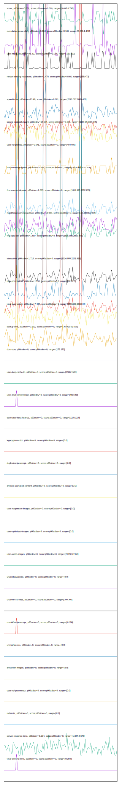

# //correlation/pages+cached+noexternal+nosvg

[→ Parent](../..)

[0. score, p90stdev=0.009, score:p90stdev=0.009, range=[0.695:0.743]](../../meta/score/samples/pages+cached+noexternal+nosvg)  
[1. cumulative-layout-shift, p90stdev=0.064, score:p90stdev=0.165, range=[0.069:1.146]](../../cumulative-layout-shift/samples/pages+cached+noexternal+nosvg/)  
[2. uses-http2, p90stdev=46.32, score:p90stdev=0.038, range=[160:320]](../../uses-http2/samples/pages+cached+noexternal+nosvg/)  
[3. render-blocking-resources, p90stdev=1.478, score:p90stdev=0.001, range=[155:473]](../../render-blocking-resources/samples/pages+cached+noexternal+nosvg/)  
[4. speed-index, p90stdev=13.49, score:p90stdev=0.001, range=[2520.577:2685.422]](../../speed-index/samples/pages+cached+noexternal+nosvg/)  
[5. largest-contentful-paint, p90stdev=53.194, score:p90stdev=0.001, range=[8837.98:9019.975]](../../largest-contentful-paint/samples/pages+cached+noexternal+nosvg/)  
[6. uses-rel-preload, p90stdev=0.541, score:p90stdev=0, range=[454:605]](../../uses-rel-preload/samples/pages+cached+noexternal+nosvg/)  
[7. first-meaningful-paint, p90stdev=1.687, score:p90stdev=0, range=[1814.995:2052.876]](../../first-meaningful-paint/samples/pages+cached+noexternal+nosvg/)  
[8. first-contentful-paint, p90stdev=1.687, score:p90stdev=0, range=[1814.995:2052.876]](../../first-contentful-paint/samples/pages+cached+noexternal+nosvg/)  
[9. mainthread-work-breakdown, p90stdev=13.988, score:p90stdev=0, range=[731.08:861.924]](../../mainthread-work-breakdown/samples/pages+cached+noexternal+nosvg/)  
[10. first-cpu-idle, p90stdev=1.687, score:p90stdev=0, range=[1814.995:2052.876]](../../first-cpu-idle/samples/pages+cached+noexternal+nosvg/)  
[11. interactive, p90stdev=1.715, score:p90stdev=0, range=[1814.995:2231.929]](../../interactive/samples/pages+cached+noexternal+nosvg/)  
[12. max-potential-fid, p90stdev=1.261, score:p90stdev=0, range=[26:72.5]](../../max-potential-fid/samples/pages+cached+noexternal+nosvg/)  
[13. total-byte-weight, p90stdev=7.484, score:p90stdev=0, range=[6591596:6591644]](../../total-byte-weight/samples/pages+cached+noexternal+nosvg/)  
[14. bootup-time, p90stdev=0.692, score:p90stdev=0, range=[36.916:52.096]](../../bootup-time/samples/pages+cached+noexternal+nosvg/)  
[15. dom-size, p90stdev=0, score:p90stdev=0, range=[172:172]](../../dom-size/samples/pages+cached+noexternal+nosvg/)  
[16. uses-long-cache-ttl, p90stdev=0, score:p90stdev=0, range=[1586:1586]](../../uses-long-cache-ttl/samples/pages+cached+noexternal+nosvg/)  
[17. uses-text-compression, p90stdev=0, score:p90stdev=0, range=[450:750]](../../uses-text-compression/samples/pages+cached+noexternal+nosvg/)  
[18. estimated-input-latency, p90stdev=0, score:p90stdev=0, range=[12.8:12.8]](../../estimated-input-latency/samples/pages+cached+noexternal+nosvg/)  
[19. uses-passive-event-listeners, p90stdev=NaN, score:p90stdev=0, range=[NaN:NaN]](../../uses-passive-event-listeners/samples/pages+cached+noexternal+nosvg/)  
[20. no-document-write, p90stdev=NaN, score:p90stdev=0, range=[NaN:NaN]](../../no-document-write/samples/pages+cached+noexternal+nosvg/)  
[21. legacy-javascript, p90stdev=0, score:p90stdev=0, range=[0:0]](../../legacy-javascript/samples/pages+cached+noexternal+nosvg/)  
[22. duplicated-javascript, p90stdev=0, score:p90stdev=0, range=[0:0]](../../duplicated-javascript/samples/pages+cached+noexternal+nosvg/)  
[23. efficient-animated-content, p90stdev=0, score:p90stdev=0, range=[0:0]](../../efficient-animated-content/samples/pages+cached+noexternal+nosvg/)  
[24. uses-responsive-images, p90stdev=0, score:p90stdev=0, range=[0:0]](../../uses-responsive-images/samples/pages+cached+noexternal+nosvg/)  
[25. uses-optimized-images, p90stdev=0, score:p90stdev=0, range=[0:0]](../../uses-optimized-images/samples/pages+cached+noexternal+nosvg/)  
[26. uses-webp-images, p90stdev=0, score:p90stdev=0, range=[27450:27450]](../../uses-webp-images/samples/pages+cached+noexternal+nosvg/)  
[27. unused-javascript, p90stdev=0, score:p90stdev=0, range=[0:0]](../../unused-javascript/samples/pages+cached+noexternal+nosvg/)  
[28. unused-css-rules, p90stdev=0, score:p90stdev=0, range=[300:300]](../../unused-css-rules/samples/pages+cached+noexternal+nosvg/)  
[29. unminified-javascript, p90stdev=0, score:p90stdev=0, range=[0:150]](../../unminified-javascript/samples/pages+cached+noexternal+nosvg/)  
[30. unminified-css, p90stdev=0, score:p90stdev=0, range=[0:0]](../../unminified-css/samples/pages+cached+noexternal+nosvg/)  
[31. offscreen-images, p90stdev=0, score:p90stdev=0, range=[0:0]](../../offscreen-images/samples/pages+cached+noexternal+nosvg/)  
[32. unsized-images, p90stdev=NaN, score:p90stdev=0, range=[NaN:NaN]](../../unsized-images/samples/pages+cached+noexternal+nosvg/)  
[33. third-party-summary, p90stdev=NaN, score:p90stdev=0, range=[NaN:NaN]](../../third-party-summary/samples/pages+cached+noexternal+nosvg/)  
[34. font-display, p90stdev=NaN, score:p90stdev=0, range=[NaN:NaN]](../../font-display/samples/pages+cached+noexternal+nosvg/)  
[35. uses-rel-preconnect, p90stdev=0, score:p90stdev=0, range=[0:0]](../../uses-rel-preconnect/samples/pages+cached+noexternal+nosvg/)  
[36. redirects, p90stdev=0, score:p90stdev=0, range=[0:0]](../../redirects/samples/pages+cached+noexternal+nosvg/)  
[37. server-response-time, p90stdev=0.214, score:p90stdev=0, range=[1.327:2.575]](../../server-response-time/samples/pages+cached+noexternal+nosvg/)  
[38. total-blocking-time, p90stdev=0, score:p90stdev=0, range=[0:29.5]](../../total-blocking-time/samples/pages+cached+noexternal+nosvg/)  
