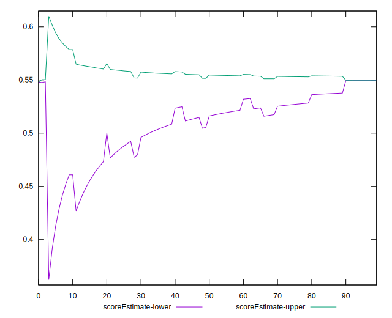

# //cumulative-layout-shift/samples/pages+cached+noexternal+nofonts+nosvg+noimg+nocss

[→ Parent](../..)


## Raw


```yaml
p90min: 0.22853081597222222
p90max: 0.22935199652777777
p90range: 0.0008211805555555507
p90mean: 0.2286842233287543
p90median: 0.22853081597222222
p90stdev: 0.0003200645579024692
p90skewness: 1.6070690421401883
p90eccentricity: 0.9999999999999984
p90discretization: 45.5
outlandishness: 1.111400460323134
confidence: 0.015458406044187578
p90confidence: 0.00013152096177299066

```


## Score


```yaml
p90min: 0.5479826726867736
p90max: 0.5499689372766312
p90range: 0.0019862645898576226
p90mean: 0.5495978768587457
p90median: 0.5499689372766312
p90stdev: 0.000774169448520391
p90skewness: -1.6070690421377813
p90eccentricity: 1.0000000000000013
p90discretization: 45.5
outlandishness: 0.9187759412015769
confidence: 0.02841188318216825
p90confidence: 0.0003181217911534251

```


## Raw Estimate


## Score Estimate


## P Score


```yaml
p90min: 0.5479826726867736
p90max: 0.5499689372766312
p90range: 0.0019862645898576226
p90mean: 0.5495978768587457
p90median: 0.5499689372766312
p90stdev: 0.000774169448520391
p90skewness: -1.6070690421377813
p90eccentricity: 1.0000000000000013
p90discretization: 45.5
outlandishness: 0.9187759412015769
confidence: 0.02841188318216825
p90confidence: 0.0003181217911534251

```


## Score Difference


```yaml
p90min: 0.00003106272336883542
p90max: 0.002017327313226458
p90range: 0.0019862645898576226
p90mean: 0.00040212314125432535
p90median: 0.00003106272336883542
p90stdev: 0.0007741694485203905
p90skewness: 1.6070690421386158
p90eccentricity: 1.0000000000000007
p90discretization: 45.5
outlandishness: 2.987474184473571
confidence: 0.00046595181239118236
p90confidence: 0.00031812179115343935

```


## P Score Difference


```yaml
p90min: 0
p90max: 0
p90range: 0
p90mean: 0
p90median: 0
p90stdev: 0
p90skewness: .nan
p90eccentricity: .nan
p90discretization: 91
outlandishness: .nan
confidence: 0
p90confidence: 0

```

