# //cumulative-layout-shift/samples/pages+cached+noexternal

[→ Parent](../..)


## Raw


```yaml
p90min: 0.0938739013671875
p90max: 0.3797997665405274
p90range: 0.2859258651733399
p90mean: 0.22816254804422567
p90median: 0.20941780090332032
p90stdev: 0.07116560295873732
p90skewness: 1.0394747446506445
p90eccentricity: 1.0000000000000002
p90discretization: 11.375
outlandishness: 1.2735713480821762
confidence: 0.07552474105370588
p90confidence: 0.02924337704751434

```

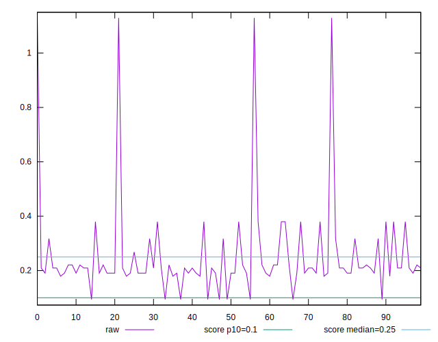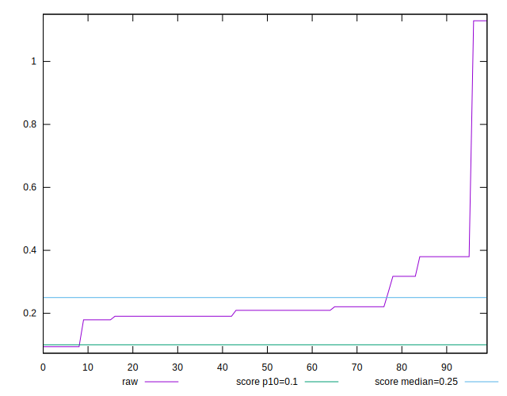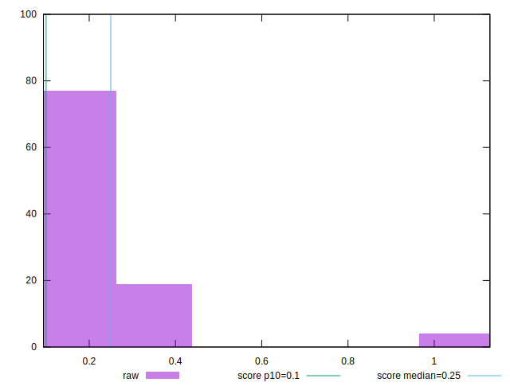
## Score


```yaml
p90min: 0.27931295209719315
p90max: 0.9146517814122077
p90range: 0.6353388293150146
p90mean: 0.5704815441383451
p90median: 0.5978316776798642
p90stdev: 0.14853447903268566
p90skewness: -0.5416405033520378
p90eccentricity: 1.0000000000000009
p90discretization: 11.375
outlandishness: 0.9828553348446564
confidence: 0.07662208427800654
p90confidence: 0.06103580373551298

```

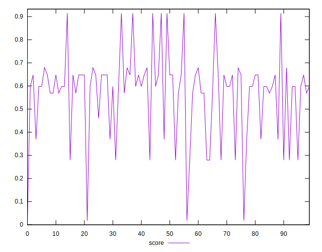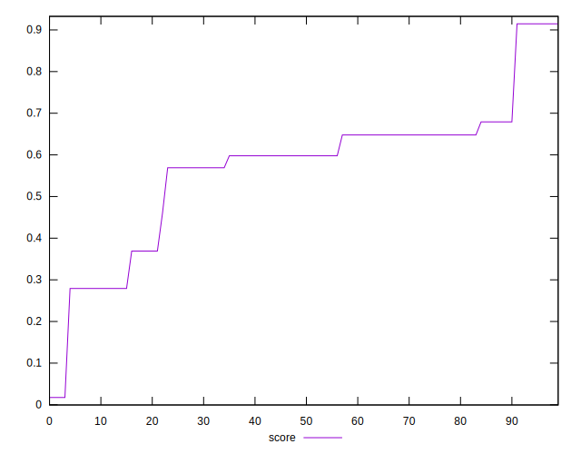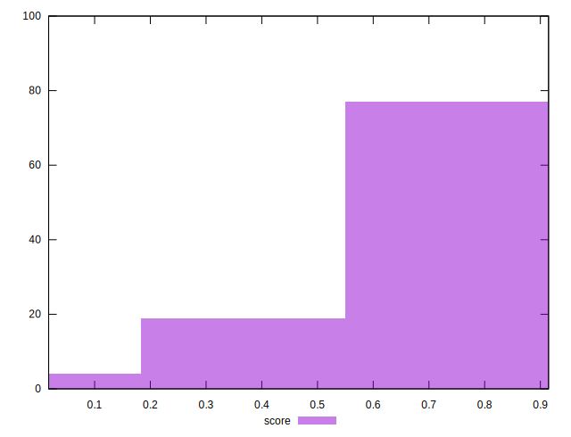
## Raw Estimate

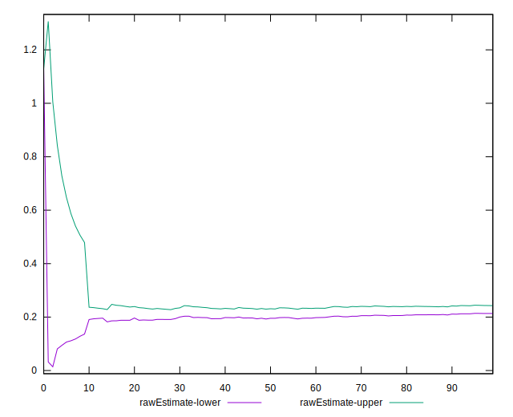
## Score Estimate

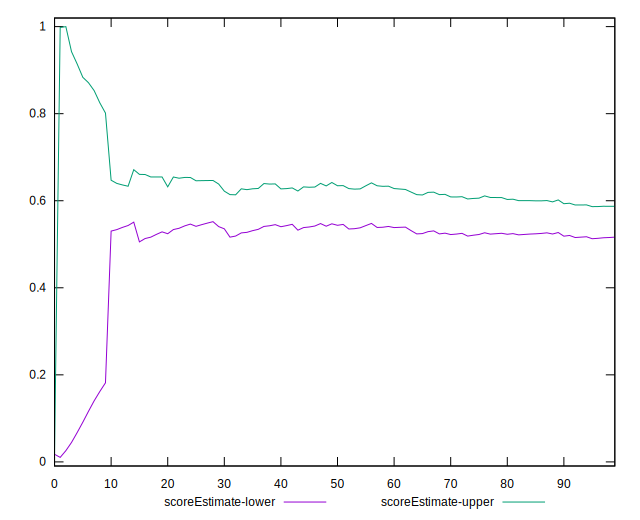
## P Score


```yaml
p90min: 0.27931295209719315
p90max: 0.9146517814122077
p90range: 0.6353388293150146
p90mean: 0.5704815441383451
p90median: 0.5978316776798642
p90stdev: 0.14853447903268566
p90skewness: -0.5416405033520378
p90eccentricity: 1.0000000000000009
p90discretization: 11.375
outlandishness: 0.9828553348446564
confidence: 0.07662208427800654
p90confidence: 0.06103580373551298

```

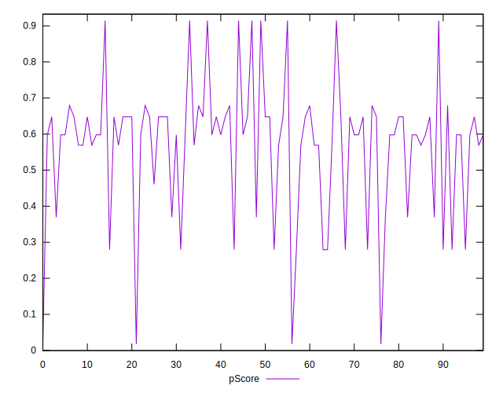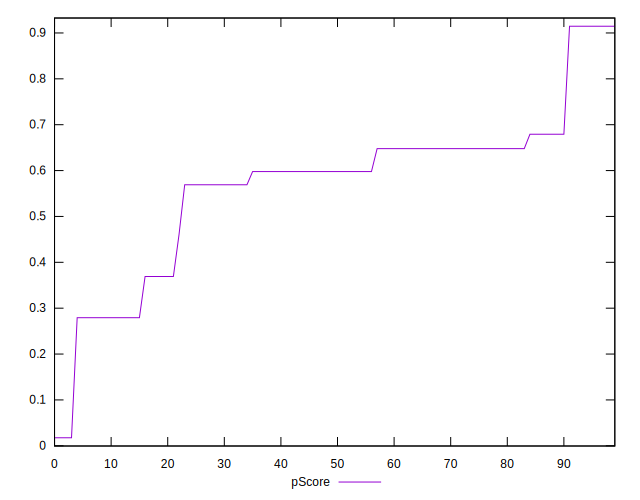
## Score Difference


```yaml
p90min: -0.0006609061257303317
p90max: 0.002518753549499358
p90range: 0.0031796596752296895
p90mean: 0.0015918859698620751
p90median: 0.0021063133744221307
p90stdev: 0.0007011905200883104
p90skewness: -0.5637947393105579
p90eccentricity: 1.0000000000000004
p90discretization: 11.375
outlandishness: 0.4186136195456973
confidence: 0.0007478907227190957
p90confidence: 0.0002881332822118332

```

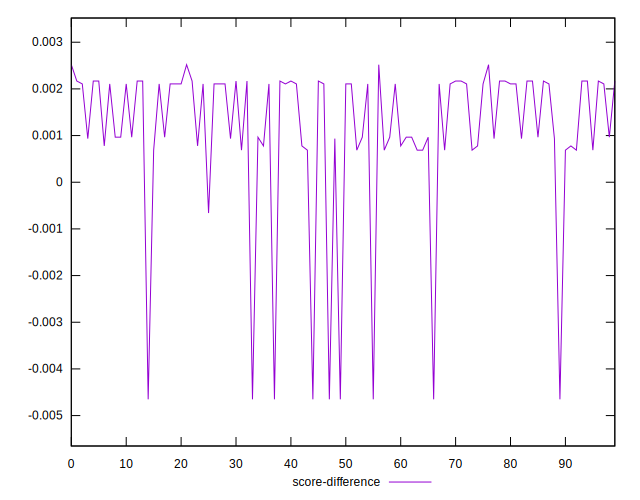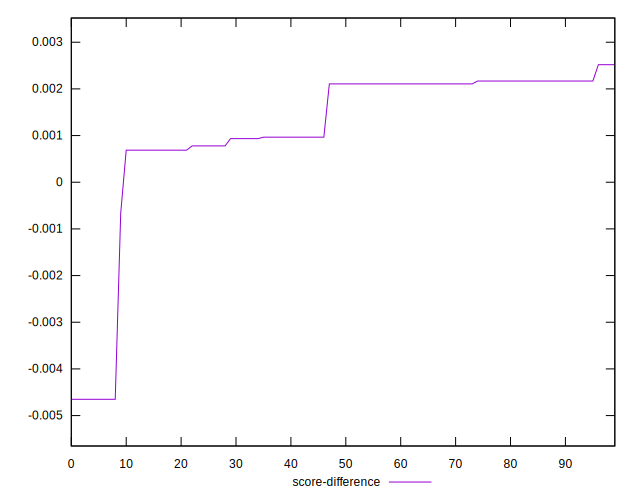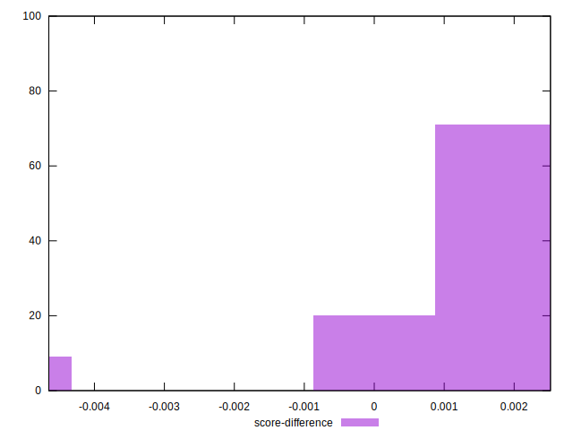
## P Score Difference


```yaml
p90min: 0
p90max: 0
p90range: 0
p90mean: 0
p90median: 0
p90stdev: 0
p90skewness: .nan
p90eccentricity: .nan
p90discretization: 91
outlandishness: .nan
confidence: 0
p90confidence: 0

```

