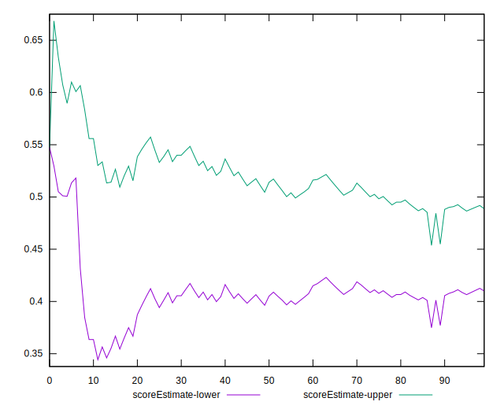

# //cumulative-layout-shift/samples/pages+cached+nointeractive

[→ Parent](../..)


## Raw


```yaml
p90min: 0.1792506052652995
p90max: 0.3992685298919677
p90range: 0.2200179246266682
p90mean: 0.2746226672637157
p90median: 0.2295603162977431
p90stdev: 0.09505118980837376
p90skewness: 0.34913378208369317
p90eccentricity: 0.9999999999999999
p90discretization: 1.8958333333333333
outlandishness: 1.0841946003062615
confidence: 0.03824683525672068
p90confidence: 0.03905844490621091

```


## Score


```yaml
p90min: 0.2562666365089175
p90max: 0.6478431386284664
p90range: 0.3915765021195489
p90mean: 0.46134863358104794
p90median: 0.5108405889204024
p90stdev: 0.18185793413901322
p90skewness: -0.08194214086430777
p90eccentricity: 0.9999999999999991
p90discretization: 1.8958333333333333
outlandishness: 1.0111637594410832
confidence: 0.07248465981741348
p90confidence: 0.07472908141019641

```


## Raw Estimate


## Score Estimate


## P Score


```yaml
p90min: 0.2562666365089175
p90max: 0.6478431386284664
p90range: 0.3915765021195489
p90mean: 0.46134863358104794
p90median: 0.5108405889204024
p90stdev: 0.18185793413901322
p90skewness: -0.08194214086430777
p90eccentricity: 0.9999999999999991
p90discretization: 1.8958333333333333
outlandishness: 1.0111637594410832
confidence: 0.07248465981741348
p90confidence: 0.07472908141019641

```


## Score Difference


```yaml
p90min: 0.0007100204626458995
p90max: 0.0037300597218731246
p90range: 0.003020039259227225
p90mean: 0.002210651885088059
p90median: 0.002196766054020638
p90stdev: 0.0010442326000168053
p90skewness: 0.008322689263673166
p90eccentricity: 0.9999999999999999
p90discretization: 1.9782608695652173
outlandishness: 0.8881202050895618
confidence: 0.0005382066069938019
p90confidence: 0.00042909616975076153

```


## P Score Difference


```yaml
p90min: 0
p90max: 0
p90range: 0
p90mean: 0
p90median: 0
p90stdev: 0
p90skewness: .nan
p90eccentricity: .nan
p90discretization: 91
outlandishness: .nan
confidence: 0
p90confidence: 0

```

