# //first-contentful-paint/samples/pages+cached+noexternal+nofonts+nosvg+noimg+nocss+nojs

[→ Parent](../..)


## Raw


```yaml
p90min: 1507.6709999999998
p90max: 1510.3714
p90range: 2.7004000000001724
p90mean: 1509.0685252747253
p90median: 1509.1147999999998
p90stdev: 0.6229805780038024
p90skewness: -0.28001023305962347
p90eccentricity: 0.9999999999999997
p90discretization: 1.011111111111111
outlandishness: 0.9998261926829626
confidence: 0.30867238888367865
p90confidence: 0.2559952445903946

```

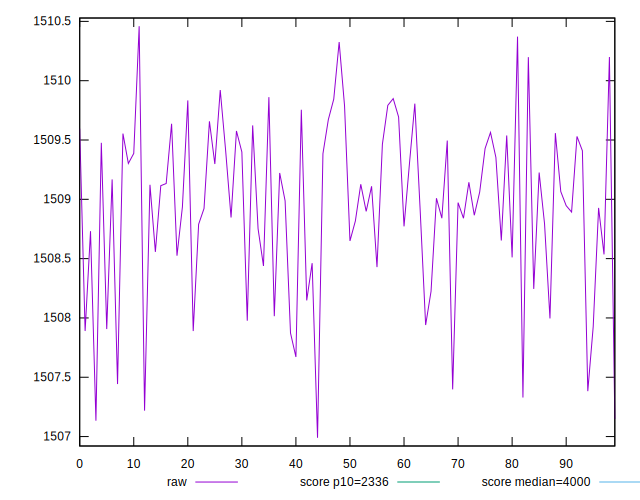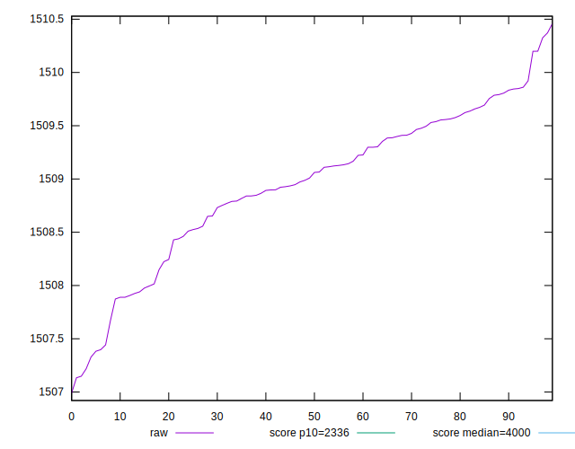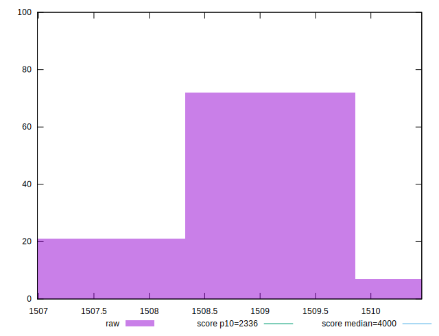
## Score


```yaml
p90min: 0.9898462092486641
p90max: 0.9899608052971889
p90range: 0.00011459604852481764
p90mean: 0.9899015902956907
p90median: 0.9898996508811531
p90stdev: 0.00002643406596729589
p90skewness: 0.27600008723520686
p90eccentricity: 1.0000000000000002
p90discretization: 1.011111111111111
outlandishness: 1.0000112141812973
confidence: 0.000013087021621061012
p90confidence: 0.000010862289165469718

```

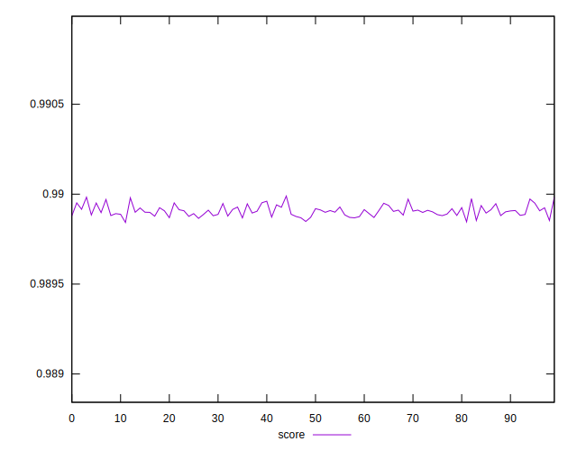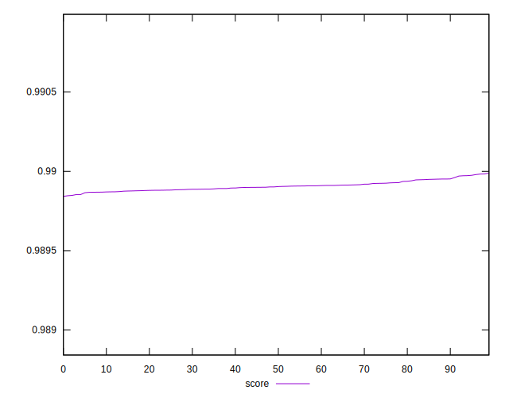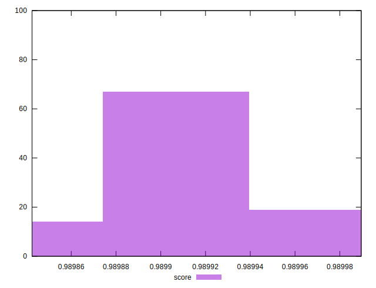
## Raw Estimate


## Score Estimate

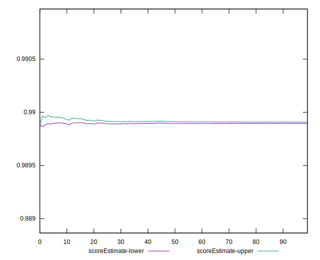
## P Score


```yaml
p90min: 0.9898462092486641
p90max: 0.9899608052971889
p90range: 0.00011459604852481764
p90mean: 0.9899015902956907
p90median: 0.9898996508811531
p90stdev: 0.00002643406596729589
p90skewness: 0.27600008723520686
p90eccentricity: 1.0000000000000002
p90discretization: 1.011111111111111
outlandishness: 1.0000112141812973
confidence: 0.000013087021621061012
p90confidence: 0.000010862289165469718

```

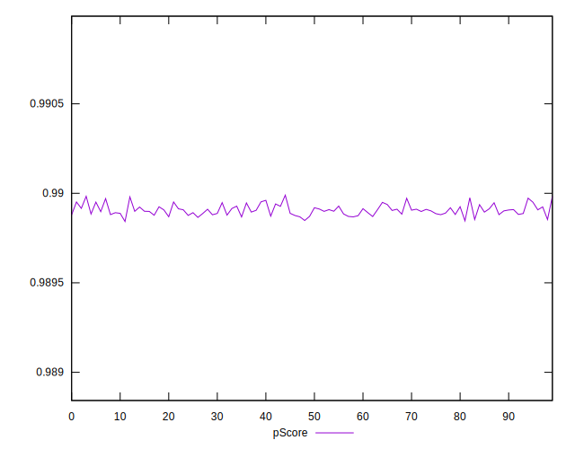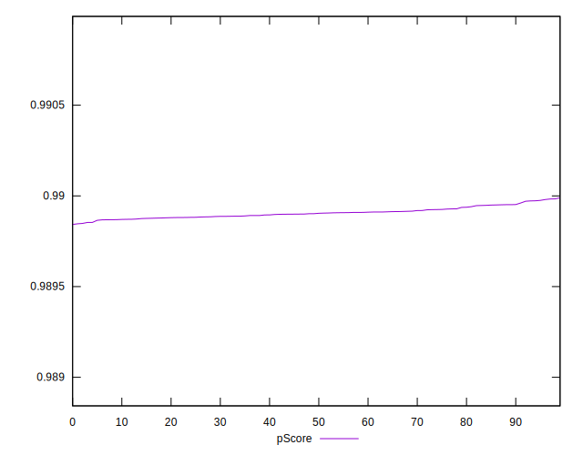
## Score Difference


```yaml
p90min: 0.00003919470281110726
p90max: 0.0001537907513359249
p90range: 0.00011459604852481764
p90mean: 0.00009840970430963702
p90median: 0.00010034911884693187
p90stdev: 0.000026434065967295894
p90skewness: -0.27600008721056035
p90eccentricity: 1.0000000000000002
p90discretization: 1.011111111111111
outlandishness: 0.8903781780692169
confidence: 0.000013087021620993494
p90confidence: 0.00001086228916557776

```

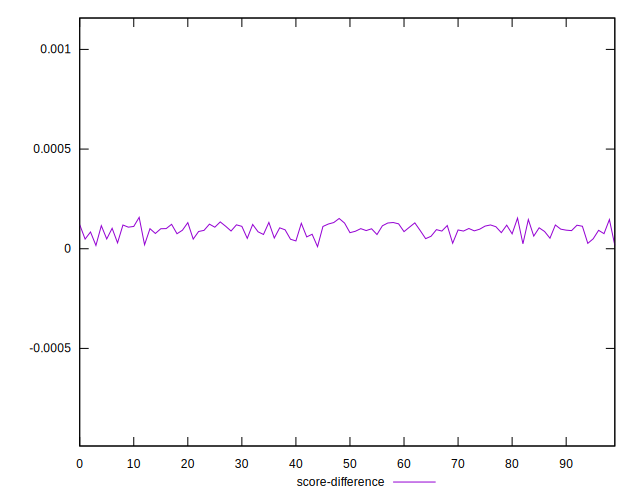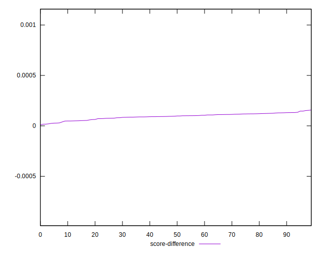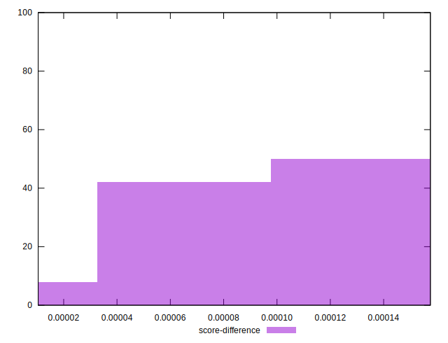
## P Score Difference


```yaml
p90min: 0
p90max: 0
p90range: 0
p90mean: 0
p90median: 0
p90stdev: 0
p90skewness: .nan
p90eccentricity: .nan
p90discretization: 91
outlandishness: .nan
confidence: 0
p90confidence: 0

```

