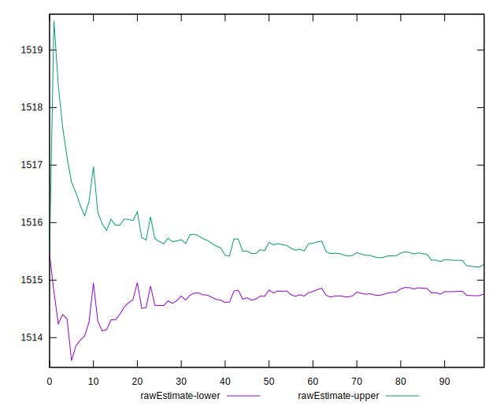

# //first-contentful-paint/samples/pages+cached+noexternal+nojs

[→ Parent](../..)


## Raw


```yaml
p90min: 1512.924
p90max: 1518.6891
p90range: 5.765100000000075
p90mean: 1515.0207197802201
p90median: 1514.7986
p90stdev: 1.2591436802529017
p90skewness: 0.5036632834448176
p90eccentricity: 0.9999999999999996
p90discretization: 1
outlandishness: 1.0009284485439753
confidence: 1.4451094568707958
p90confidence: 0.517407453429314

```


## Score


```yaml
p90min: 0.9894873619181239
p90max: 0.9897370287258744
p90range: 0.00024966680775051486
p90mean: 0.98964662014234
p90median: 0.9896563157196219
p90stdev: 0.00005445318211151207
p90skewness: -0.5120432219163693
p90eccentricity: 1.0000000000000004
p90discretization: 1
outlandishness: 0.9999369675825271
confidence: 0.00006383029282641672
p90confidence: 0.000022375907316352084

```


## Raw Estimate


## Score Estimate


## P Score


```yaml
p90min: 0.9894873619181239
p90max: 0.9897370287258744
p90range: 0.00024966680775051486
p90mean: 0.98964662014234
p90median: 0.9896563157196219
p90stdev: 0.00005445318211151207
p90skewness: -0.5120432219163693
p90eccentricity: 1.0000000000000004
p90discretization: 1
outlandishness: 0.9999369675825271
confidence: 0.00006383029282641672
p90confidence: 0.000022375907316352084

```


## Score Difference


```yaml
p90min: 0.0002629712741255563
p90max: 0.0005126380818760712
p90range: 0.00024966680775051486
p90mean: 0.00035337985765991056
p90median: 0.0003436842803781204
p90stdev: 0.000054453182111512084
p90skewness: 0.5120432219052111
p90eccentricity: 0.9999999999999999
p90discretization: 1
outlandishness: 1.1843165702047809
confidence: 0.00006383029282648134
p90confidence: 0.000022375907316448903

```


## P Score Difference


```yaml
p90min: 0
p90max: 0
p90range: 0
p90mean: 0
p90median: 0
p90stdev: 0
p90skewness: .nan
p90eccentricity: .nan
p90discretization: 91
outlandishness: .nan
confidence: 0
p90confidence: 0

```

