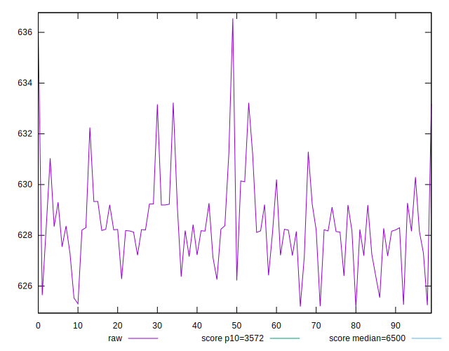
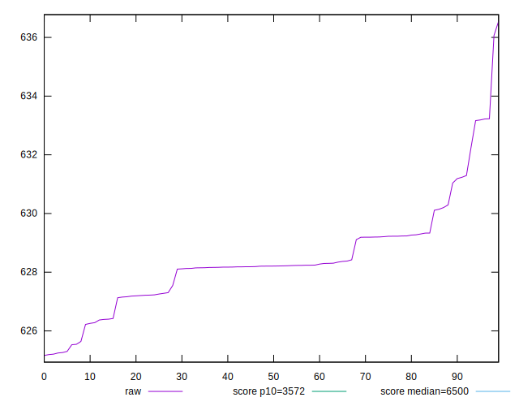
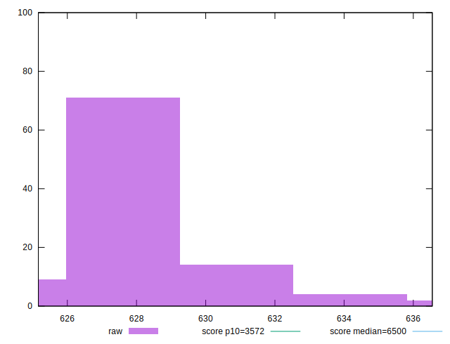
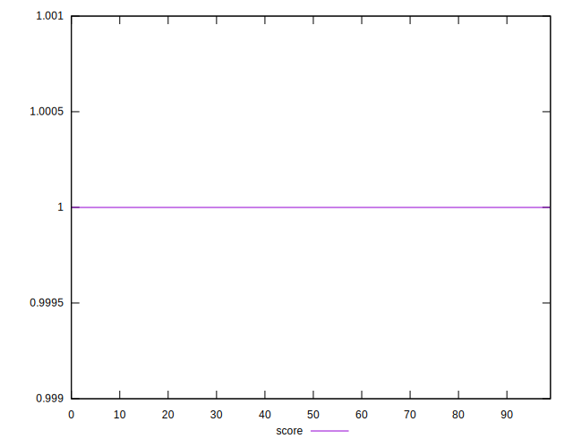
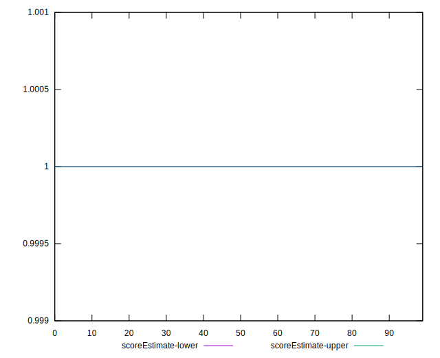
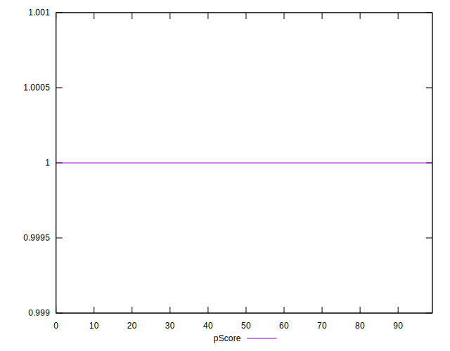
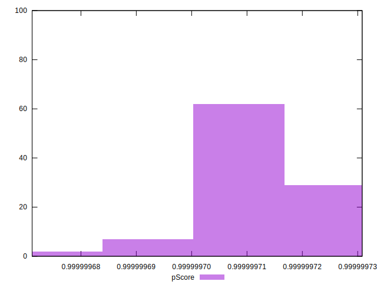
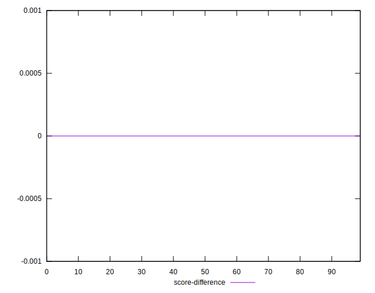
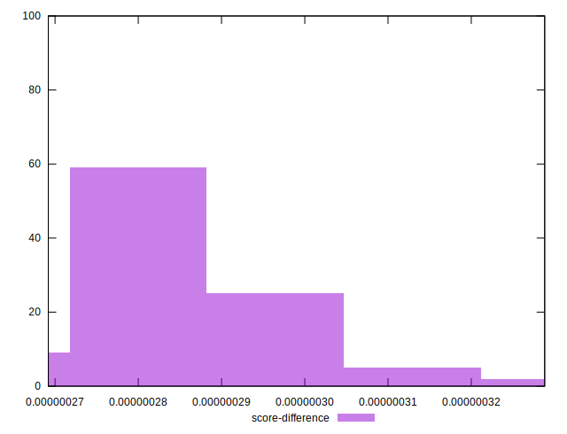

# //first-cpu-idle/samples/empty

[→ Parent](../..)


## Raw


```yaml
p90min: 625.20675
p90max: 631.29395
p90range: 6.087199999999939
p90mean: 628.121121978022
p90median: 628.20435
p90stdev: 1.3320611023920694
p90skewness: -0.08782431916081142
p90eccentricity: 1
p90discretization: 1
outlandishness: 1.0011125661661102
confidence: 0.8043109651684972
p90confidence: 0.5473706881984981

```


## Score


```yaml
p90min: 0.9999996999950614
p90max: 0.9999997305941051
p90range: 3.0599043632228984e-8
p90mean: 0.9999997162341753
p90median: 0.9999997158852205
p90stdev: 6.67660898027167e-9
p90skewness: 0.017882136704461583
p90eccentricity: 0.9999999999999991
p90discretization: 1
outlandishness: 0.9999999962923469
confidence: 4.148738241838146e-9
p90confidence: 2.743552940387417e-9

```


## Raw Estimate


## Score Estimate


## P Score


```yaml
p90min: 0.9999996999950614
p90max: 0.9999997305941051
p90range: 3.0599043632228984e-8
p90mean: 0.9999997162341753
p90median: 0.9999997158852205
p90stdev: 6.67660898027167e-9
p90skewness: 0.017882136704461583
p90eccentricity: 0.9999999999999991
p90discretization: 1
outlandishness: 0.9999999962923469
confidence: 4.148738241838146e-9
p90confidence: 2.743552940387417e-9

```


## Score Difference


```yaml
p90min: 2.69405894925967e-7
p90max: 3.00004938558196e-7
p90range: 3.0599043632228984e-8
p90mean: 2.837658242570685e-7
p90median: 2.841147794807597e-7
p90stdev: 6.67660898027165e-9
p90skewness: -0.017882374620591165
p90eccentricity: 1
p90discretization: 1
outlandishness: 1.0131085668552577
confidence: 4.148738171353887e-9
p90confidence: 2.7435528639040477e-9

```


## P Score Difference


```yaml
p90min: 0
p90max: 0
p90range: 0
p90mean: 0
p90median: 0
p90stdev: 0
p90skewness: .nan
p90eccentricity: .nan
p90discretization: 91
outlandishness: .nan
confidence: 0
p90confidence: 0

```

