# //first-cpu-idle/samples/pages+cached+noexternal+nocss

[→ Parent](../..)


## Raw


```yaml
p90min: 1665.2136999999998
p90max: 1670.5841999999998
p90range: 5.370499999999993
p90mean: 1668.1580043956042
p90median: 1668.2639
p90stdev: 1.267550657106961
p90skewness: -0.34557371829790234
p90eccentricity: 1
p90discretization: 1
outlandishness: 1.0000012284264546
confidence: 0.663741319309338
p90confidence: 0.520862049241714

```

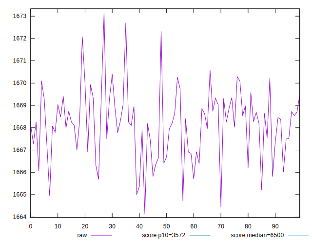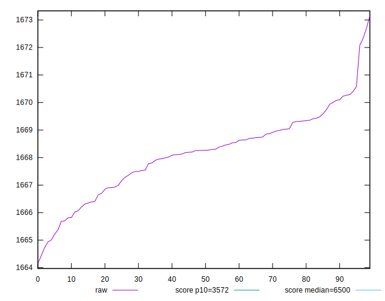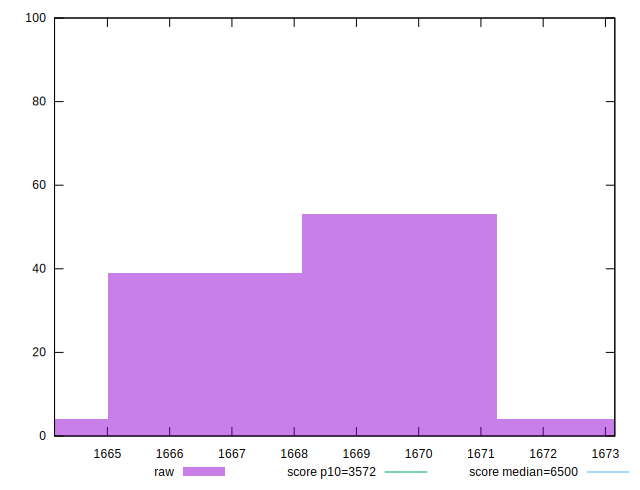
## Score


```yaml
p90min: 0.9981831480638936
p90max: 0.9982227963317172
p90range: 0.00003964826782354436
p90mean: 0.9982011238348962
p90median: 0.998200359901739
p90stdev: 0.000009358991752421439
p90skewness: 0.3372281268403259
p90eccentricity: 0.9999999999999999
p90discretization: 1
outlandishness: 0.9999999555487011
confidence: 0.000004905959801959625
p90confidence: 0.000003845797874602042

```

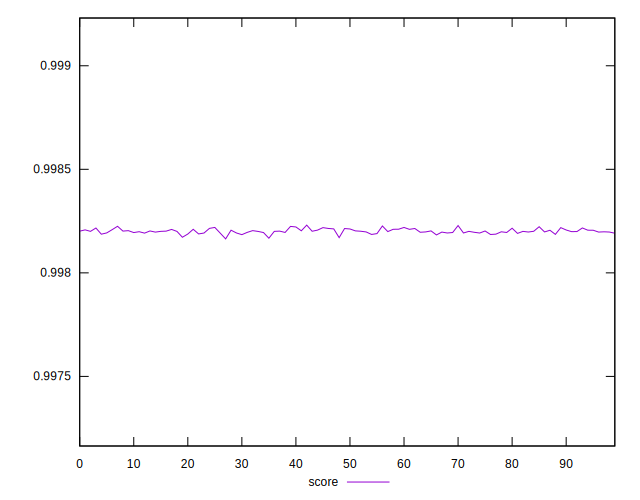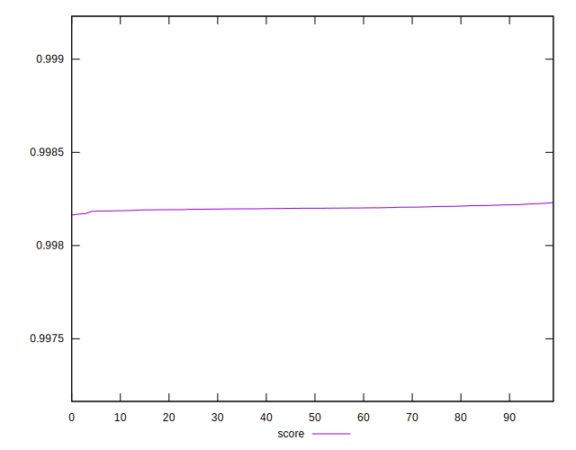
## Raw Estimate

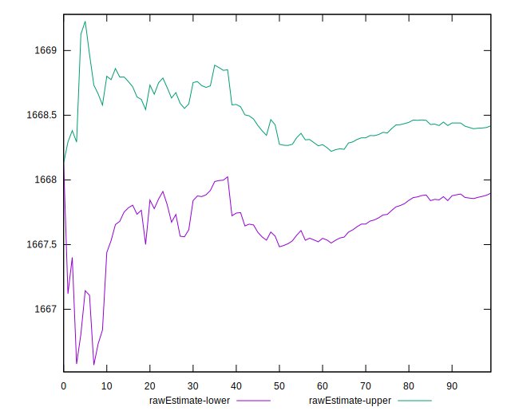
## Score Estimate

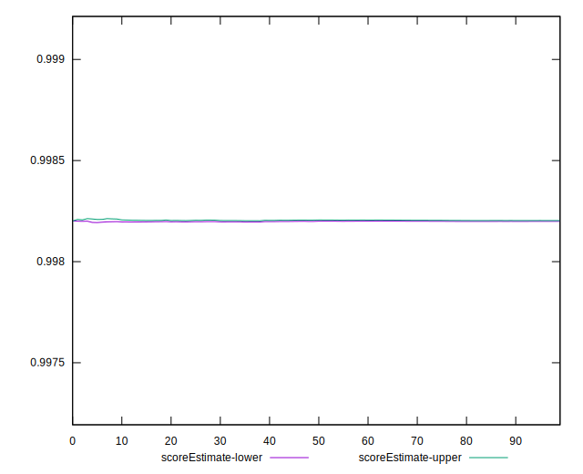
## P Score


```yaml
p90min: 0.9981831480638936
p90max: 0.9982227963317172
p90range: 0.00003964826782354436
p90mean: 0.9982011238348962
p90median: 0.998200359901739
p90stdev: 0.000009358991752421439
p90skewness: 0.3372281268403259
p90eccentricity: 0.9999999999999999
p90discretization: 1
outlandishness: 0.9999999555487011
confidence: 0.000004905959801959625
p90confidence: 0.000003845797874602042

```

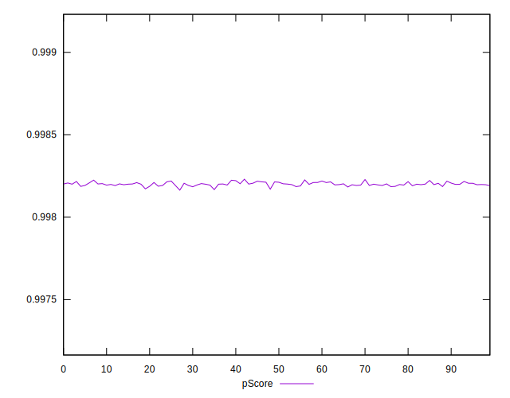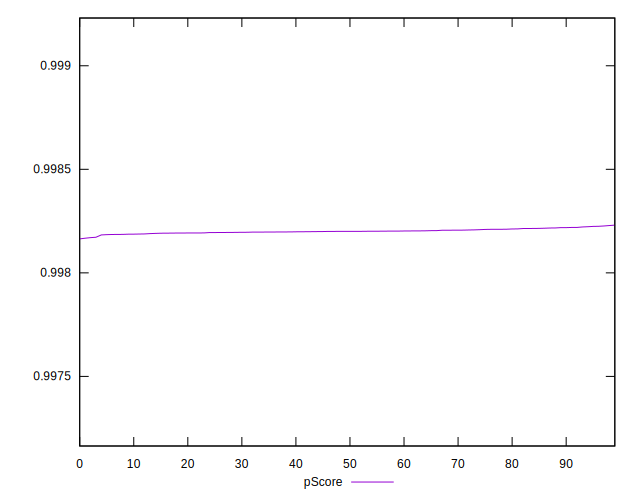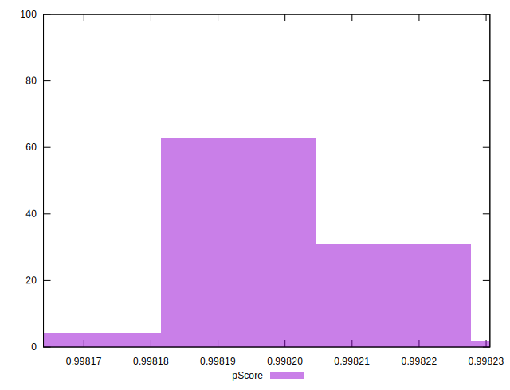
## Score Difference


```yaml
p90min: 0.001777203668282823
p90max: 0.0018168519361063673
p90range: 0.00003964826782354436
p90mean: 0.0017988761651035992
p90median: 0.0017996400982609462
p90stdev: 0.000009358991752421439
p90skewness: -0.3372281268927345
p90eccentricity: 1.0000000000000002
p90discretization: 1
outlandishness: 1.0000246662955434
confidence: 0.00000490595980203682
p90confidence: 0.000003845797874562143

```

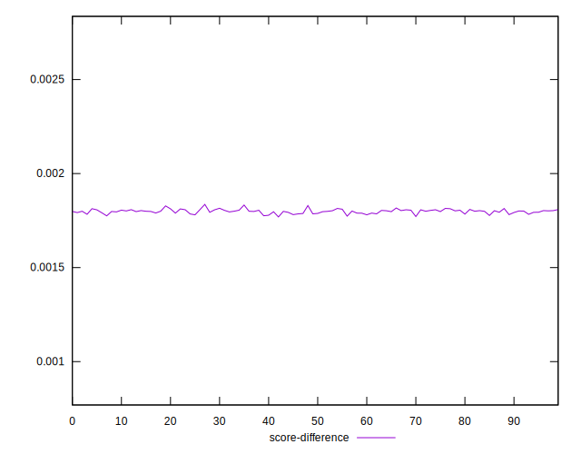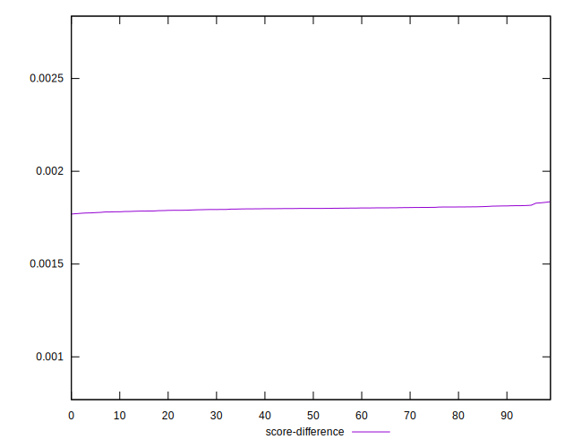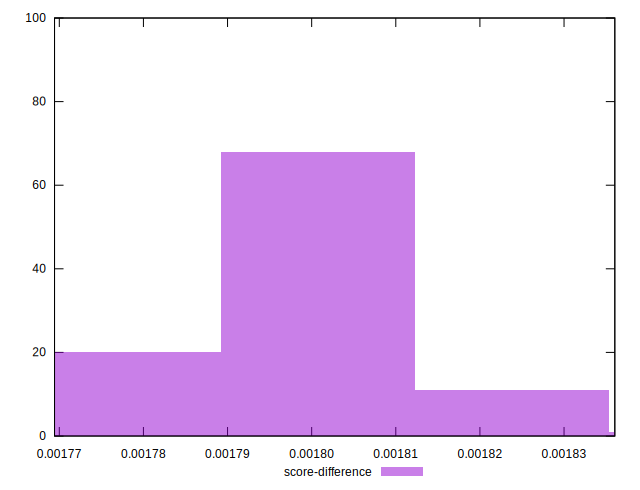
## P Score Difference


```yaml
p90min: 0
p90max: 0
p90range: 0
p90mean: 0
p90median: 0
p90stdev: 0
p90skewness: .nan
p90eccentricity: .nan
p90discretization: 91
outlandishness: .nan
confidence: 0
p90confidence: 0

```

