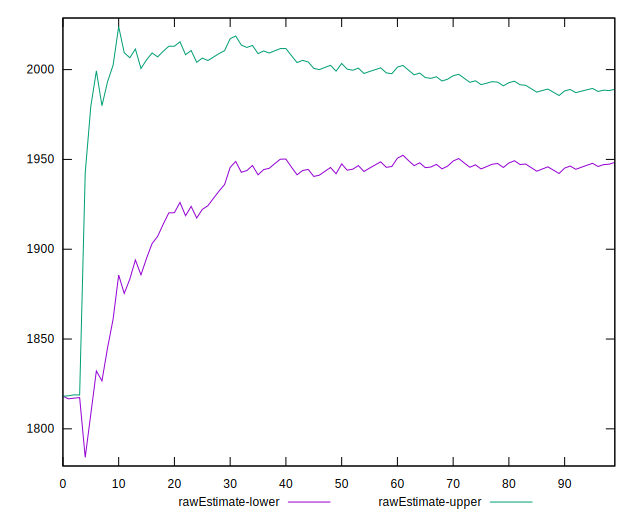

# //first-cpu-idle/samples/pages+cached+noexternal+noimg

[→ Parent](../..)


## Raw


```yaml
p90min: 1816.7107999999996
p90max: 2050.66715
p90range: 233.9563500000006
p90mean: 1968.702523626373
p90median: 2043.8113499999997
p90stdev: 98.96706850308051
p90skewness: -0.7407006475096194
p90eccentricity: 0.9999999999999997
p90discretization: 1
outlandishness: 0.9860374378698534
confidence: 40.80576058579845
p90confidence: 40.6675581910099

```


## Score


```yaml
p90min: 0.9932353217589898
p90max: 0.996822020714211
p90range: 0.0035866989552212347
p90mean: 0.9945406063447365
p90median: 0.9933696647512789
p90stdev: 0.0015129196689169589
p90skewness: 0.6701173220119396
p90eccentricity: 0.9999999999999991
p90discretization: 1
outlandishness: 1.0004155296951267
confidence: 0.0006215951615988757
p90confidence: 0.0006216891093635546

```


## Raw Estimate


## Score Estimate


## P Score


```yaml
p90min: 0.9932353217589898
p90max: 0.996822020714211
p90range: 0.0035866989552212347
p90mean: 0.9945406063447365
p90median: 0.9933696647512789
p90stdev: 0.0015129196689169589
p90skewness: 0.6701173220119396
p90eccentricity: 0.9999999999999991
p90discretization: 1
outlandishness: 1.0004155296951267
confidence: 0.0006215951615988757
p90confidence: 0.0006216891093635546

```


## Score Difference


```yaml
p90min: -0.004746439206810171
p90max: 0.0031976450421904445
p90range: 0.007944084249000616
p90mean: -0.0016875629017163685
p90median: -0.0033079838568998987
p90stdev: 0.0031164483774855857
p90skewness: 0.8630490899288764
p90eccentricity: 0.9999999999999996
p90discretization: 1
outlandishness: 0.5462142585950293
confidence: 0.0012881455949295606
p90confidence: 0.001280611294824084

```


## P Score Difference


```yaml
p90min: 0
p90max: 0
p90range: 0
p90mean: 0
p90median: 0
p90stdev: 0
p90skewness: .nan
p90eccentricity: .nan
p90discretization: 91
outlandishness: .nan
confidence: 0
p90confidence: 0

```

