# //first-cpu-idle/samples/pages+cached+noexternal+nosvg

[→ Parent](../..)


## Raw


```yaml
p90min: 1816.1404000000002
p90max: 1823.5164
p90range: 7.375999999999749
p90mean: 1818.9417131868129
p90median: 1818.8148
p90stdev: 1.6868265423575513
p90skewness: 0.3583482763388381
p90eccentricity: 1.0000000000000007
p90discretization: 1
outlandishness: 1.0151030179432818
confidence: 21.413109095362415
p90confidence: 0.693150940076066

```

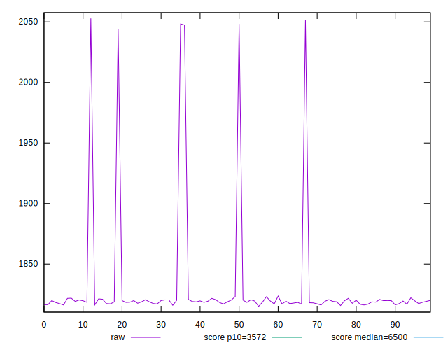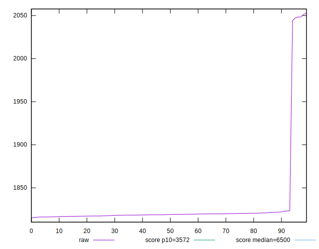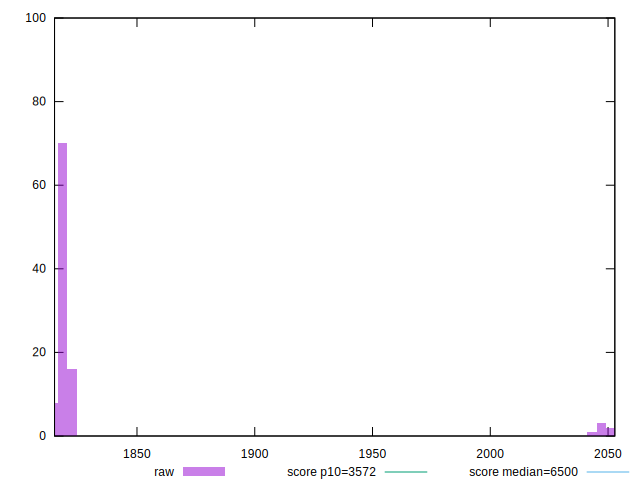
## Score


```yaml
p90min: 0.9967440434023507
p90max: 0.996828492387632
p90range: 0.00008444898528137124
p90mean: 0.9967965712543628
p90median: 0.9967980638415099
p90stdev: 0.00001928277385620116
p90skewness: -0.36929579167015913
p90eccentricity: 1.0000000000000002
p90discretization: 1
outlandishness: 0.9995782579347117
confidence: 0.0003282204215957485
p90confidence: 0.00000792367945967598

```

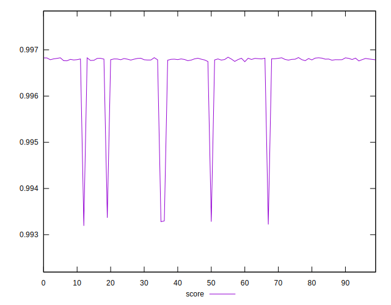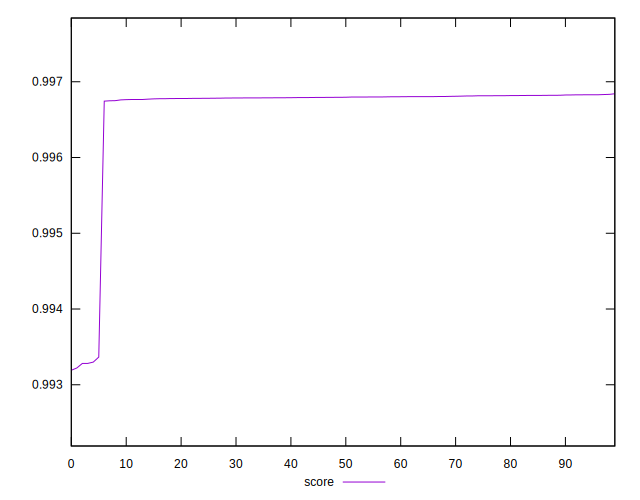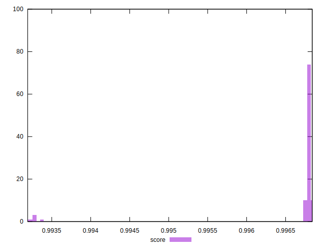
## Raw Estimate

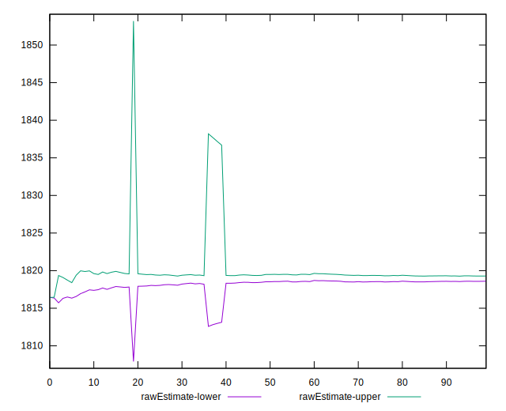
## Score Estimate

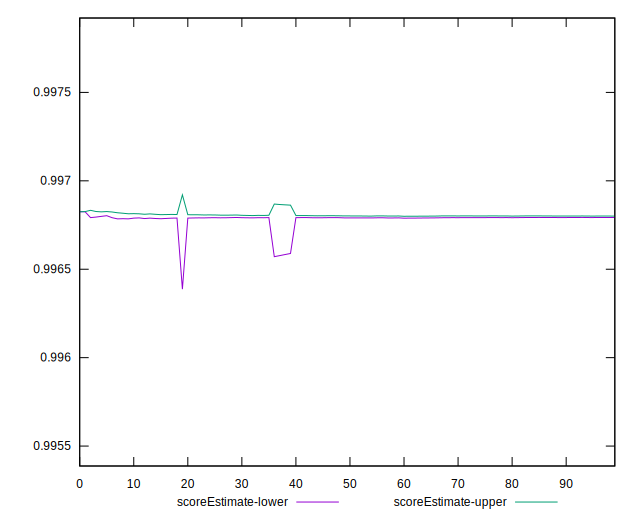
## P Score


```yaml
p90min: 0.9967440434023507
p90max: 0.996828492387632
p90range: 0.00008444898528137124
p90mean: 0.9967965712543628
p90median: 0.9967980638415099
p90stdev: 0.00001928277385620116
p90skewness: -0.36929579167015913
p90eccentricity: 1.0000000000000002
p90discretization: 1
outlandishness: 0.9995782579347117
confidence: 0.0003282204215957485
p90confidence: 0.00000792367945967598

```

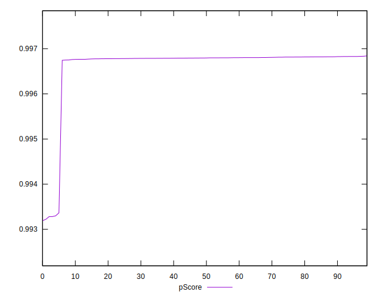
## Score Difference


```yaml
p90min: 0.0031585395116575654
p90max: 0.003239473294778028
p90range: 0.00008093378312046262
p90mean: 0.003200538689637259
p90median: 0.003201276234354178
p90stdev: 0.00001830350072180113
p90skewness: -0.04945786822412042
p90eccentricity: 1.0000000000000009
p90discretization: 1
outlandishness: 0.7728458555954303
confidence: 0.0006029168599671229
p90confidence: 0.000007521276440353164

```

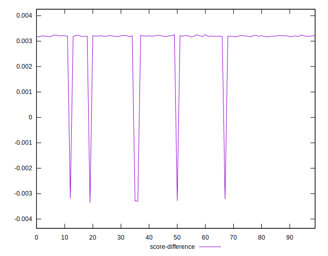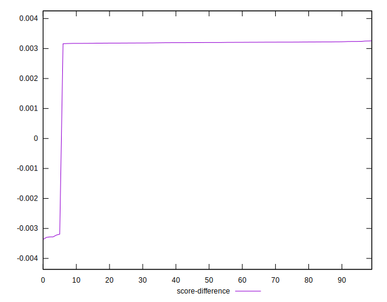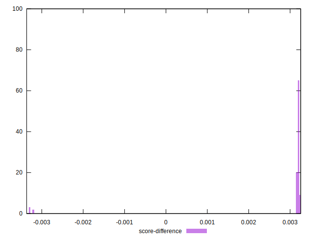
## P Score Difference


```yaml
p90min: 0
p90max: 0
p90range: 0
p90mean: 0
p90median: 0
p90stdev: 0
p90skewness: .nan
p90eccentricity: .nan
p90discretization: 91
outlandishness: .nan
confidence: 0
p90confidence: 0

```

