# //first-cpu-idle/samples/pages

[→ Parent](../..)


## Raw


```yaml
p90min: 1945.1764999999998
p90max: 2069.29
p90range: 124.11350000000016
p90mean: 1960.350219780219
p90median: 1952.1359999999997
p90stdev: 25.49237858689594
p90skewness: 2.7862943267015137
p90eccentricity: 1.0000000000000002
p90discretization: 1
outlandishness: 1.0788512081992623
confidence: 167.9448682786974
p90confidence: 10.475330888249573

```

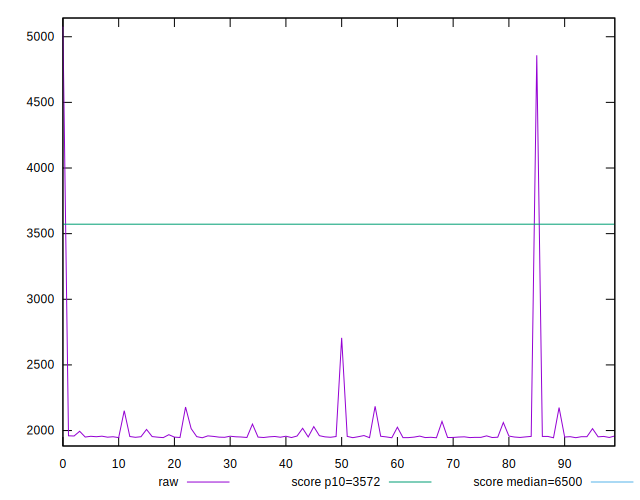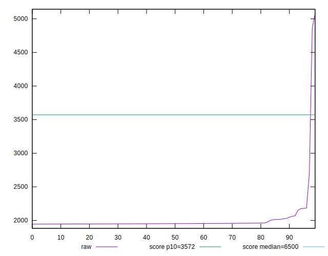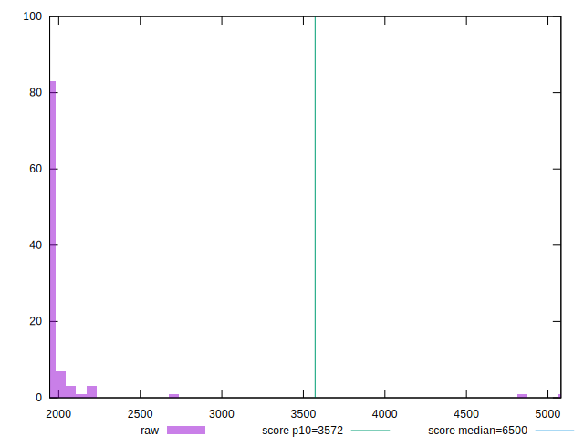
## Score


```yaml
p90min: 0.9902054559997523
p90max: 0.995087227320148
p90range: 0.004881771320395689
p90mean: 0.9946412241556873
p90median: 0.9949731533784785
p90stdev: 0.0009937901068743382
p90skewness: -3.352944536473413
p90eccentricity: 0.9999999999999993
p90discretization: 1
outlandishness: 0.9884293337504945
confidence: 0.015273861809950162
p90confidence: 0.00040836833516699755

```

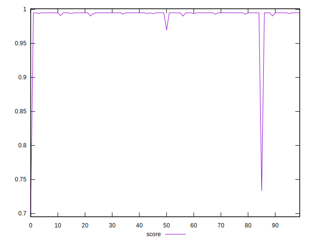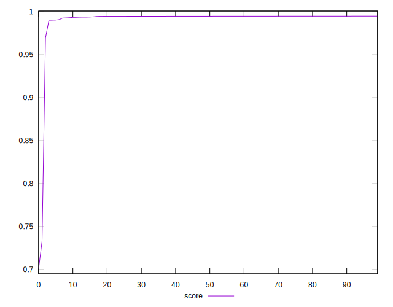
## Raw Estimate

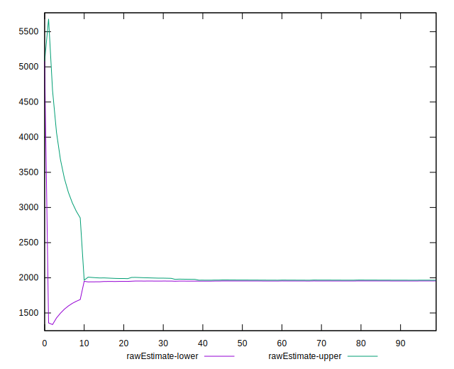
## Score Estimate

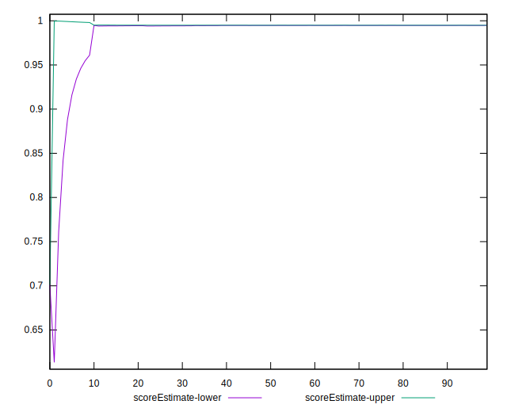
## P Score


```yaml
p90min: 0.9902054559997523
p90max: 0.995087227320148
p90range: 0.004881771320395689
p90mean: 0.9946412241556873
p90median: 0.9949731533784785
p90stdev: 0.0009937901068743382
p90skewness: -3.352944536473413
p90eccentricity: 0.9999999999999993
p90discretization: 1
outlandishness: 0.9884293337504945
confidence: 0.015273861809950162
p90confidence: 0.00040836833516699755

```

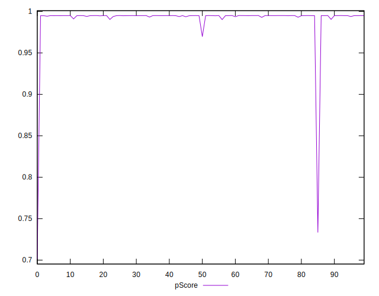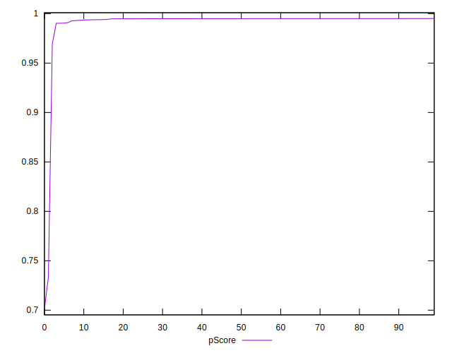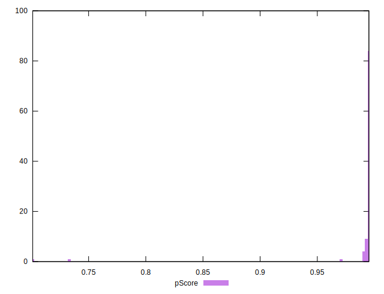
## Score Difference


```yaml
p90min: -0.004996197287148174
p90max: 0.004976645425180504
p90range: 0.009972842712328678
p90mean: -0.000900040279825038
p90median: -0.0038736600338692417
p90stdev: 0.004539988443460983
p90skewness: 0.42721023774690475
p90eccentricity: 0.9999999999999993
p90discretization: 1
outlandishness: 0.16913515995815617
confidence: 0.0018216276053642383
p90confidence: 0.0018655725283528584

```

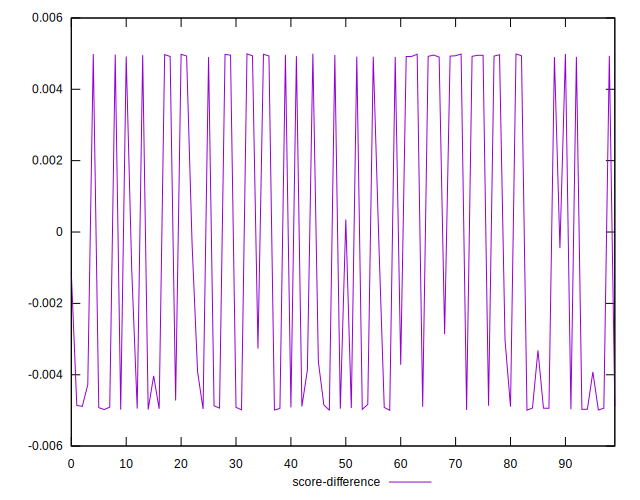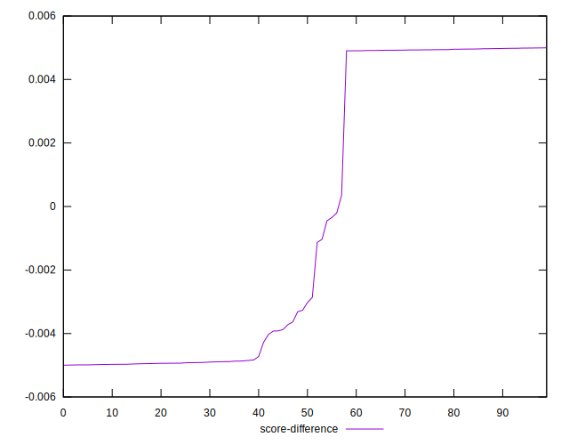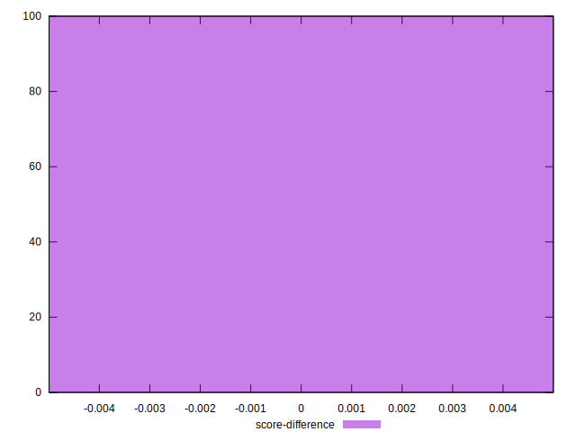
## P Score Difference


```yaml
p90min: 0
p90max: 0
p90range: 0
p90mean: 0
p90median: 0
p90stdev: 0
p90skewness: .nan
p90eccentricity: .nan
p90discretization: 91
outlandishness: .nan
confidence: 0
p90confidence: 0

```

