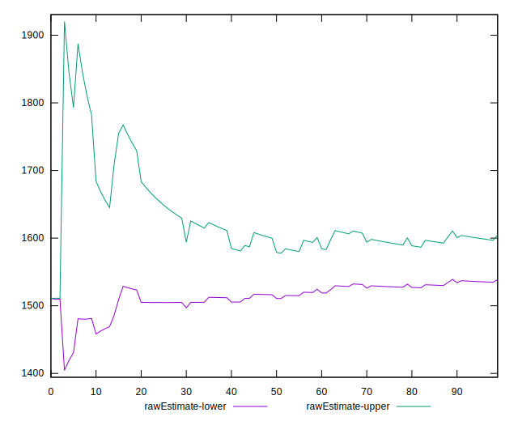

# //first-meaningful-paint/samples/pages+cached+noexternal+nofonts+nosvg+noimg

[→ Parent](../..)


## Raw


```yaml
p90min: 1508.0034
p90max: 2117.3809500000007
p90range: 609.3775500000006
p90mean: 1571.7963252747245
p90median: 1510.3378
p90stdev: 159.99083897558123
p90skewness: 2.512672186359603
p90eccentricity: 1
p90discretization: 1
outlandishness: 1.0637104652967722
confidence: 85.7609710460797
p90confidence: 65.74345236734416

```


## Score


```yaml
p90min: 0.9351994674345541
p90max: 0.9899467495008307
p90range: 0.05474728206627666
p90mean: 0.9849817901657817
p90median: 0.9898476408385009
p90stdev: 0.013427326589156602
p90skewness: -2.908057587829031
p90eccentricity: 1.0000000000000002
p90discretization: 1
outlandishness: 0.9908672107721406
confidence: 0.007535702471522354
p90confidence: 0.0055175584532669575

```


## Raw Estimate


## Score Estimate


## P Score


```yaml
p90min: 0.9351994674345541
p90max: 0.9899467495008307
p90range: 0.05474728206627666
p90mean: 0.9849817901657817
p90median: 0.9898476408385009
p90stdev: 0.013427326589156602
p90skewness: -2.908057587829031
p90eccentricity: 1.0000000000000002
p90discretization: 1
outlandishness: 0.9908672107721406
confidence: 0.007535702471522354
p90confidence: 0.0055175584532669575

```


## Score Difference


```yaml
p90min: -0.0029527865994192215
p90max: 0.004800532565445992
p90range: 0.007753319164865213
p90mean: 0.0002929351089436938
p90median: 0.00014310417787855023
p90stdev: 0.0011347327715851693
p90skewness: 2.493280214553244
p90eccentricity: 1.0000000000000004
p90discretization: 1
outlandishness: 1.2410890063426794
confidence: 0.0007014918062630414
p90confidence: 0.00046628450976346264

```


## P Score Difference


```yaml
p90min: 0
p90max: 0
p90range: 0
p90mean: 0
p90median: 0
p90stdev: 0
p90skewness: .nan
p90eccentricity: .nan
p90discretization: 91
outlandishness: .nan
confidence: 0
p90confidence: 0

```

