# //first-meaningful-paint/samples/pages+cached+noexternal+noimg

[→ Parent](../..)


## Raw


```yaml
p90min: 1816.7107999999996
p90max: 2050.66715
p90range: 233.9563500000006
p90mean: 1968.702523626373
p90median: 2043.8113499999997
p90stdev: 98.96706850308051
p90skewness: -0.7407006475096194
p90eccentricity: 0.9999999999999997
p90discretization: 1
outlandishness: 0.9860374378698534
confidence: 40.80576058579845
p90confidence: 40.6675581910099

```

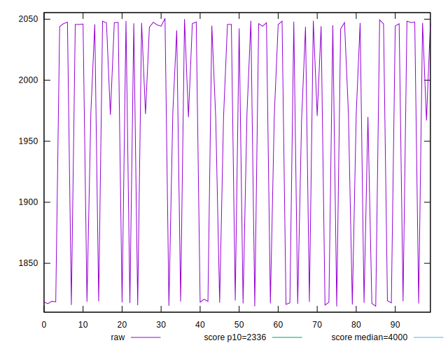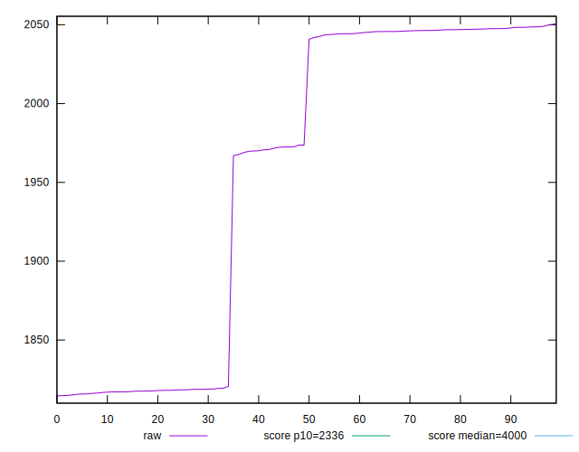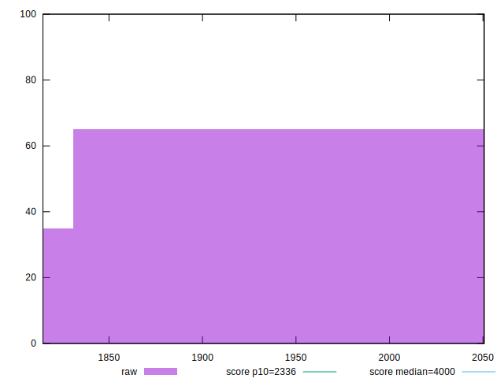
## Score


```yaml
p90min: 0.9443030417368379
p90max: 0.9699865397924918
p90range: 0.025683498055653953
p90mean: 0.9535370295015204
p90median: 0.9451938599750356
p90stdev: 0.010842231191209431
p90skewness: 0.693279437679504
p90eccentricity: 1.0000000000000004
p90discretization: 1
outlandishness: 1.0031287825589421
confidence: 0.004459739959388642
p90confidence: 0.004455290780641441

```

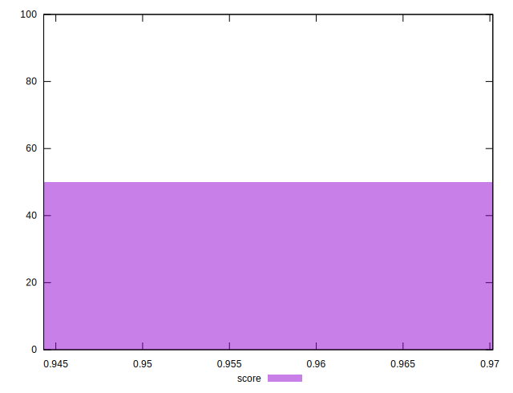
## Raw Estimate

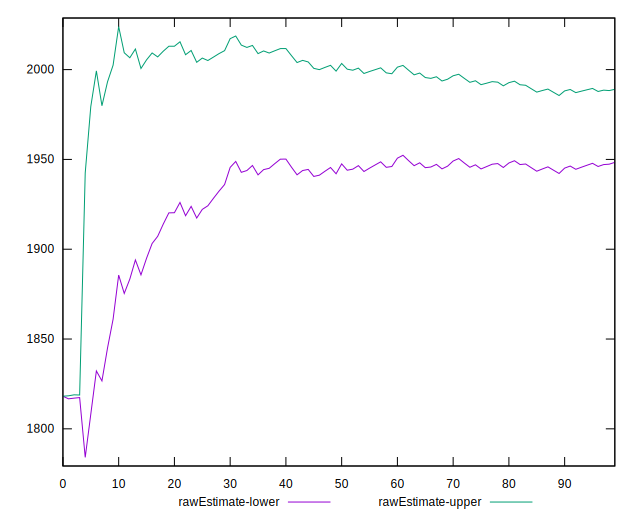
## Score Estimate

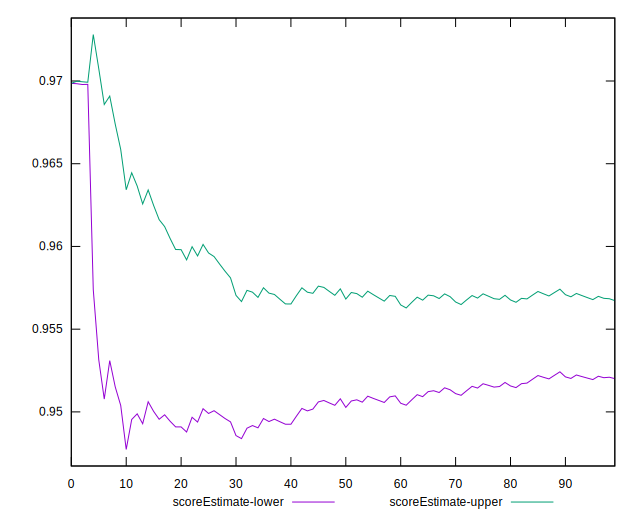
## P Score


```yaml
p90min: 0.9443030417368379
p90max: 0.9699865397924918
p90range: 0.025683498055653953
p90mean: 0.9535370295015204
p90median: 0.9451938599750356
p90stdev: 0.010842231191209431
p90skewness: 0.693279437679504
p90eccentricity: 1.0000000000000004
p90discretization: 1
outlandishness: 1.0031287825589421
confidence: 0.004459739959388642
p90confidence: 0.004455290780641441

```

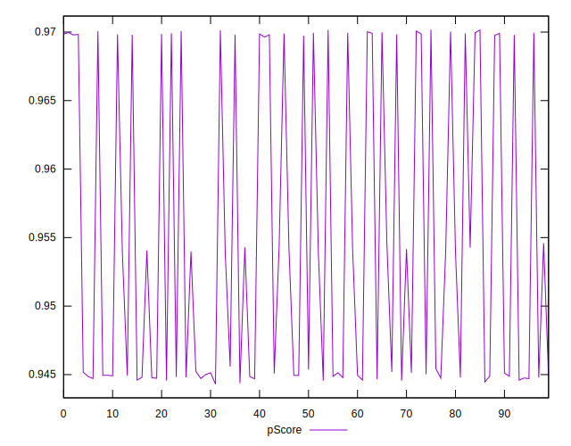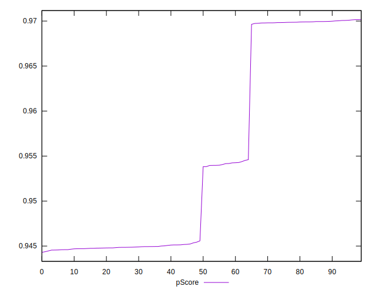
## Score Difference


```yaml
p90min: -0.004956246087355454
p90max: 0.004762470115288964
p90range: 0.009718716202644417
p90mean: -0.0023820968413895316
p90median: -0.004063690782516005
p90stdev: 0.0026990063239798433
p90skewness: 0.72781810794439
p90eccentricity: 1.0000000000000002
p90discretization: 1
outlandishness: 0.5259594293914479
confidence: 0.0012977865192708767
p90confidence: 0.0011090759623231415

```

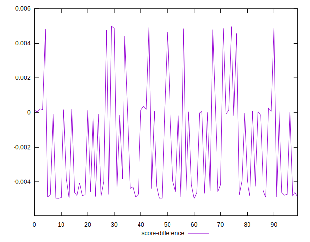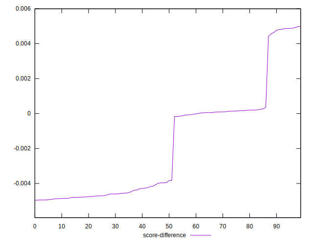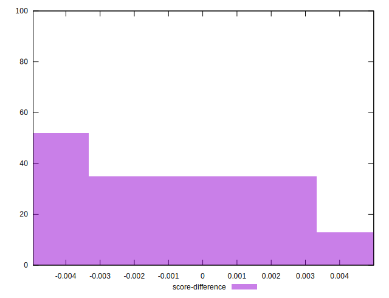
## P Score Difference


```yaml
p90min: 0
p90max: 0
p90range: 0
p90mean: 0
p90median: 0
p90stdev: 0
p90skewness: .nan
p90eccentricity: .nan
p90discretization: 91
outlandishness: .nan
confidence: 0
p90confidence: 0

```

