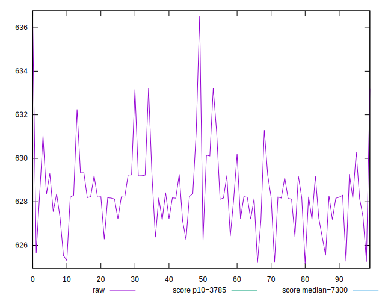
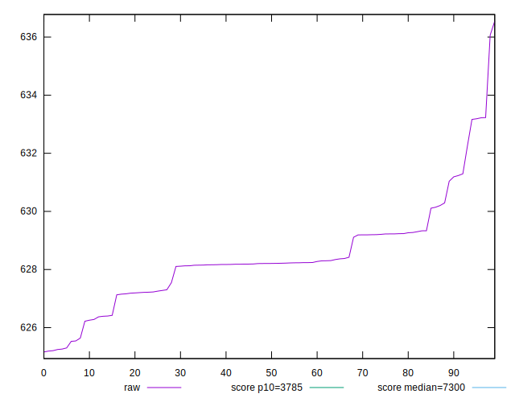
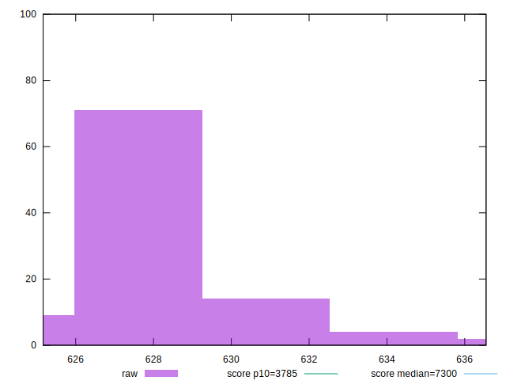
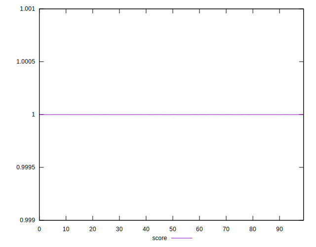
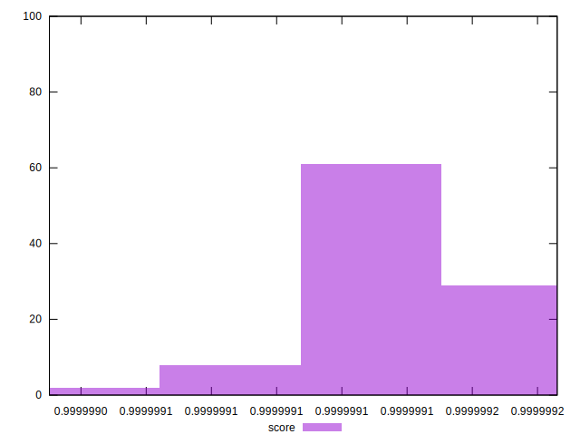
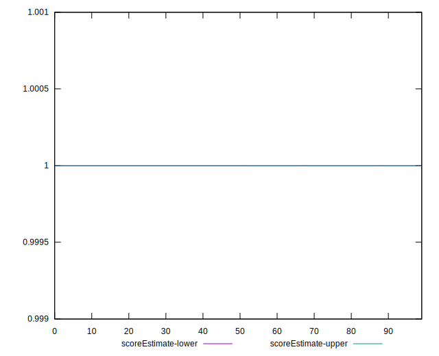
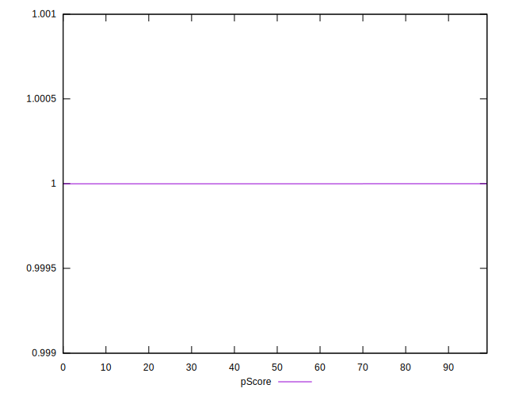
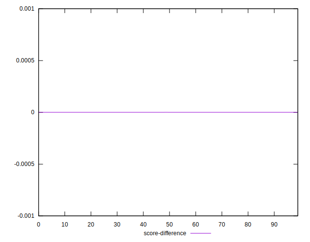
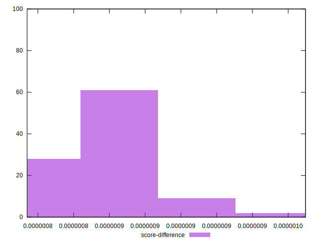

# //interactive/samples/empty

[→ Parent](../..)


## Raw


```yaml
p90min: 625.20675
p90max: 631.29395
p90range: 6.087199999999939
p90mean: 628.121121978022
p90median: 628.20435
p90stdev: 1.3320611023920694
p90skewness: -0.08782431916081142
p90eccentricity: 1
p90discretization: 1
outlandishness: 1.0011125661661102
confidence: 0.8043109651684972
p90confidence: 0.5473706881984981

```


## Score


```yaml
p90min: 0.9999991050872981
p90max: 0.9999991854636331
p90range: 8.037633503210628e-8
p90mean: 0.9999991476361031
p90median: 0.9999991466937688
p90stdev: 1.7545055557152025e-8
p90skewness: 0.027799944341029916
p90eccentricity: 1.0000000000000002
p90discretization: 1
outlandishness: 0.9999999903350332
confidence: 1.0856999299591052e-8
p90confidence: 7.209616015302345e-9

```


## Raw Estimate


## Score Estimate


## P Score


```yaml
p90min: 0.9999991050872981
p90max: 0.9999991854636331
p90range: 8.037633503210628e-8
p90mean: 0.9999991476361031
p90median: 0.9999991466937688
p90stdev: 1.7545055557152025e-8
p90skewness: 0.027799944341029916
p90eccentricity: 1.0000000000000002
p90discretization: 1
outlandishness: 0.9999999903350332
confidence: 1.0856999299591052e-8
p90confidence: 7.209616015302345e-9

```


## Score Difference


```yaml
p90min: 8.145363669109784e-7
p90max: 8.949127019430847e-7
p90range: 8.037633503210628e-8
p90mean: 8.523638966520317e-7
p90median: 8.533062312299222e-7
p90stdev: 1.7545055557152025e-8
p90skewness: -0.027799900532903335
p90eccentricity: 1.0000000000000004
p90discretization: 1
outlandishness: 1.0113711487830284
confidence: 1.0856999228291419e-8
p90confidence: 7.209616073580753e-9

```


## P Score Difference


```yaml
p90min: 0
p90max: 0
p90range: 0
p90mean: 0
p90median: 0
p90stdev: 0
p90skewness: .nan
p90eccentricity: .nan
p90discretization: 91
outlandishness: .nan
confidence: 0
p90confidence: 0

```

