# //interactive/samples/pages+cached+noexternal+nosvg

[→ Parent](../..)


## Raw


```yaml
p90min: 1815.9042
p90max: 1823.5164
p90range: 7.61220000000003
p90mean: 1818.9149109890104
p90median: 1818.8148
p90stdev: 1.7152605995226635
p90skewness: 0.32714169268011695
p90eccentricity: 1.0000000000000002
p90discretization: 1
outlandishness: 1.019719994320418
confidence: 26.468409963723843
p90confidence: 0.7048350658346862

```

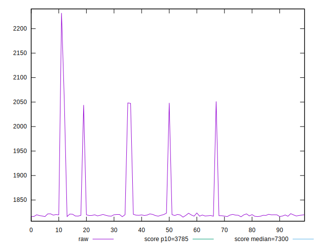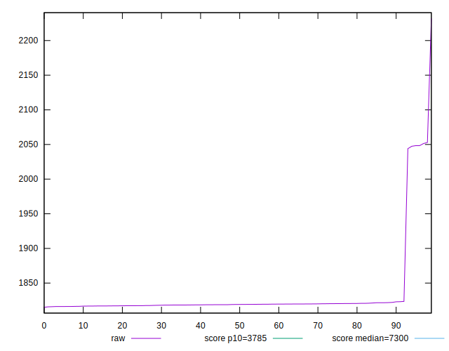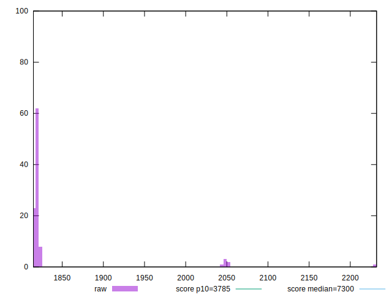
## Score


```yaml
p90min: 0.9965992431136814
p90max: 0.9966819174847706
p90range: 0.00008267437108921971
p90mean: 0.9966493584489091
p90median: 0.9966504811800735
p90stdev: 0.000018606455953039682
p90skewness: -0.33683497135900714
p90eccentricity: 0.9999999999999992
p90discretization: 1
outlandishness: 0.9994711473825081
confidence: 0.00040229024554139237
p90confidence: 0.000007645766835873147

```

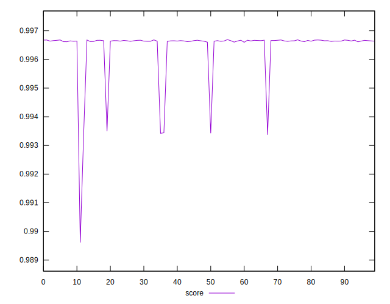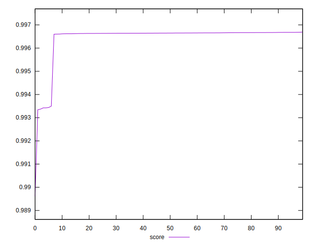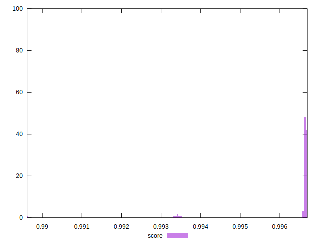
## Raw Estimate

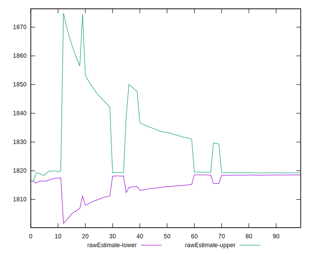
## Score Estimate

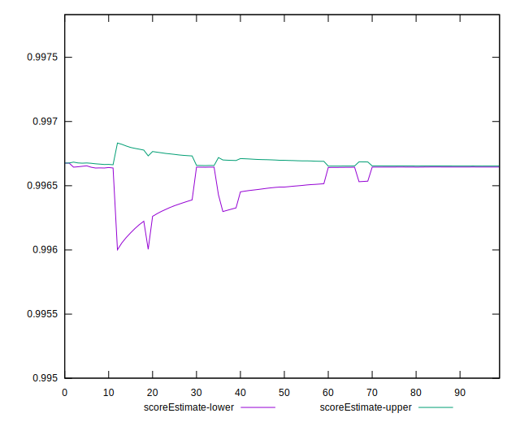
## P Score


```yaml
p90min: 0.9965992431136814
p90max: 0.9966819174847706
p90range: 0.00008267437108921971
p90mean: 0.9966493584489091
p90median: 0.9966504811800735
p90stdev: 0.000018606455953039682
p90skewness: -0.33683497135900714
p90eccentricity: 0.9999999999999992
p90discretization: 1
outlandishness: 0.9994711473825081
confidence: 0.00040229024554139237
p90confidence: 0.000007645766835873147

```

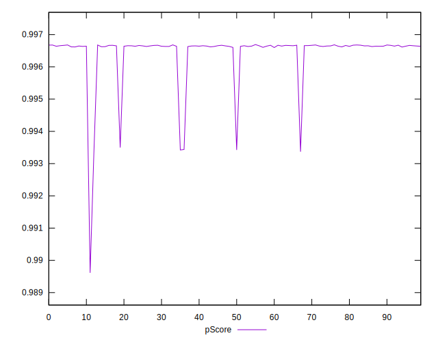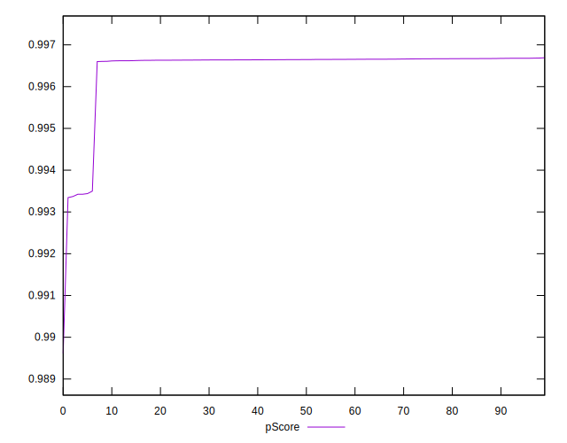
## Score Difference


```yaml
p90min: 0.0033083046985401543
p90max: 0.0033947074158483526
p90range: 0.00008640271730819826
p90mean: 0.0033487409009852415
p90median: 0.0033489141113864918
p90stdev: 0.00001803247024817328
p90skewness: 0.051742544246801525
p90eccentricity: 1.0000000000000002
p90discretization: 1
outlandishness: 0.7573220406387317
confidence: 0.0006375505231407093
p90confidence: 0.000007409904569643903

```

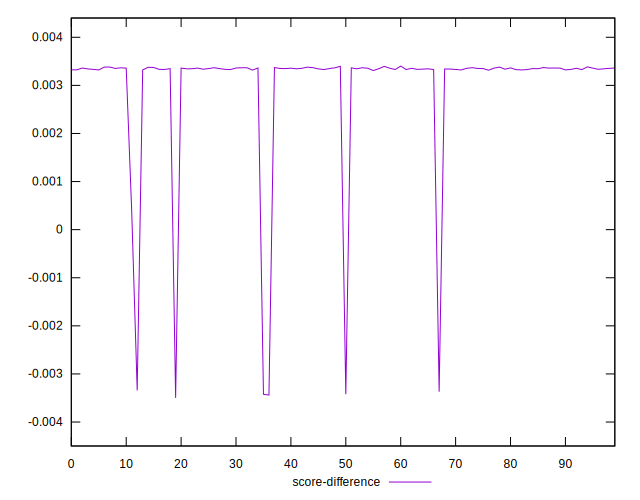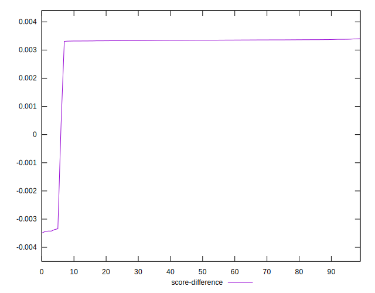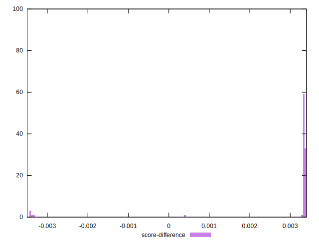
## P Score Difference


```yaml
p90min: 0
p90max: 0
p90range: 0
p90mean: 0
p90median: 0
p90stdev: 0
p90skewness: .nan
p90eccentricity: .nan
p90discretization: 91
outlandishness: .nan
confidence: 0
p90confidence: 0

```

