# //interactive/samples/pages+cached+nointeractive

[→ Parent](../..)


## Raw


```yaml
p90min: 10939.342299999997
p90max: 10977.644699999997
p90range: 38.30240000000049
p90mean: 10955.07514065934
p90median: 10953.1874
p90stdev: 9.772360704996954
p90skewness: 0.8619267696136578
p90eccentricity: 1
p90discretization: 1
outlandishness: 1.0004173002422108
confidence: 5.087803346905275
p90confidence: 4.0156594879990735

```

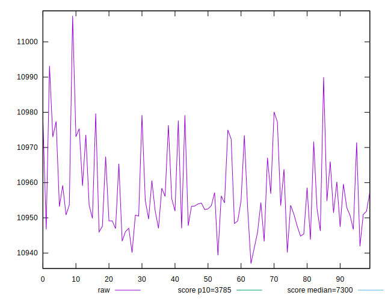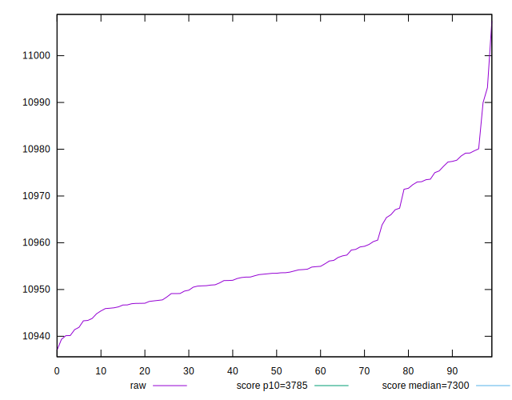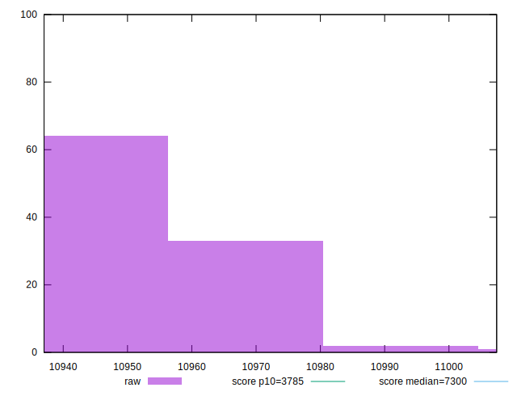
## Score


```yaml
p90min: 0.21300695063511488
p90max: 0.21499417432361845
p90range: 0.00198722368850357
p90mean: 0.21417635024474874
p90median: 0.21427381423169067
p90stdev: 0.0005069207689273001
p90skewness: -0.85796394973329
p90eccentricity: 0.9999999999999999
p90discretization: 1
outlandishness: 0.9988965145113877
confidence: 0.00026355920158493973
p90confidence: 0.00020830393564641447

```

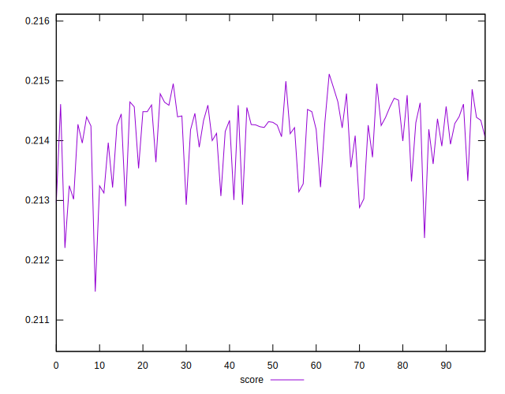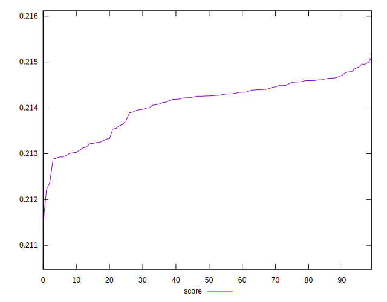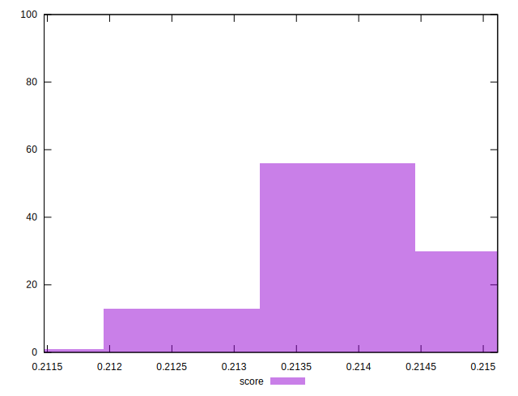
## Raw Estimate

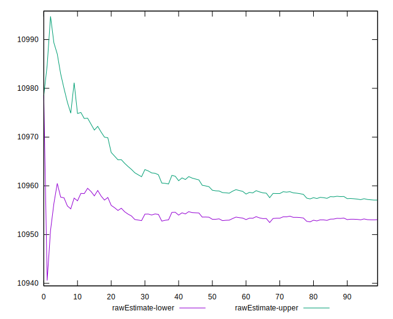
## Score Estimate

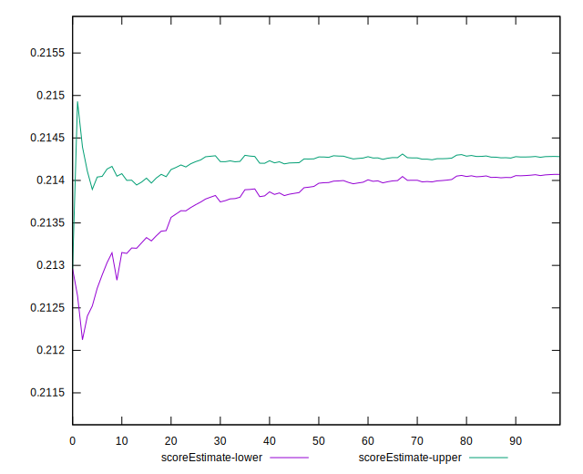
## P Score


```yaml
p90min: 0.21300695063511488
p90max: 0.21499417432361845
p90range: 0.00198722368850357
p90mean: 0.21417635024474874
p90median: 0.21427381423169067
p90stdev: 0.0005069207689273001
p90skewness: -0.85796394973329
p90eccentricity: 0.9999999999999999
p90discretization: 1
outlandishness: 0.9988965145113877
confidence: 0.00026355920158493973
p90confidence: 0.00020830393564641447

```

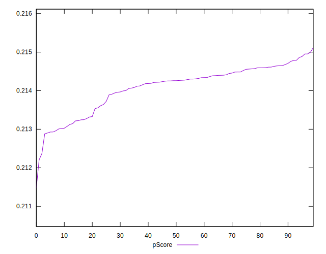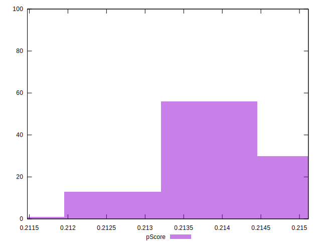
## Score Difference


```yaml
p90min: -0.0049531385722579035
p90max: -0.002960381030039566
p90range: 0.0019927575422183375
p90mean: -0.004154000867896249
p90median: -0.004269341695609025
p90stdev: 0.0005151382989130415
p90skewness: 0.8758192322635464
p90eccentricity: 1.0000000000000007
p90discretization: 1
outlandishness: 0.9079266332924497
confidence: 0.0004348532730508812
p90confidence: 0.00021168068393186655

```

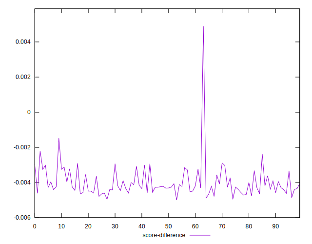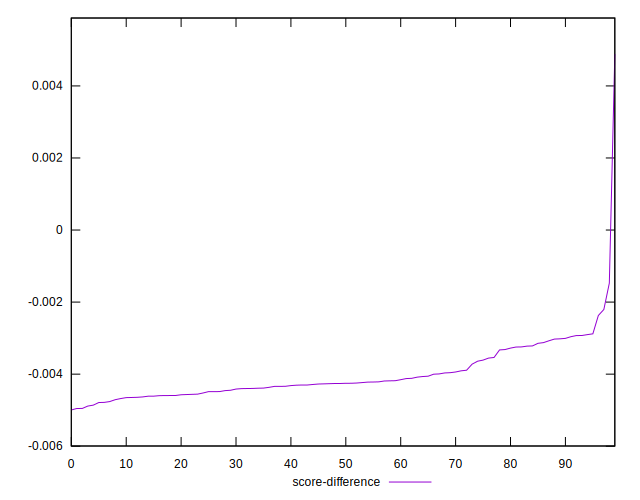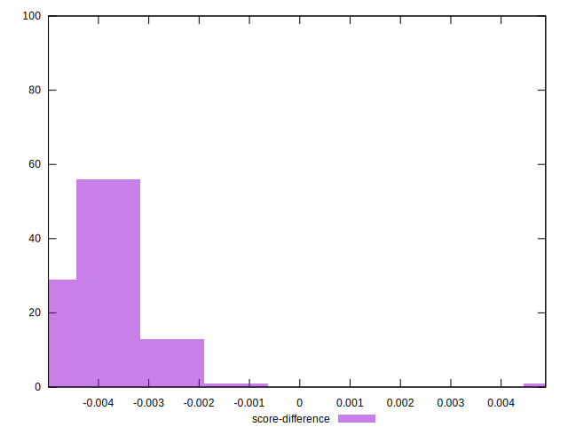
## P Score Difference


```yaml
p90min: 0
p90max: 0
p90range: 0
p90mean: 0
p90median: 0
p90stdev: 0
p90skewness: .nan
p90eccentricity: .nan
p90discretization: 91
outlandishness: .nan
confidence: 0
p90confidence: 0

```

