# //interactive/samples/pages+cached

[→ Parent](../..)


## Raw


```yaml
p90min: 10941.2228
p90max: 10989.744499999999
p90range: 48.52169999999933
p90mean: 10960.864767032961
p90median: 10959.496599999999
p90stdev: 12.738842929421015
p90skewness: 0.1898837666116518
p90eccentricity: 1.0000000000000013
p90discretization: 1
outlandishness: 1.0013119707059865
confidence: 21.937109786591463
p90confidence: 5.234646675446129

```

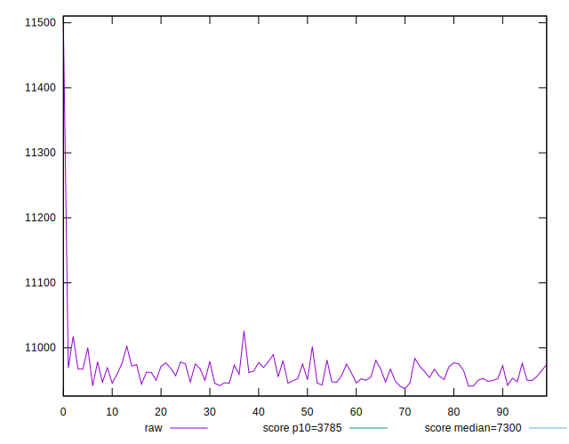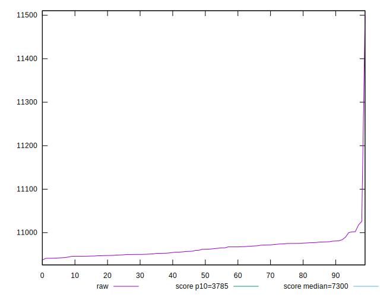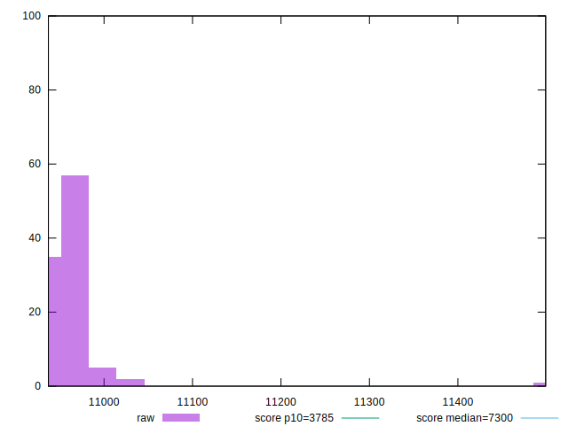
## Score


```yaml
p90min: 0.2123828521005181
p90max: 0.21489619598741816
p90range: 0.0025133438869000546
p90mean: 0.21387633618491347
p90median: 0.21394631441612438
p90stdev: 0.0006603731231233425
p90skewness: -0.1868464430111399
p90eccentricity: 0.9999999999999997
p90discretization: 1
outlandishness: 0.996682167459271
confidence: 0.0010747076395681288
p90confidence: 0.00027136059316096306

```

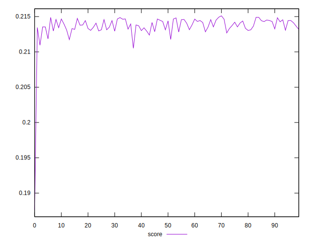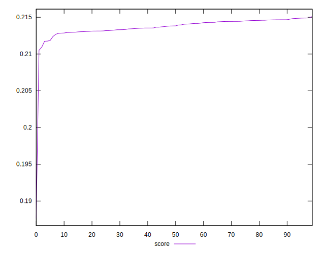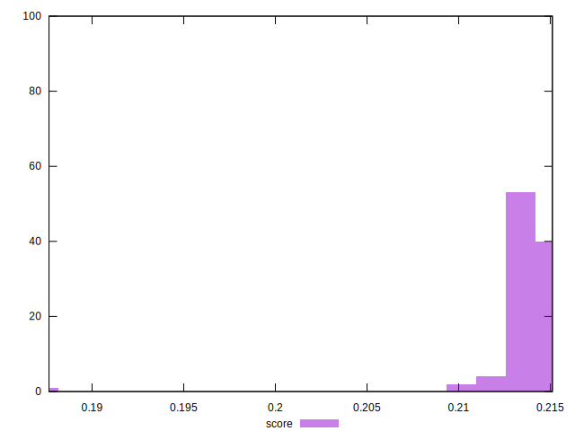
## Raw Estimate

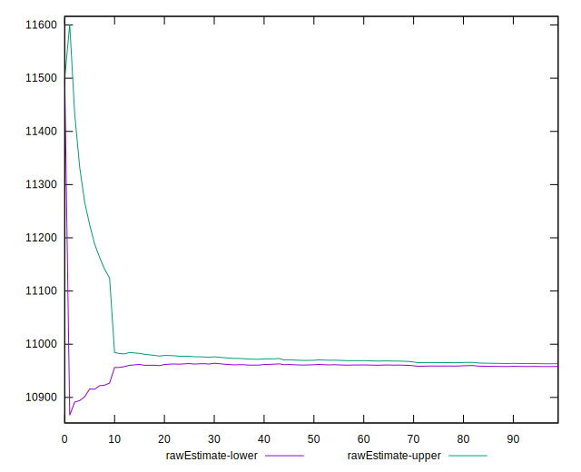
## Score Estimate

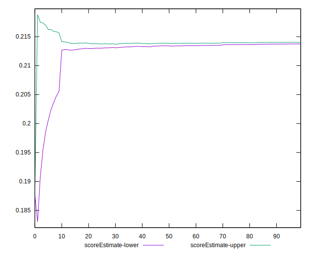
## P Score


```yaml
p90min: 0.2123828521005181
p90max: 0.21489619598741816
p90range: 0.0025133438869000546
p90mean: 0.21387633618491347
p90median: 0.21394631441612438
p90stdev: 0.0006603731231233425
p90skewness: -0.1868464430111399
p90eccentricity: 0.9999999999999997
p90discretization: 1
outlandishness: 0.996682167459271
confidence: 0.0010747076395681288
p90confidence: 0.00027136059316096306

```

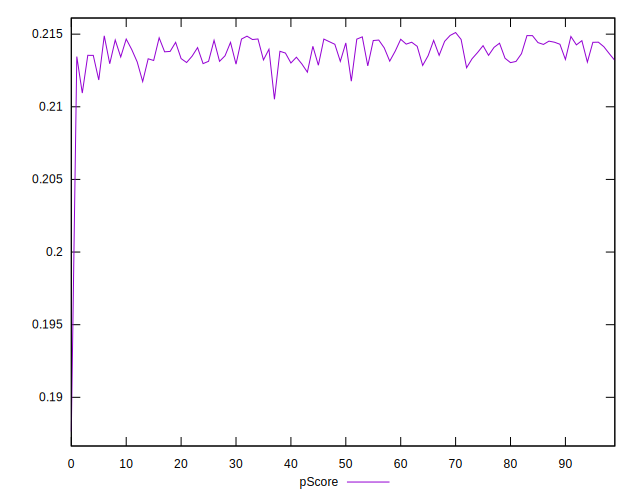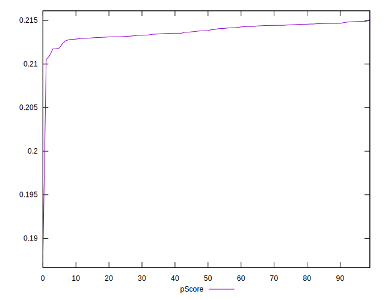
## Score Difference


```yaml
p90min: -0.004896195987418167
p90max: -0.0023828521005181125
p90range: 0.0025133438869000546
p90mean: -0.003876336184913572
p90median: -0.003946314416124391
p90stdev: 0.0006603731231233423
p90skewness: 0.18684644301092748
p90eccentricity: 1.0000000000000004
p90discretization: 1
outlandishness: 0.8727128681719413
confidence: 0.0005316929430638955
p90confidence: 0.0002713605931609622

```

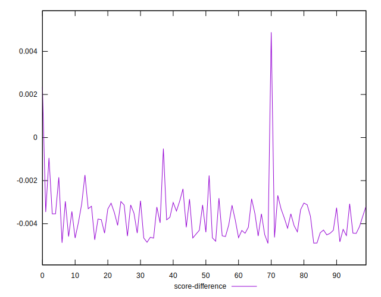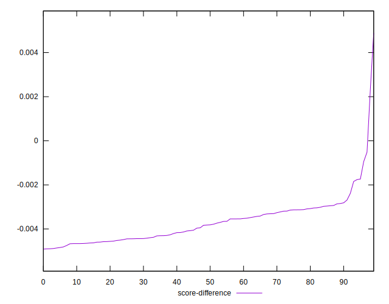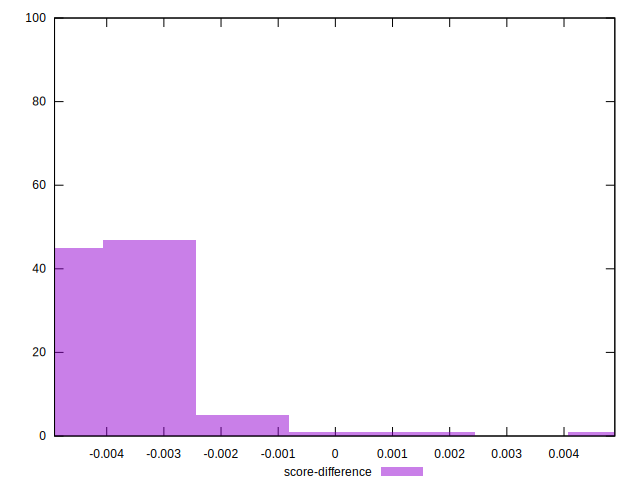
## P Score Difference


```yaml
p90min: 0
p90max: 0
p90range: 0
p90mean: 0
p90median: 0
p90stdev: 0
p90skewness: .nan
p90eccentricity: .nan
p90discretization: 91
outlandishness: .nan
confidence: 0
p90confidence: 0

```

