# //largest-contentful-paint/samples/pages+cached+noexternal+nofonts+nosvg+noimg

[→ Parent](../..)


## Raw


```yaml
p90min: 2803.9116000000004
p90max: 2957.423499999999
p90range: 153.5118999999986
p90mean: 2873.501650549449
p90median: 2879.195599999999
p90stdev: 31.99540593494466
p90skewness: -0.3973106657101635
p90eccentricity: 0.9999999999999997
p90discretization: 1
outlandishness: 1.0042649372181403
confidence: 15.332881946460475
p90confidence: 13.147555569596989

```

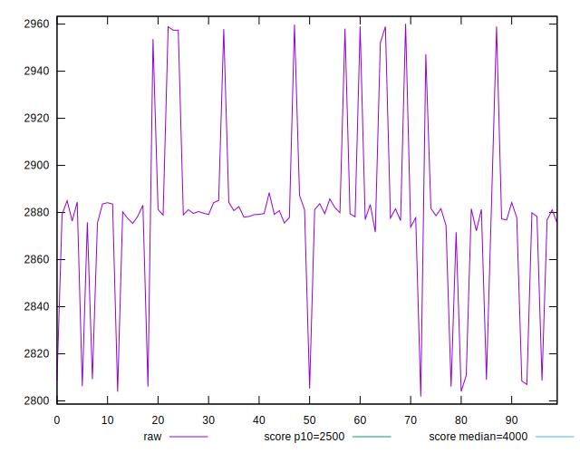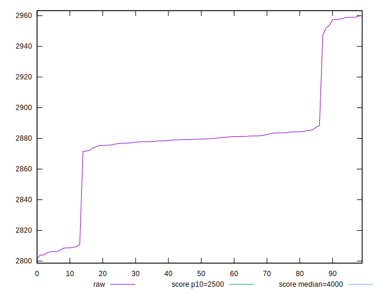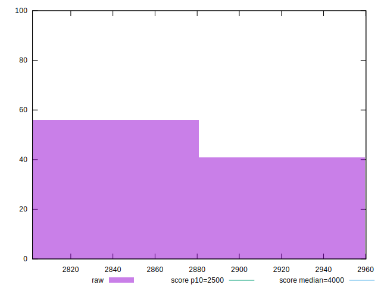
## Score


```yaml
p90min: 0.7948625677047677
p90max: 0.8341683683791558
p90range: 0.03930580067438805
p90mean: 0.8168074330274743
p90median: 0.8150090015817366
p90stdev: 0.007921737067429966
p90skewness: 0.5017014073999874
p90eccentricity: 0.9999999999999997
p90discretization: 1
outlandishness: 0.9950892608142277
confidence: 0.003878160478932413
p90confidence: 0.0032552010283457555

```

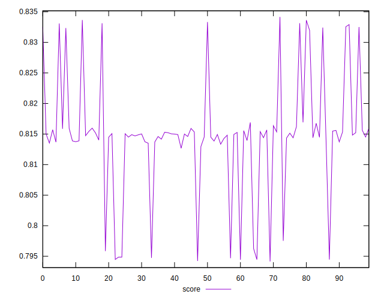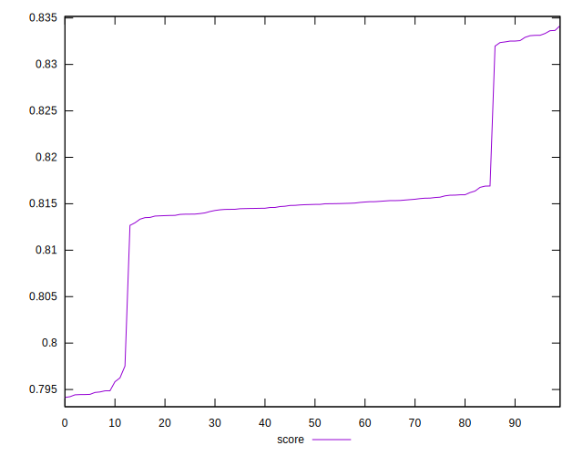
## Raw Estimate

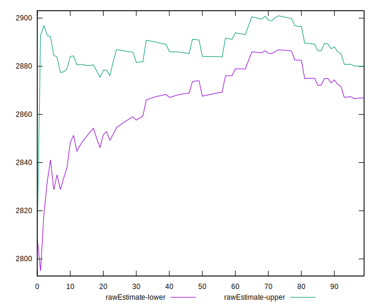
## Score Estimate

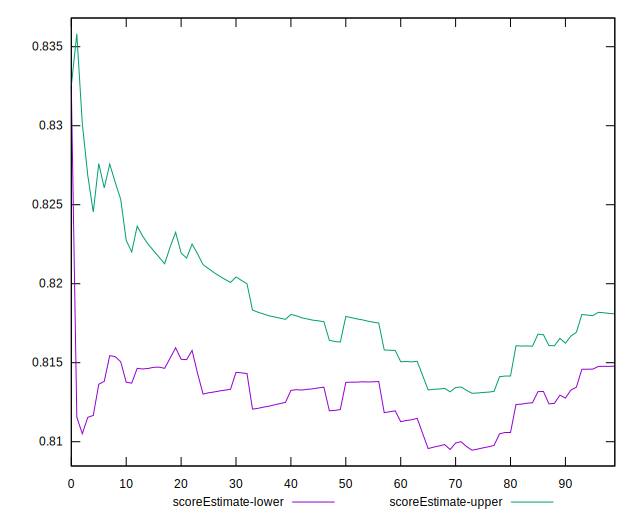
## P Score


```yaml
p90min: 0.7948625677047677
p90max: 0.8341683683791558
p90range: 0.03930580067438805
p90mean: 0.8168074330274743
p90median: 0.8150090015817366
p90stdev: 0.007921737067429966
p90skewness: 0.5017014073999874
p90eccentricity: 0.9999999999999997
p90discretization: 1
outlandishness: 0.9950892608142277
confidence: 0.003878160478932413
p90confidence: 0.0032552010283457555

```

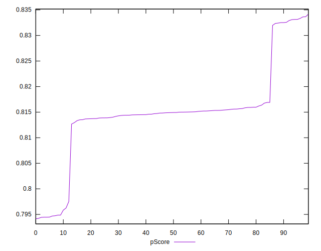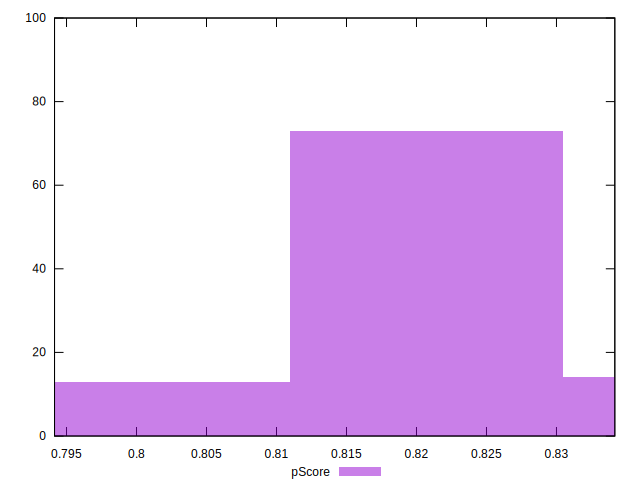
## Score Difference


```yaml
p90min: -0.004995287866289333
p90max: 0.004776114735168591
p90range: 0.009771402601457924
p90mean: -0.0015845130550897282
p90median: -0.0036731986076670164
p90stdev: 0.003776311005375213
p90skewness: 0.8211085787810815
p90eccentricity: 0.9999999999999997
p90discretization: 1
outlandishness: 0.39782089743618515
confidence: 0.0015893461965910158
p90confidence: 0.0015517621152299536

```

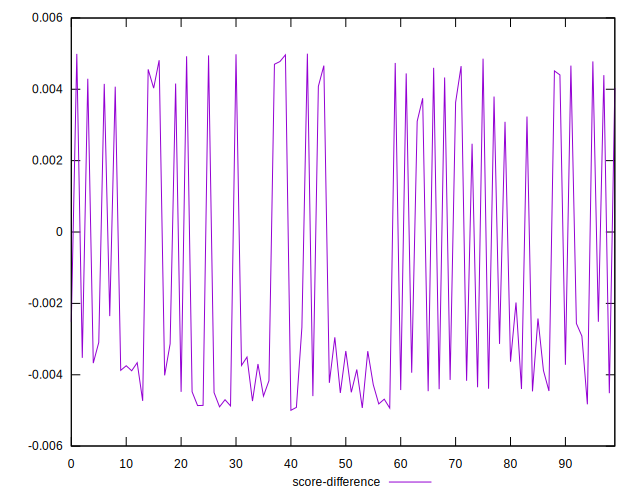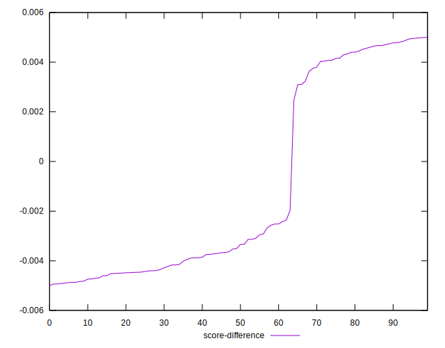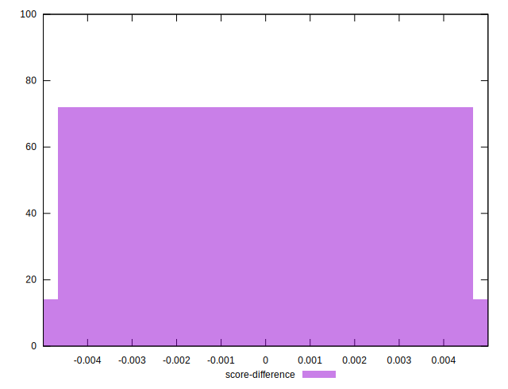
## P Score Difference


```yaml
p90min: 0
p90max: 0
p90range: 0
p90mean: 0
p90median: 0
p90stdev: 0
p90skewness: .nan
p90eccentricity: .nan
p90discretization: 91
outlandishness: .nan
confidence: 0
p90confidence: 0

```

