# //mainthread-work-breakdown/samples/pages+cached+noexternal+nocss

[→ Parent](../..)


## Raw


```yaml
p90min: 463.2760000000002
p90max: 494.9800000000003
p90range: 31.70400000000012
p90mean: 479.24505494505524
p90median: 478.1800000000001
p90stdev: 7.249297262437175
p90skewness: 0.16716692841989025
p90eccentricity: 1.0000000000000002
p90discretization: 1
outlandishness: 0.9985960552707601
confidence: 5.84500714588944
p90confidence: 2.9788819930026875

```

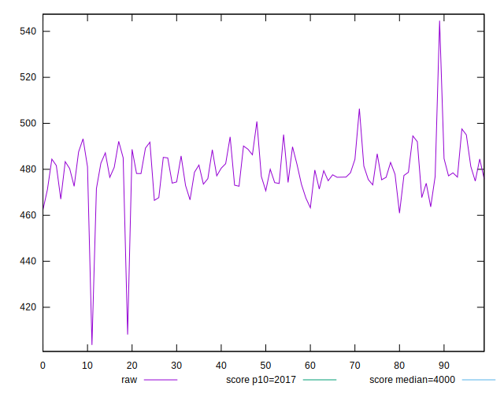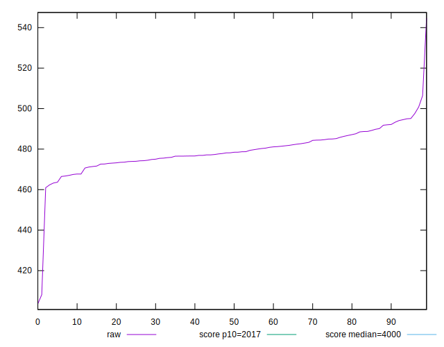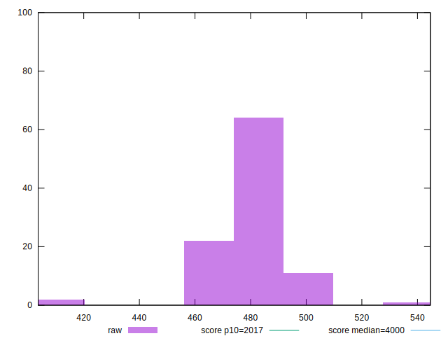
## Score


```yaml
p90min: 0.9999543586940882
p90max: 0.9999731094844447
p90range: 0.00001875079035651428
p90mean: 0.9999642808652887
p90median: 0.9999649166091578
p90stdev: 0.000004271580797390335
p90skewness: -0.2991347161741328
p90eccentricity: 1.0000000000000007
p90discretization: 1.011111111111111
outlandishness: 0.9999987356576563
confidence: 0.0000034077885540106934
p90confidence: 0.00000175527843015999

```

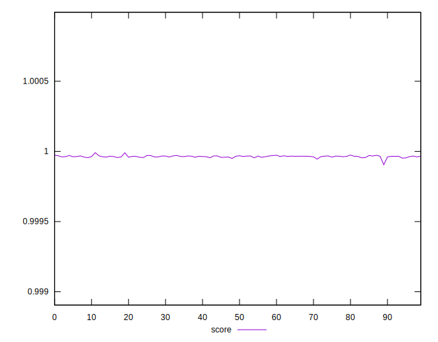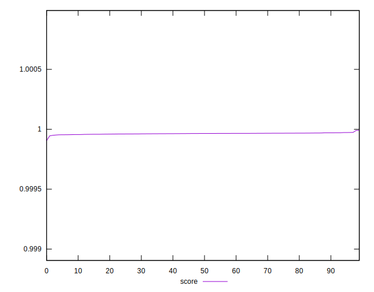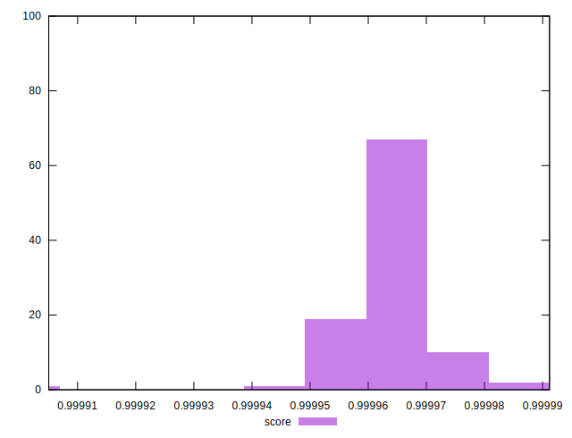
## Raw Estimate

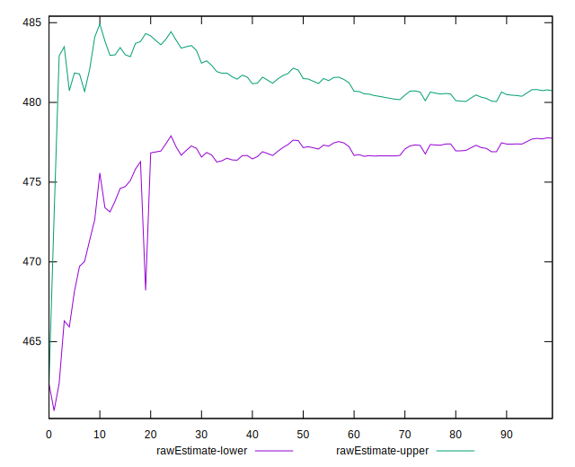
## Score Estimate

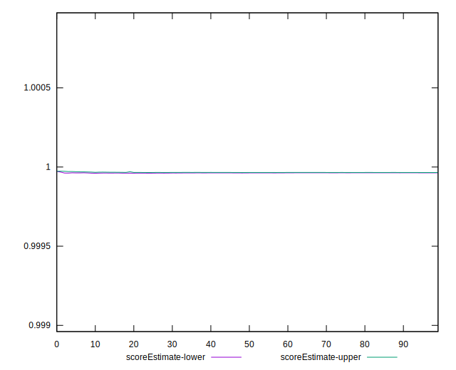
## P Score


```yaml
p90min: 0.9999543586940882
p90max: 0.9999731094844447
p90range: 0.00001875079035651428
p90mean: 0.9999642808652887
p90median: 0.9999649166091578
p90stdev: 0.000004271580797390335
p90skewness: -0.2991347161741328
p90eccentricity: 1.0000000000000007
p90discretization: 1.011111111111111
outlandishness: 0.9999987356576563
confidence: 0.0000034077885540106934
p90confidence: 0.00000175527843015999

```

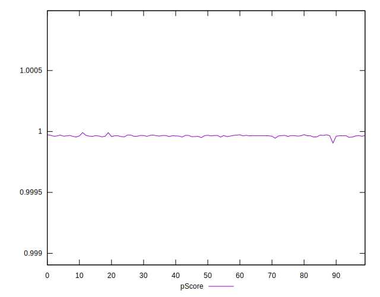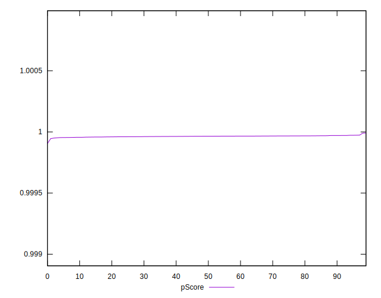
## Score Difference


```yaml
p90min: 0.00002689051555526678
p90max: 0.00004564130591178106
p90range: 0.00001875079035651428
p90mean: 0.00003571913471170393
p90median: 0.00003508339084223877
p90stdev: 0.000004271580797390337
p90skewness: 0.2991347163103707
p90eccentricity: 0.9999999999999993
p90discretization: 1.011111111111111
outlandishness: 1.0357087374215637
confidence: 0.0000034077885540673023
p90confidence: 0.0000017552784302190925

```

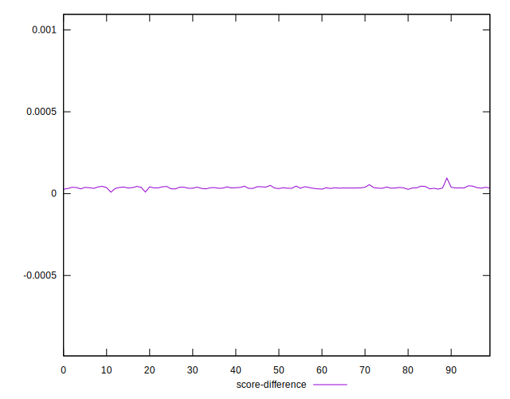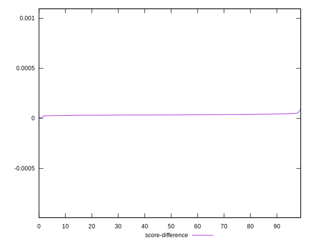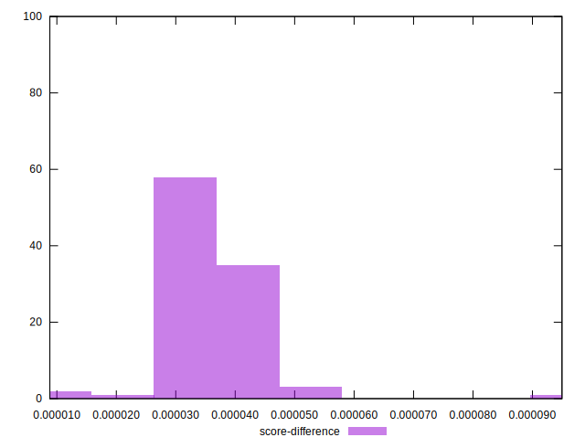
## P Score Difference


```yaml
p90min: 0
p90max: 0
p90range: 0
p90mean: 0
p90median: 0
p90stdev: 0
p90skewness: .nan
p90eccentricity: .nan
p90discretization: 91
outlandishness: .nan
confidence: 0
p90confidence: 0

```

