# //mainthread-work-breakdown/samples/pages+cached+noexternal+nofonts

[→ Parent](../..)


## Raw


```yaml
p90min: 620.1280000000008
p90max: 689.8240000000005
p90range: 69.69599999999969
p90mean: 661.6360439560444
p90median: 662.1920000000003
p90stdev: 17.037713229362087
p90skewness: -0.410025963040654
p90eccentricity: 0.9999999999999992
p90discretization: 1
outlandishness: 0.998486254472283
confidence: 8.893430142951502
p90confidence: 7.001138910922236

```

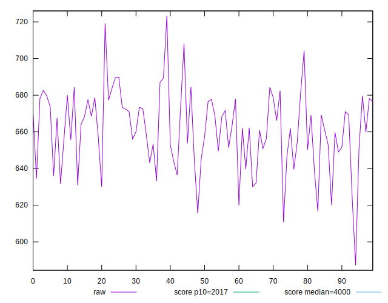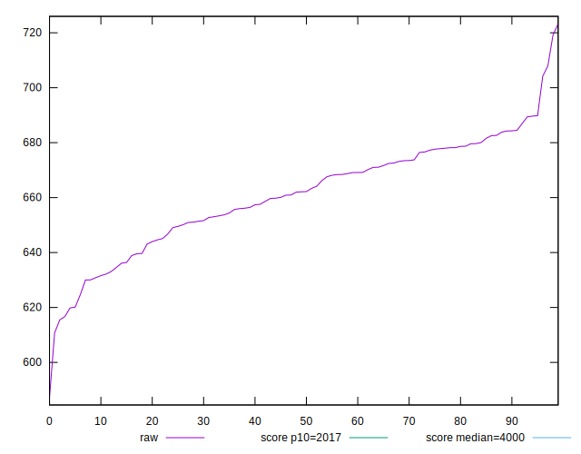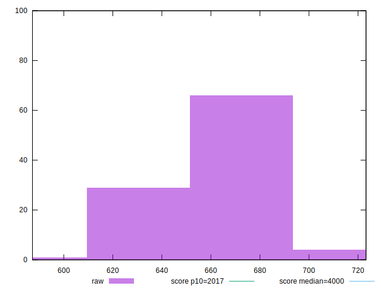
## Score


```yaml
p90min: 0.9994986515218454
p90max: 0.9997576867650021
p90range: 0.00025903524315673554
p90mean: 0.9996167544841665
p90median: 0.999619055657714
p90stdev: 0.00006485001929861779
p90skewness: 0.18139594929923783
p90eccentricity: 1.0000000000000004
p90discretization: 1
outlandishness: 0.9999969720380641
confidence: 0.0000344492314805489
p90confidence: 0.000026648176746135732

```

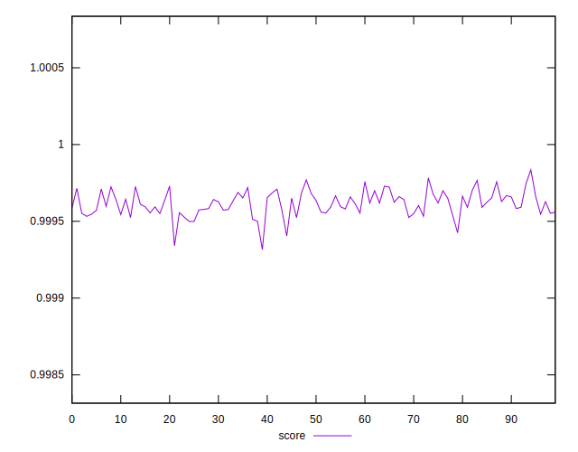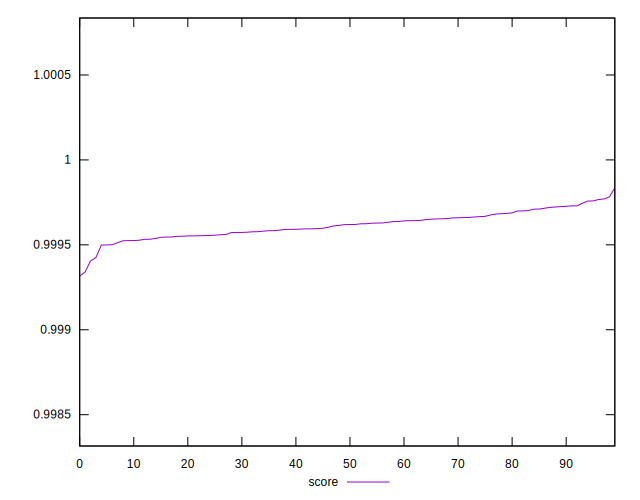
## Raw Estimate

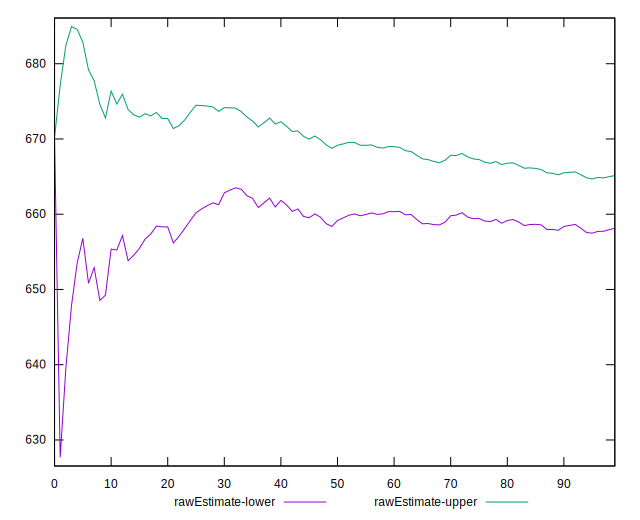
## Score Estimate

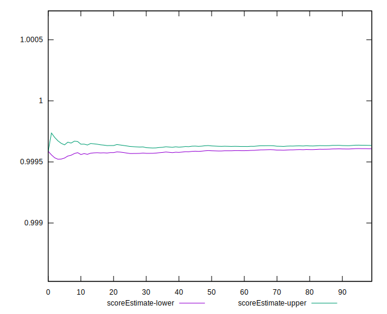
## P Score


```yaml
p90min: 0.9994986515218454
p90max: 0.9997576867650021
p90range: 0.00025903524315673554
p90mean: 0.9996167544841665
p90median: 0.999619055657714
p90stdev: 0.00006485001929861779
p90skewness: 0.18139594929923783
p90eccentricity: 1.0000000000000004
p90discretization: 1
outlandishness: 0.9999969720380641
confidence: 0.0000344492314805489
p90confidence: 0.000026648176746135732

```

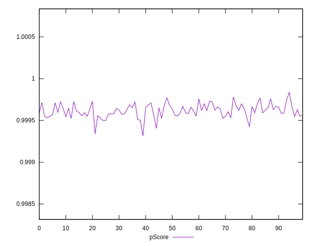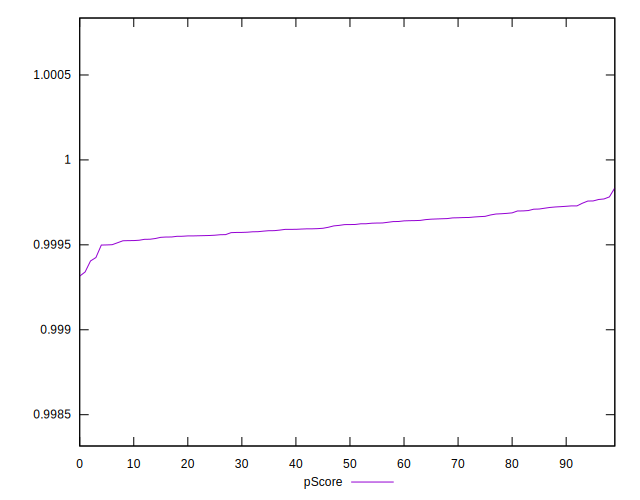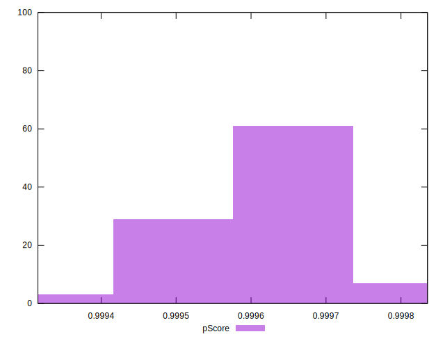
## Score Difference


```yaml
p90min: 0.00024231323499790403
p90max: 0.0005013484781546396
p90range: 0.00025903524315673554
p90mean: 0.0003832455158334257
p90median: 0.0003809443422859715
p90stdev: 0.00006485001929861779
p90skewness: -0.18139594928721542
p90eccentricity: 1.0000000000000002
p90discretization: 1
outlandishness: 1.0079134130374112
confidence: 0.000034449231480494476
p90confidence: 0.000026648176746111988

```

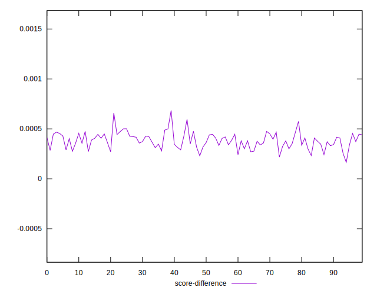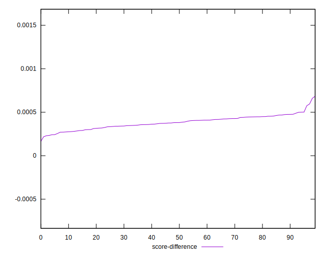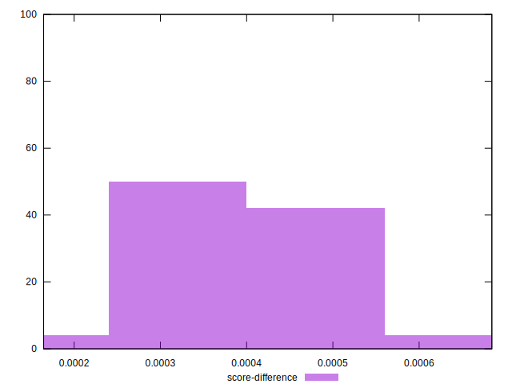
## P Score Difference


```yaml
p90min: 0
p90max: 0
p90range: 0
p90mean: 0
p90median: 0
p90stdev: 0
p90skewness: .nan
p90eccentricity: .nan
p90discretization: 91
outlandishness: .nan
confidence: 0
p90confidence: 0

```

