# //mainthread-work-breakdown/samples/pages+cached+nointeractive

[→ Parent](../..)


## Raw


```yaml
p90min: 1777.2560000000008
p90max: 1854.407999999999
p90range: 77.15199999999822
p90mean: 1811.9148131868137
p90median: 1811.8520000000003
p90stdev: 20.2504525891151
p90skewness: 0.15125734937155957
p90eccentricity: 1.0000000000000002
p90discretization: 1
outlandishness: 1.0017716252935356
confidence: 10.01194892354124
p90confidence: 8.321318106300168

```

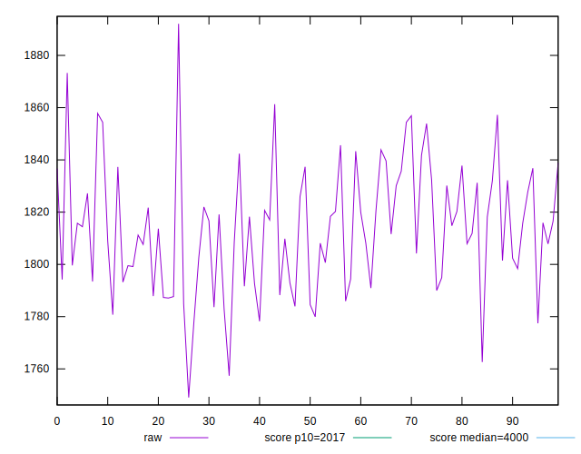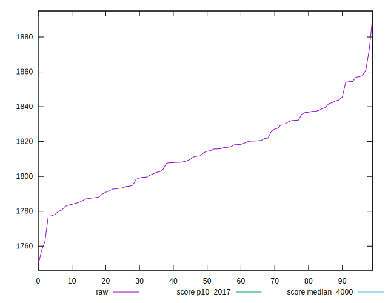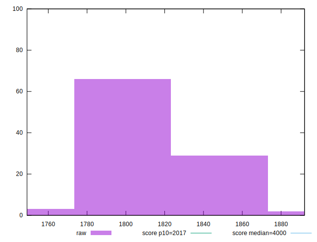
## Score


```yaml
p90min: 0.924905382829474
p90max: 0.935543594936703
p90range: 0.01063821210722904
p90mean: 0.9308359325435548
p90median: 0.9308721256639734
p90stdev: 0.0027861137231056615
p90skewness: -0.18304986007453902
p90eccentricity: 1
p90discretization: 1
outlandishness: 0.9994913270948957
confidence: 0.0013818378075023396
p90confidence: 0.001144870143927168

```

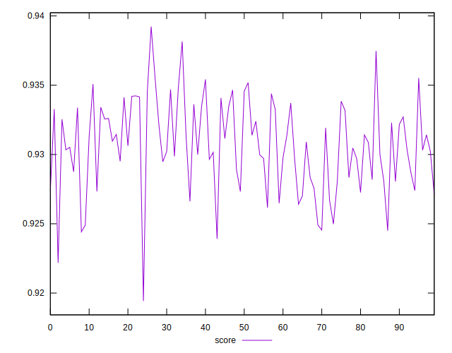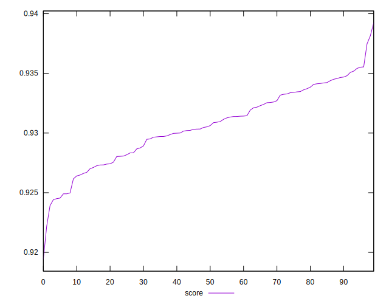
## Raw Estimate

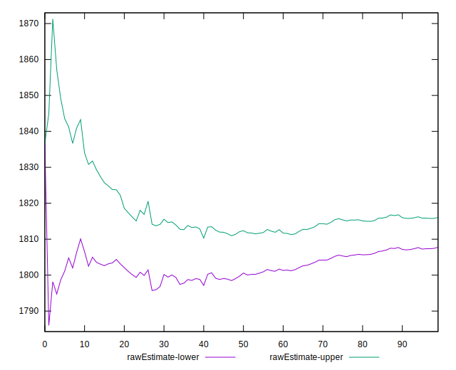
## Score Estimate

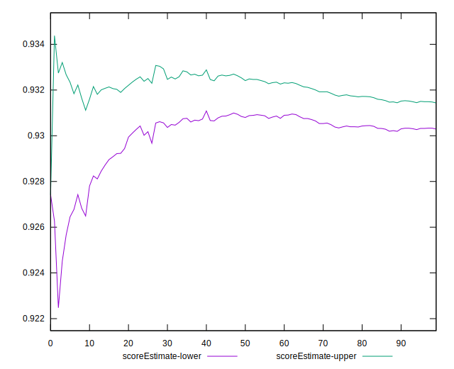
## P Score


```yaml
p90min: 0.924905382829474
p90max: 0.935543594936703
p90range: 0.01063821210722904
p90mean: 0.9308359325435548
p90median: 0.9308721256639734
p90stdev: 0.0027861137231056615
p90skewness: -0.18304986007453902
p90eccentricity: 1
p90discretization: 1
outlandishness: 0.9994913270948957
confidence: 0.0013818378075023396
p90confidence: 0.001144870143927168

```

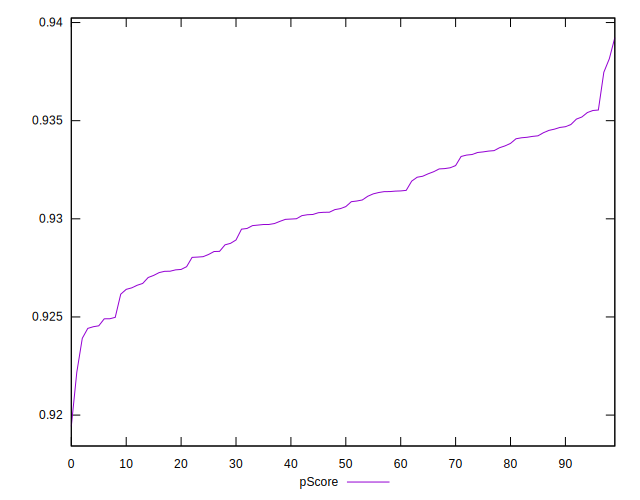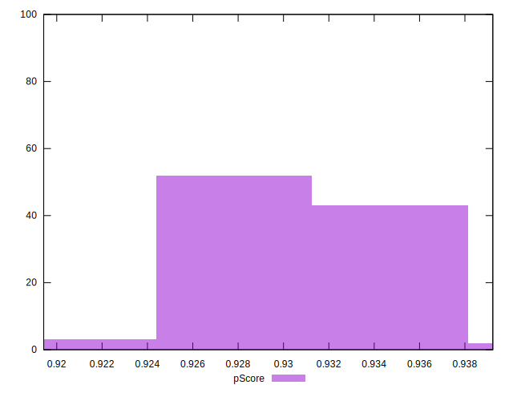
## Score Difference


```yaml
p90min: -0.004907671074993236
p90max: 0.003384455513374296
p90range: 0.008292126588367532
p90mean: -0.0010894960829448054
p90median: -0.0009594682596938409
p90stdev: 0.0024382670706857698
p90skewness: 0.073590220108982
p90eccentricity: 0.9999999999999999
p90discretization: 1
outlandishness: 0.4118110304853891
confidence: 0.0010900697551838147
p90confidence: 0.0010019329609550934

```

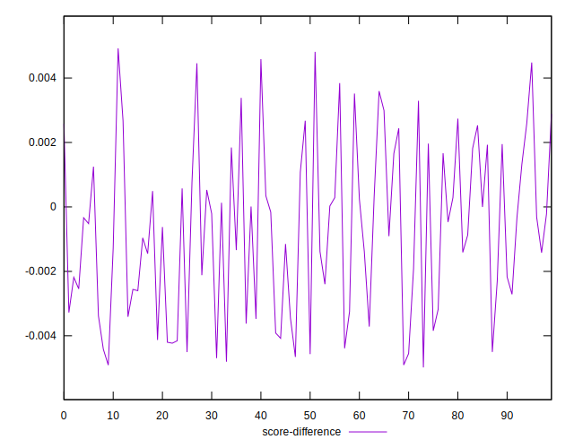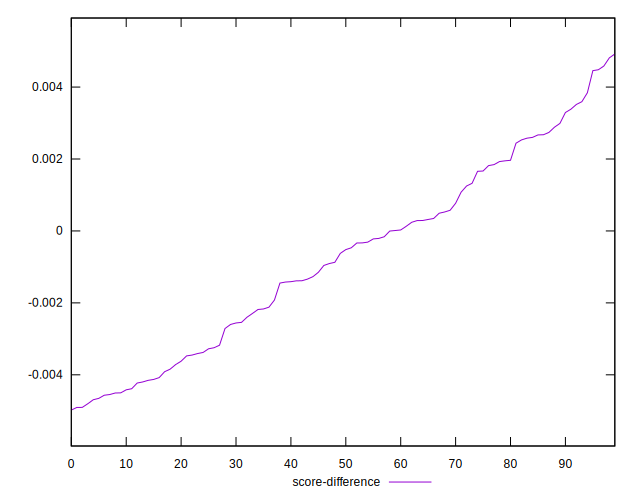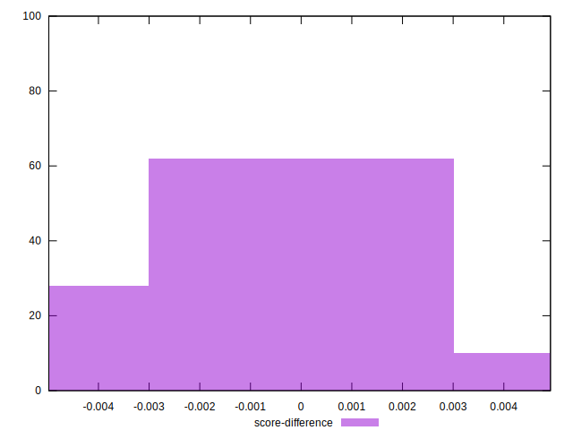
## P Score Difference


```yaml
p90min: 0
p90max: 0
p90range: 0
p90mean: 0
p90median: 0
p90stdev: 0
p90skewness: .nan
p90eccentricity: .nan
p90discretization: 91
outlandishness: .nan
confidence: 0
p90confidence: 0

```

