# //max-potential-fid/samples/pages+cached+nointeractive

[→ Parent](../..)


## Raw


```yaml
p90min: 267
p90max: 297.0000000000018
p90range: 30.00000000000182
p90mean: 277.4725274725274
p90median: 273
p90stdev: 9.370682196119645
p90skewness: 1.115785660737109
p90eccentricity: 0.9999999999999996
p90discretization: 1.9782608695652173
outlandishness: 1.0189555211859227
confidence: 4.936026780239445
p90confidence: 3.8506017129152497

```

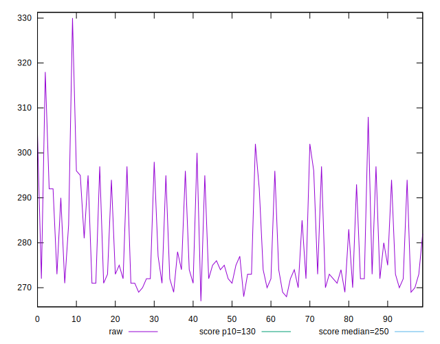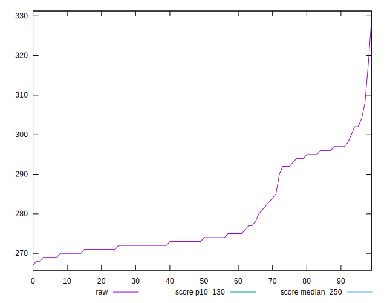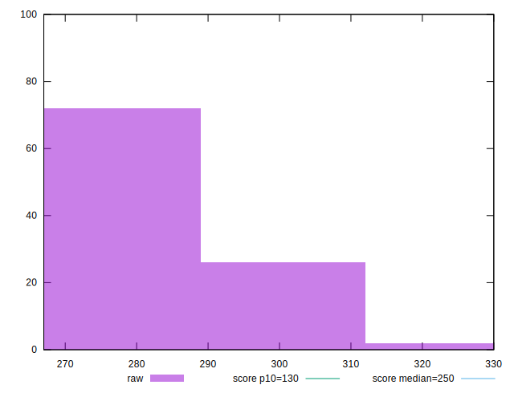
## Score


```yaml
p90min: 0.36782727249667685
p90max: 0.4487066999006886
p90range: 0.08087942740401177
p90mean: 0.4196608430302835
p90median: 0.43152934857222425
p90stdev: 0.025175635277933702
p90skewness: -1.0876122416169876
p90eccentricity: 1.0000000000000002
p90discretization: 1.9782608695652173
outlandishness: 0.9684037250131108
confidence: 0.012861780071405371
p90confidence: 0.010345174694440296

```

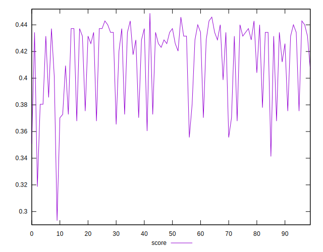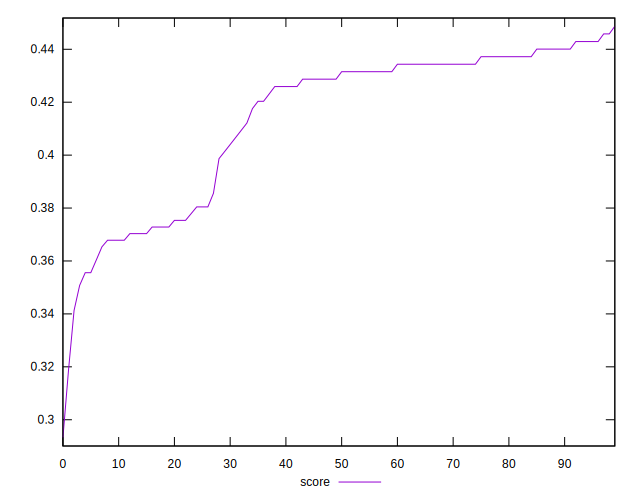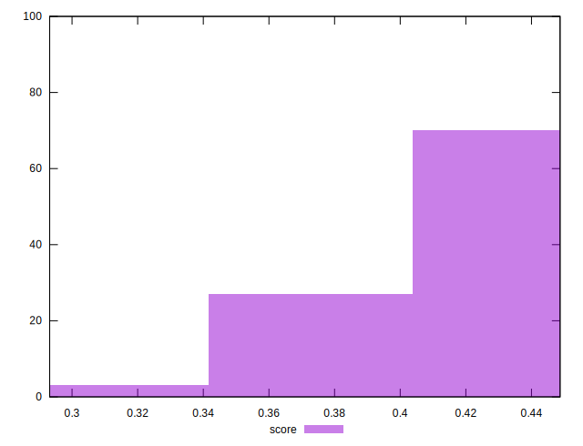
## Raw Estimate

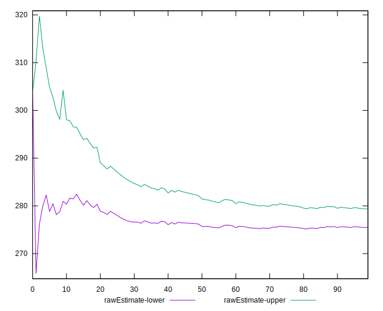
## Score Estimate

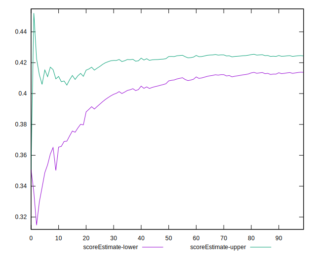
## P Score


```yaml
p90min: 0.36782727249667685
p90max: 0.4487066999006886
p90range: 0.08087942740401177
p90mean: 0.4196608430302835
p90median: 0.43152934857222425
p90stdev: 0.025175635277933702
p90skewness: -1.0876122416169876
p90eccentricity: 1.0000000000000002
p90discretization: 1.9782608695652173
outlandishness: 0.9684037250131108
confidence: 0.012861780071405371
p90confidence: 0.010345174694440296

```

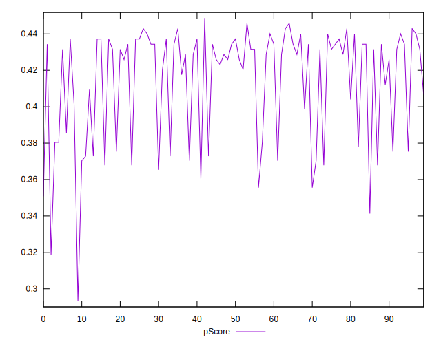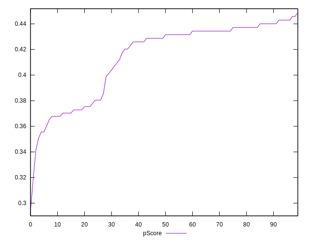
## Score Difference


```yaml
p90min: -0.004357845905356594
p90max: 0.004190473197453526
p90range: 0.00854831910281012
p90mean: -0.00034014939740093165
p90median: -0.00032085364650125126
p90stdev: 0.0026411779391138012
p90skewness: 0.00701547522260325
p90eccentricity: 1.0000000000000007
p90discretization: 1.9361702127659575
outlandishness: 0.052273296720304736
confidence: 0.001128021563134349
p90confidence: 0.0010853131163360574

```

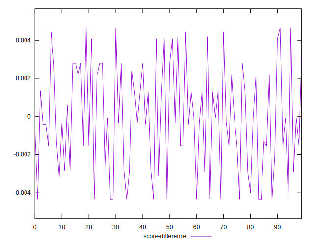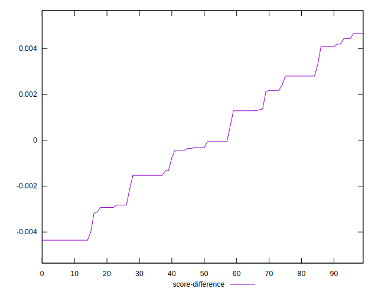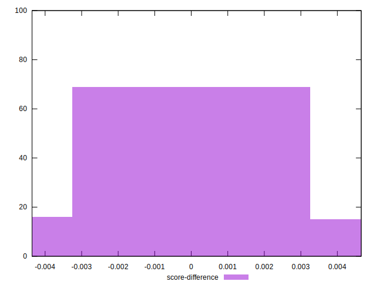
## P Score Difference


```yaml
p90min: 0
p90max: 0
p90range: 0
p90mean: 0
p90median: 0
p90stdev: 0
p90skewness: .nan
p90eccentricity: .nan
p90discretization: 91
outlandishness: .nan
confidence: 0
p90confidence: 0

```

