# //max-potential-fid/samples/pages

[→ Parent](../..)


## Raw


```yaml
p90min: 277.9999999999982
p90max: 302
p90range: 24.00000000000182
p90mean: 288.04395604395603
p90median: 288
p90stdev: 5.5843424906621415
p90skewness: 0.1916893070830675
p90eccentricity: 0.9999999999999999
p90discretization: 2.116279069767442
outlandishness: 1.010135425725195
confidence: 3.902051534988118
p90confidence: 2.2947186031933597

```

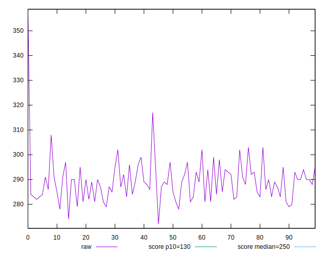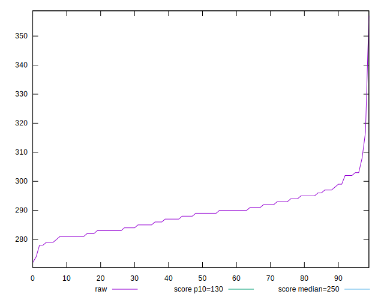
## Score


```yaml
p90min: 0.3555676813469126
p90max: 0.41759477713855103
p90range: 0.062027095791638454
p90mean: 0.3908752142007509
p90median: 0.39077190547644314
p90stdev: 0.014545021331884553
p90skewness: -0.13787093898092742
p90eccentricity: 0.9999999999999997
p90discretization: 2.116279069767442
outlandishness: 0.9830503250713165
confidence: 0.009290804695965438
p90confidence: 0.005976841694421697

```

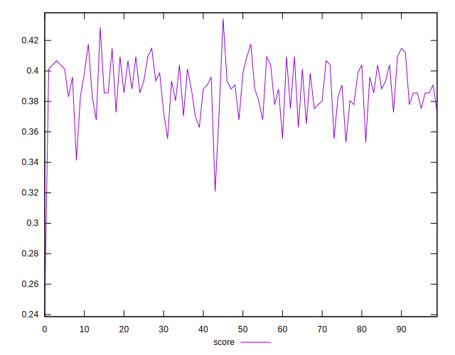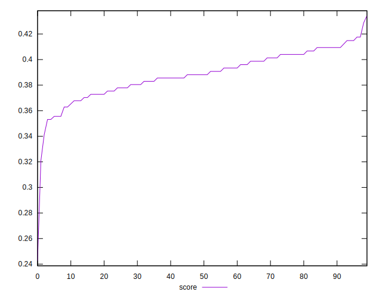
## Raw Estimate

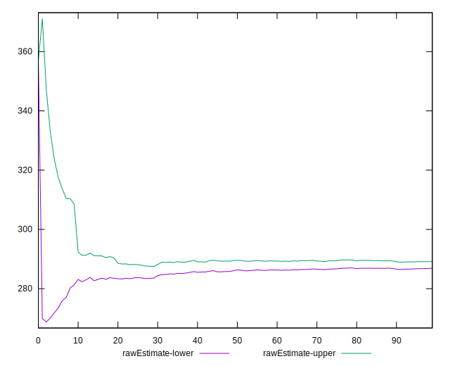
## Score Estimate

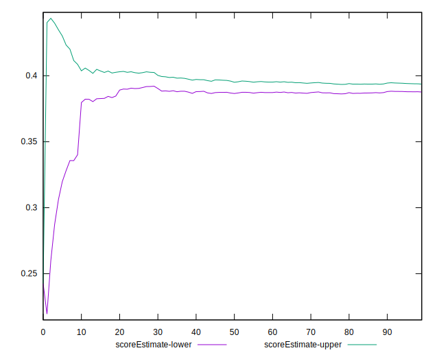
## P Score


```yaml
p90min: 0.3555676813469126
p90max: 0.41759477713855103
p90range: 0.062027095791638454
p90mean: 0.3908752142007509
p90median: 0.39077190547644314
p90stdev: 0.014545021331884553
p90skewness: -0.13787093898092742
p90eccentricity: 0.9999999999999997
p90discretization: 2.116279069767442
outlandishness: 0.9830503250713165
confidence: 0.009290804695965438
p90confidence: 0.005976841694421697

```

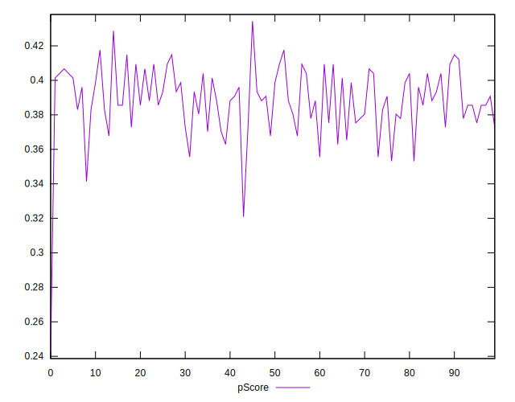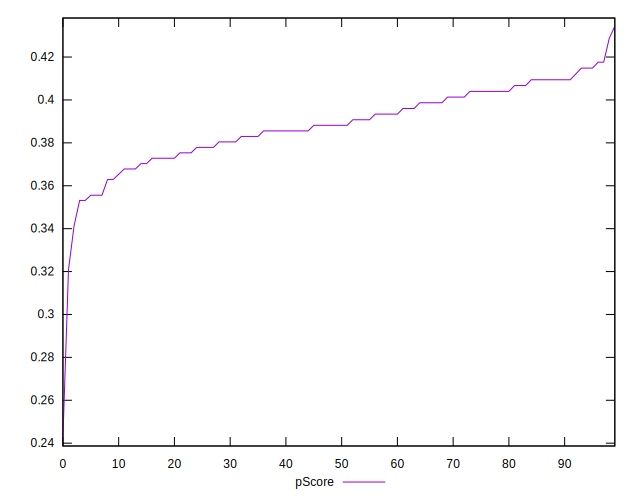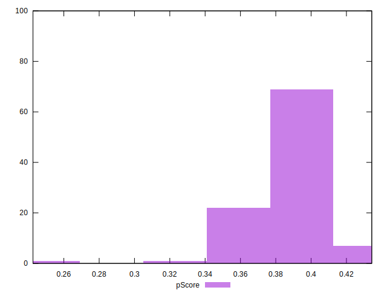
## Score Difference


```yaml
p90min: -0.004008499025753731
p90max: 0.004432318653087408
p90range: 0.00844081767884114
p90mean: 0.00012116525731792765
p90median: 0.0005989014916699675
p90stdev: 0.0027676480769087794
p90skewness: 0.03620162570530106
p90eccentricity: 0.9999999999999993
p90discretization: 2.116279069767442
outlandishness: 1.5643629363158402
confidence: 0.0011706072995436463
p90confidence: 0.0011372822386511458

```

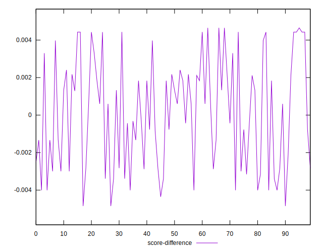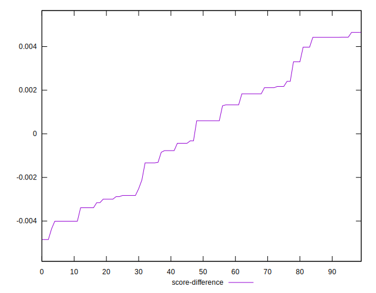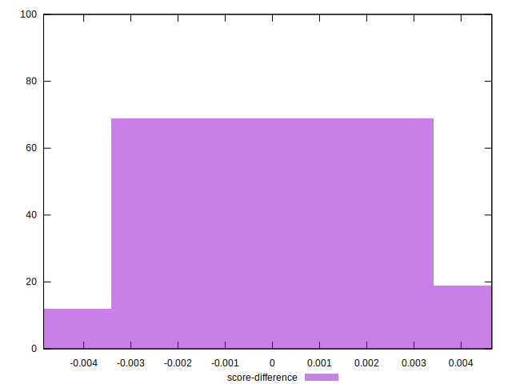
## P Score Difference


```yaml
p90min: 0
p90max: 0
p90range: 0
p90mean: 0
p90median: 0
p90stdev: 0
p90skewness: .nan
p90eccentricity: .nan
p90discretization: 91
outlandishness: .nan
confidence: 0
p90confidence: 0

```

