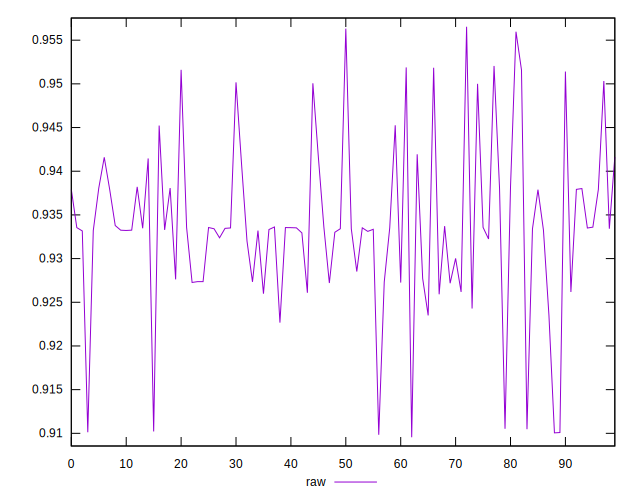
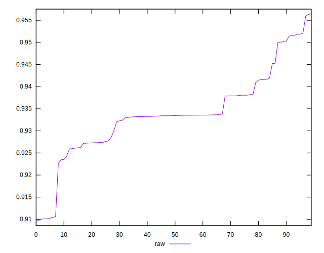
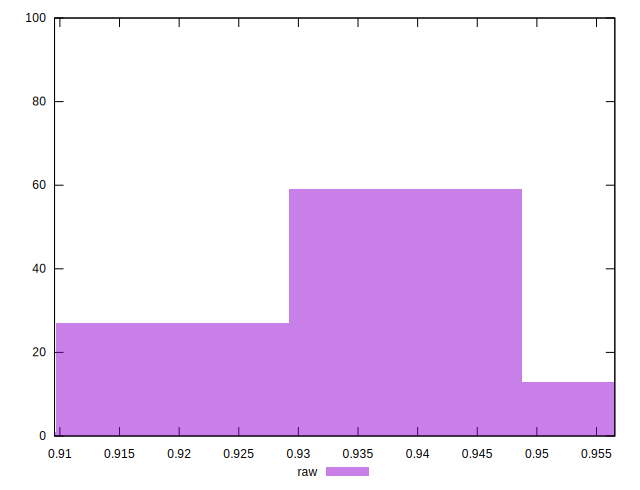

# //meta/pScore/samples/pages+cached+noexternal+nofonts+nosvg+noimg

[→ Parent](../..)


## Raw


```yaml
p90min: 0.9226685120812858
p90max: 0.9563229509338737
p90range: 0.0336544388525879
p90mean: 0.9355702792844417
p90median: 0.9335067634923552
p90stdev: 0.00793029303427516
p90skewness: 0.8908286478302544
p90eccentricity: 1.0000000000000002
p90discretization: 1
outlandishness: 0.9960972633416596
confidence: 0.004114324990499796
p90confidence: 0.0032587168471409633

```

