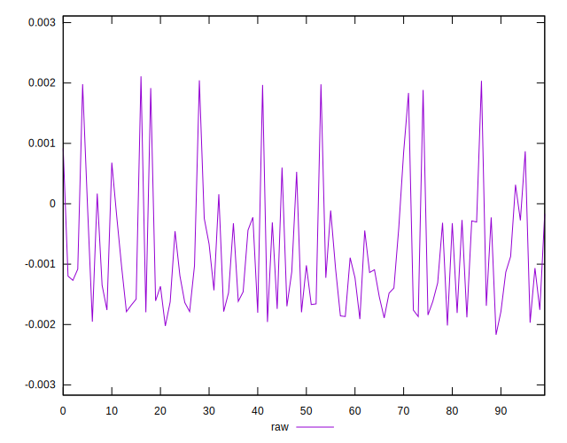

# //meta/score-difference/samples/pages+cached+noadtech

[→ Parent](../..)


## Raw


```yaml
p90min: -0.0021697083777997388
p90max: 0.0009177493193797409
p90range: 0.0030874576971794796
p90mean: -0.0010663191876907712
p90median: -0.0012682282628813486
p90stdev: 0.000798278389454756
p90skewness: 0.7863481489571368
p90eccentricity: 1.0000000000000004
p90discretization: 1
outlandishness: 0.5527996563329782
confidence: 0.00045322929103554775
p90confidence: 0.0003280286396961079

```

