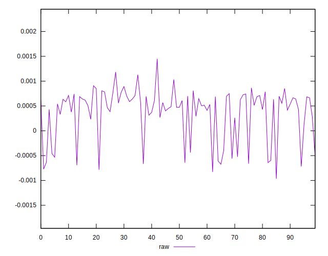

# //meta/score-difference/samples/pages+cached+noexternal+nocss

[→ Parent](../..)


## Raw


```yaml
p90min: -0.0006632005185757073
p90max: 0.0011840238326757124
p90range: 0.0018472243512514196
p90mean: 0.0004390985598854208
p90median: 0.0005730085671561719
p90stdev: 0.00044601003616886683
p90skewness: -1.3667244983440383
p90eccentricity: 1
p90discretization: 1
outlandishness: 0.6463512705875479
confidence: 0.00021474470700464353
p90confidence: 0.00018327449093945107

```

