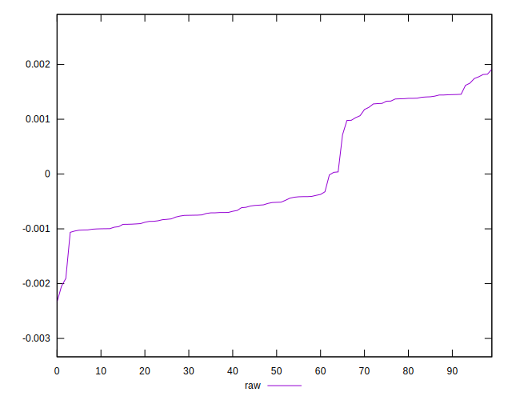

# //meta/score-difference/samples/pages+cached+noexternal+nofonts+nosvg+noimg

[→ Parent](../..)


## Raw


```yaml
p90min: -0.0010634129171966488
p90max: 0.0016189222783108304
p90range: 0.0026823351955074792
p90mean: -0.00005738915089655286
p90median: -0.0005363384250841819
p90stdev: 0.0009628945104010745
p90skewness: 0.6678743469472687
p90eccentricity: 1.0000000000000002
p90discretization: 1
outlandishness: 0.018721398138813152
confidence: 0.00042428478915412153
p90confidence: 0.000395672713416998

```

