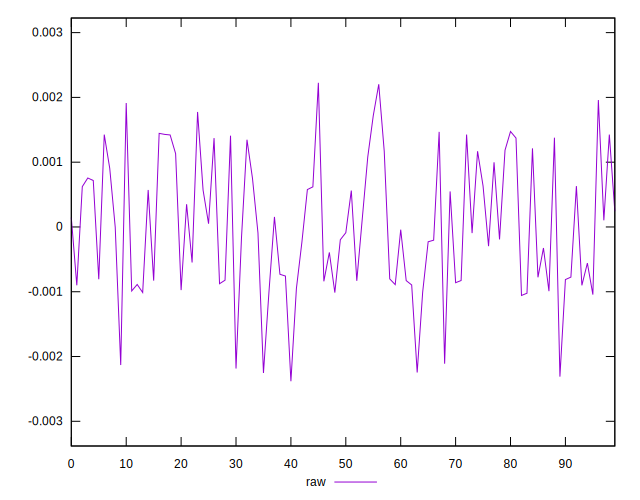

# //meta/score-difference/samples/pages+cached+noexternal+nofonts

[→ Parent](../..)


## Raw


```yaml
p90min: -0.0010574425432016796
p90max: 0.001959145588463651
p90range: 0.0030165881316653303
p90mean: 0.00013139420269324994
p90median: -0.00004200230479366393
p90stdev: 0.0009335237032065212
p90skewness: 0.2901022830276604
p90eccentricity: 1
p90discretization: 1
outlandishness: 0.003379405782391131
confidence: 0.00043929859337047935
p90confidence: 0.00038360365823765567

```

