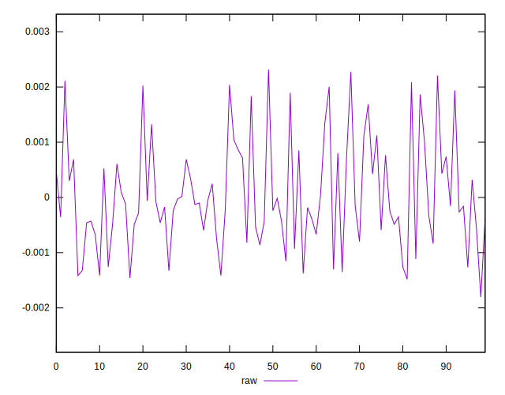

# //meta/score-difference/samples/pages+cached+noexternal+noimg

[→ Parent](../..)


## Raw


```yaml
p90min: -0.0018050816229632158
p90max: 0.001897553126329933
p90range: 0.003702634749293149
p90mean: -0.00015256433796005328
p90median: -0.00023784071057776217
p90stdev: 0.0008473308639542959
p90skewness: 0.3846533880655429
p90eccentricity: 1.0000000000000002
p90discretization: 1
outlandishness: 0.1125384952600045
confidence: 0.0004063140296568056
p90confidence: 0.0003481852876730154

```

