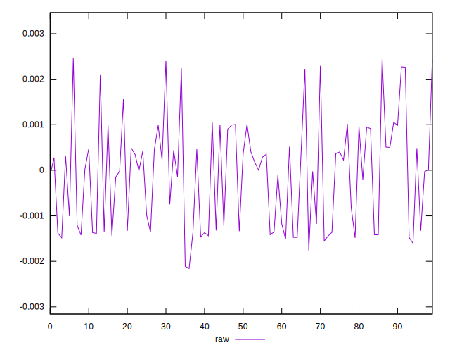

# //meta/score-difference/samples/pages+cached+noexternal+nosvg

[→ Parent](../..)


## Raw


```yaml
p90min: -0.0021574016333571334
p90max: 0.002104602497242756
p90range: 0.00426200413059989
p90mean: -0.0003283798517977234
p90median: -0.000030664859878553604
p90stdev: 0.0010172481200058131
p90skewness: 0.06525008507411986
p90eccentricity: 1.0000000000000002
p90discretization: 1
outlandishness: 0.0721842728715693
confidence: 0.00048417199362475575
p90confidence: 0.00041800770438849813

```

