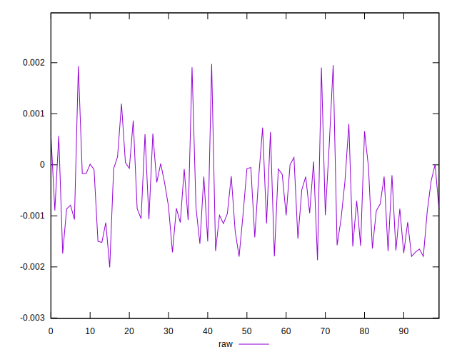

# //meta/score-difference/samples/pages+cached+noexternal

[→ Parent](../..)


## Raw


```yaml
p90min: -0.0018687856457741897
p90max: 0.000729357550876964
p90range: 0.0025981431966511535
p90mean: -0.0007266227657263038
p90median: -0.0008610774724614572
p90stdev: 0.0007257523068785763
p90skewness: 0.190119391611297
p90eccentricity: 1
p90discretization: 1
outlandishness: 0.5852781389121973
confidence: 0.0003732705576026474
p90confidence: 0.0002982262142212039

```

