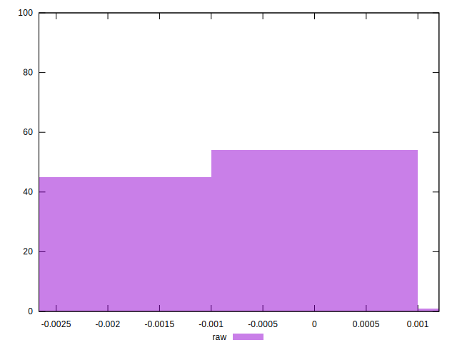

# //meta/score-difference/samples/pages+cached+nointeractive

[→ Parent](../..)


## Raw


```yaml
p90min: -0.002351999160069755
p90max: 0.0005001708959944826
p90range: 0.0028521700560642377
p90mean: -0.0009533988164630425
p90median: -0.0008124898856150767
p90stdev: 0.0008070724102766134
p90skewness: -0.14294994064751465
p90eccentricity: 1
p90discretization: 1
outlandishness: 0.9560053371336176
confidence: 0.0003577813683917396
p90confidence: 0.00033164227965650265

```

