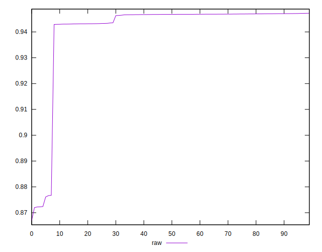

# //meta/score/samples/pages+cached+noexternal+nocss

[→ Parent](../..)


## Raw


```yaml
p90min: 0.9428999271464161
p90max: 0.9472077979278886
p90range: 0.004307870781472434
p90mean: 0.9459695365295995
p90median: 0.9468057026825691
p90stdev: 0.0015994547420768116
p90skewness: -1.1830992611080964
p90eccentricity: 0.9999999999999997
p90discretization: 1
outlandishness: 0.9877486618407044
confidence: 0.007775738537634469
p90confidence: 0.0006572481107214312

```

