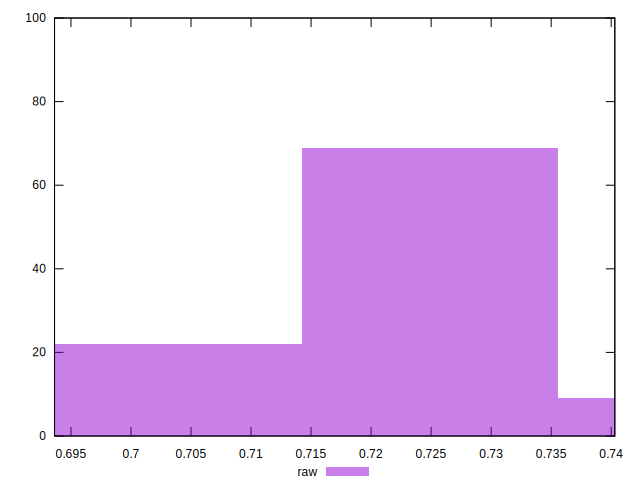

# //meta/score/samples/pages+cached+noexternal

[→ Parent](../..)


## Raw


```yaml
p90min: 0.7029204508617969
p90max: 0.7399802823189373
p90range: 0.037059831457140424
p90mean: 0.7193530888504199
p90median: 0.7203025420212729
p90stdev: 0.008643286073677972
p90skewness: -0.1955551999042974
p90eccentricity: 1.0000000000000002
p90discretization: 1
outlandishness: 1.0000494973106342
confidence: 0.0042187555309569635
p90confidence: 0.0035517000218301398

```

