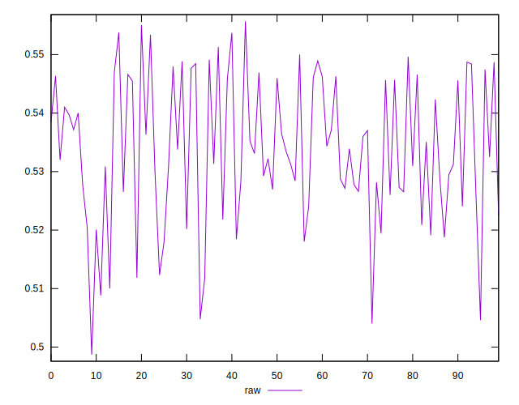

# //meta/score/samples/pages+cached+nointeractive

[→ Parent](../..)


## Raw


```yaml
p90min: 0.512333465187359
p90max: 0.5550604887249247
p90range: 0.042727023537565745
p90mean: 0.5355928155470795
p90median: 0.5339069001494735
p90stdev: 0.010727781316547665
p90skewness: -0.00661207611213129
p90eccentricity: 1.0000000000000007
p90discretization: 1
outlandishness: 0.99217127115874
confidence: 0.005141665724788247
p90confidence: 0.004408261026116467

```

