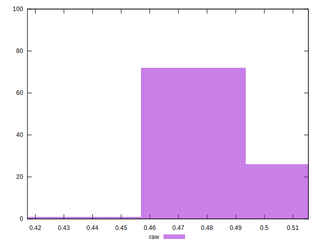

# //meta/score/samples/pages

[→ Parent](../..)


## Raw


```yaml
p90min: 0.4579236913114101
p90max: 0.5135154334996269
p90range: 0.05559174218821683
p90mean: 0.48063334500345184
p90median: 0.4739038743317071
p90stdev: 0.014820270011966346
p90skewness: 0.9658582994316021
p90eccentricity: 1.0000000000000002
p90discretization: 1
outlandishness: 1.005129743950584
confidence: 0.0072809708138595886
p90confidence: 0.006089946910970312

```

