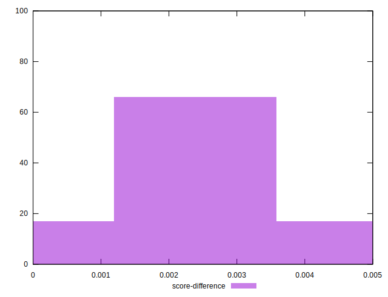

# //render-blocking-resources/samples/pages+cached+noexternal+noimg

[→ Parent](../..)


## Raw


```yaml
p90min: 158
p90max: 471
p90range: 313
p90mean: 379.02197802197804
p90median: 466
p90stdev: 139.0449352636084
p90skewness: -0.9481811657384274
p90eccentricity: 1.0000000000000009
p90discretization: 7
outlandishness: 0.8972397333924959
confidence: 57.66260623117887
p90confidence: 57.1363594125454

```


## Score


```yaml
p90min: 0.655
p90max: 0.8683333333333333
p90range: 0.21333333333333326
p90mean: 0.7172741147741147
p90median: 0.6577777777777778
p90stdev: 0.09491600039401268
p90skewness: 0.9483880436620533
p90eccentricity: 0.9999999999999997
p90discretization: 7
outlandishness: 1.0385280422483603
confidence: 0.03937998567973966
p90confidence: 0.03900289285785297

```


## Raw Estimate


## Score Estimate


## P Score


```yaml
p90min: 0.655
p90max: 0.8683333333333333
p90range: 0.21333333333333326
p90mean: 0.7172741147741147
p90median: 0.6577777777777778
p90stdev: 0.09491600039401268
p90skewness: 0.9483880436620533
p90eccentricity: 0.9999999999999997
p90discretization: 7
outlandishness: 1.0385280422483603
confidence: 0.03937998567973966
p90confidence: 0.03900289285785297

```


## Score Difference


```yaml
p90min: 0.0008333333333333526
p90max: 0.004444444444444473
p90range: 0.0036111111111111205
p90mean: 0.0026800976800977158
p90median: 0.002777777777777768
p90stdev: 0.0009687261634860092
p90skewness: -0.20998740141574068
p90eccentricity: 0.9999999999999999
p90discretization: 8.272727272727273
outlandishness: 0.8974001634487154
confidence: 0.0004711217428927531
p90confidence: 0.0003980690569155825

```


## P Score Difference


```yaml
p90min: 0
p90max: 0
p90range: 0
p90mean: 0
p90median: 0
p90stdev: 0
p90skewness: .nan
p90eccentricity: .nan
p90discretization: 91
outlandishness: .nan
confidence: 0
p90confidence: 0

```

